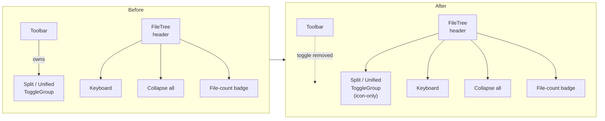

# Plan: Move Split/Unified View Toggle into FileTree Header

## Original Work Order
> I need to move the unify vs split button from the header of the application to the header of the file list. This is because I want to retain that button when including the self-review interface as a component in other applications.

Tracking issue: [e0ipso/self-review#91](https://github.com/e0ipso/self-review/issues/91)

## Plan Clarifications

| Question | Answer |
|----------|--------|
| How should the toggle look in the FileTree header? | Icon-only (Columns2 / AlignJustify), matching the existing `h-5 w-5` icon buttons in the header. |
| Where in the FileTree header should it sit? | Same row as the keyboard-shortcuts and expand/collapse buttons (left of the file-count badge). |
| What happens to the Toolbar after the move? | Toolbar stays in place for the Electron app; only the Split/Unified `ToggleGroup` and its handler/imports are removed. |

## Executive Summary

The `@self-review/react` package exposes both a top-level `Toolbar` and a sidebar `FileTree`. Host applications that embed the review UI as a component frequently render their own application chrome and skip `Toolbar` — but they almost always mount `FileTree` next to the diff viewer. Today the Split/Unified diff-view selector lives in `Toolbar`, so embedded hosts lose the ability to switch view modes unless they re-implement the control or pull in the bundled toolbar.

This plan relocates the Split/Unified `ToggleGroup` from `Toolbar.tsx` into the `FileTree.tsx` header as a pair of compact icon-only buttons, sitting alongside the existing keyboard-shortcuts tooltip and expand/collapse-all control. The toggle continues to read and write `config.diffView` through the already-imported `useConfig()` hook, and the existing `data-testid` values (`view-mode-split`, `view-mode-unified`) are preserved so e2e steps in `tests/webapp-steps/05-view-modes-and-toolbar.steps.ts` and `tests/recording/demo-recording.spec.ts` keep working unchanged.

The result: the diff-view toggle becomes available in any host that mounts `FileTree`, without dragging in the entire `Toolbar`. The Electron app's user-facing experience is preserved (the same control, in a slightly more contextual location), and the `Toolbar` keeps every other responsibility it has today (untracked toggle, comment collapse, word-wrap, theme, review progress, finish review).

## Context

### Current State vs Target State

| Current State | Target State | Why? |
|---------------|--------------|------|
| `Toolbar.tsx` renders a labeled `Split / Unified` `ToggleGroup` (lines 110–143) bound to `config.diffView`. | The `ToggleGroup` is removed from `Toolbar.tsx` along with its `handleViewModeChange` handler and the now-unused `Columns2` / `AlignJustify` imports and adjacent `<Separator />`. | The control needs to live with `FileTree`, not with chrome that embedders skip. |
| `FileTree.tsx` header contains only the keyboard-shortcuts tooltip, expand/collapse-all button, and a file-count badge. | `FileTree.tsx` header gains an icon-only `ToggleGroup` (Columns2 / AlignJustify, `h-5 w-5`) on the right side of the header, before the existing buttons, wired to `config.diffView`. | Keeps the toggle visible in any host that mounts `FileTree`, regardless of whether `Toolbar` is rendered. |
| Embedding `@self-review/react` without `Toolbar` removes the user's only way to switch between Split and Unified diff views. | Embedding `@self-review/react` with just `FileTree` + `DiffViewer` retains a working diff-view selector. | Stated goal of the work order. |
| E2E tests locate the toggle via `[data-testid="view-mode-split"]` and `[data-testid="view-mode-unified"]` against `Toolbar`. | Same selectors continue to resolve, but now against the element rendered inside `FileTree`. | Avoids churn in `tests/webapp-steps/05-view-modes-and-toolbar.steps.ts` and `tests/recording/demo-recording.spec.ts`. |

### Background

- `Toolbar.tsx` and `FileTree.tsx` both already consume `useConfig()`, so no new context plumbing is required. The toggle handler is a one-liner: `updateConfig({ diffView: value })`.
- `FileTree.tsx`'s header buttons are styled `h-5 w-5` icon-only ghost buttons. Matching that style for the new toggle keeps the sidebar visually coherent and avoids horizontal overflow at the default sidebar width.
- The `ToggleGroup` / `ToggleGroupItem` primitives from `./ui/toggle-group` are already used in `Toolbar.tsx`, so the same component contract works inside `FileTree.tsx`.
- E2E coverage for the toggle lives in `tests/webapp-steps/05-view-modes-and-toolbar.steps.ts` (steps 15 and 17) and `tests/recording/demo-recording.spec.ts:298`. Preserving the two `data-testid` values means these scenarios continue to pass without rewrites.
- The Electron `App.tsx` consumes `Toolbar` as-is. Removing the toggle from `Toolbar` is a pure subtraction — no changes to `App.tsx` are required.

## Architectural Approach

The change is a localized UI relocation, contained entirely within the `@self-review/react` package. No new state, hooks, IPC channels, types, or props are introduced.

### Component 1 — Strip the Toggle from `Toolbar`

**Objective**: Remove every artifact of the diff-view toggle from `Toolbar.tsx` so the toolbar no longer carries that responsibility.

In `packages/react/src/components/Toolbar.tsx`:

- Delete the `ToggleGroup` block currently spanning lines 110–143 (Split / Unified items plus their `Tooltip`s).
- Delete the `handleViewModeChange` handler (lines 60–64) — its sole caller goes away with the `ToggleGroup`.
- Remove the `<Separator orientation='vertical' className='h-5' />` (line 145) that separated the Split/Unified group from the Collapse Comments button. With the group gone, the separator is redundant — leaving it would produce a stranded divider at the start of the left toolbar group.
- Remove the now-unused icon imports `Columns2` and `AlignJustify` from the `lucide-react` import list. Keep the rest of the import as-is.
- Leave `useConfig()` and `config.diffView` references untouched in any other Toolbar logic (none exist today; this is just a check during implementation).

The Toolbar's other controls (untracked toggle, Collapse Comments, diff stats, word-wrap, theme group, ReviewProgress, Finish Review) remain exactly as they are.

### Component 2 — Add the Toggle to `FileTree` Header

**Objective**: Render the same Split/Unified control inside `FileTree`'s header, styled to match the existing icon buttons, while preserving the e2e selectors.

In `packages/react/src/components/FileTree.tsx`:

- Import `ToggleGroup`, `ToggleGroupItem` from `./ui/toggle-group`.
- Import `Columns2`, `AlignJustify` from `lucide-react` (alongside the existing icon imports).
- Add a `handleViewModeChange` callback identical in shape to the one being removed from `Toolbar.tsx`: validates the value is `'split'` or `'unified'`, then calls `updateConfig({ diffView: value })`.
- Inside the header row at lines 66–113 (the `
` that already holds the keyboard-shortcuts tooltip, the expand/collapse button, and the file-count badge), insert a new `ToggleGroup` as the first child of that row:
    - `type='single'`, `variant='outline'`, `size='sm'`, bound to `config.diffView` and `handleViewModeChange`.
    - Two `ToggleGroupItem`s — `value='split'` with the `Columns2` icon, `value='unified'` with the `AlignJustify` icon.
    - Each item is icon-only (no text label), sized to align visually with the adjacent `h-5 w-5` ghost buttons. Use `h-5 px-1` (or equivalent) so the toggle pair stays compact and the file-count badge does not wrap on the default sidebar width.
    - Each item retains a `Tooltip` ("Side-by-side view" / "Unified view") for accessibility and keeps `data-testid='view-mode-split'` / `data-testid='view-mode-unified'`.
    - Each item carries an `` describing the mode for screen-reader users (mirrors the theme-toggle pattern already used in `Toolbar.tsx`).
- Place the new `ToggleGroup` followed by a small visual gap (rely on the existing `gap-1` spacing on the row) and an optional `<Separator orientation='vertical' className='h-4' />` between the toggle and the keyboard-shortcuts button only if the row otherwise looks crowded. Preference: skip the separator and rely on the existing gap to keep the row light.

The result is a header that reads, left-to-right: `Changed files` label · (right-aligned cluster) Split/Unified toggle · keyboard tooltip · expand/collapse · count badge.

### Component 3 — Test & Demo Compatibility Check

**Objective**: Verify nothing downstream breaks — particularly e2e steps that locate the toggle by `data-testid`, and the recording fixture.

- `tests/webapp-steps/05-view-modes-and-toolbar.steps.ts` lines 15/17 click `[data-testid="view-mode-unified"]` and `[data-testid="view-mode-split"]`. Because the test IDs are preserved on the relocated elements, no edits are required. Run the webapp e2e suite to confirm.
- `tests/recording/demo-recording.spec.ts:298` references the same selector for screen-recording demos. The selector still resolves; no edits are required. If the recording's framing depends on the cursor moving to the top toolbar, a follow-up tweak to the recording script may be desired — but that is out of scope for this work order.
- No existing unit tests target the Split/Unified `ToggleGroup` directly (it is exercised exclusively through e2e). No unit test additions are necessary; adding one would constitute scope creep relative to the stated goal.

## Risk Considerations and Mitigation Strategies

Visual / Layout Risks

- **Sidebar header overflow at narrow widths.** Adding a two-button toggle to the same row as three existing controls plus a badge could push content past the sidebar width on smaller windows.
    - **Mitigation**: Use icon-only items with tight padding (`h-5 px-1`). Verify in the running app at the default and minimum sidebar widths. If overflow occurs, fall back to dropping the keyboard-shortcuts tooltip below the toggle row or removing the file-count badge's left margin.
- **Visual mismatch between `ToggleGroup` (outline variant) and the adjacent ghost-icon buttons.** The toolbar today uses `variant='outline'` for the toggle, which has a visible border; the FileTree header buttons are borderless ghosts.
    - **Mitigation**: The outlined toggle reads as the "selectable mode" affordance — distinct from the click-once ghost actions next to it. This contrast is intentional. If it feels heavy in practice, switching to a borderless variant is a one-line change.

Test Risks

- **E2E selectors silently match the wrong element.** If a stale Toolbar copy of the toggle were left behind, both copies would carry the same `data-testid`, and Playwright's `locator(...)` would throw a strict-mode violation.
    - **Mitigation**: The plan removes the Toolbar copy in the same change. A grep for `data-testid='view-mode-split'` after the edit must return exactly one match (in `FileTree.tsx`).
- **Tests in worktree copies show stale state.** The repo currently has worktrees under `.claude/worktrees/` that contain older copies of `Toolbar.tsx`. These are not part of the build output and should be ignored.
    - **Mitigation**: Edits are scoped to `/workspace/packages/react/src/components/`. Worktree copies are read-only artifacts.

Embedding Risks

- **`FileTree` already requires `ConfigContext`; no regression on that front.** But hosts that mount `FileTree` outside `ConfigContext` would now fail on the new `useConfig()` call path.
    - **Mitigation**: `FileTree.tsx` already calls `useConfig()` today (line 17). The new toggle reuses the same hook instance. Hosts that worked before continue to work.

## Success Criteria

### Primary Success Criteria

1. The Split/Unified `ToggleGroup` no longer exists in `packages/react/src/components/Toolbar.tsx`. A grep for `view-mode-split` in that file returns zero matches; the unused `Columns2` / `AlignJustify` imports and the `handleViewModeChange` function are gone.
2. The Split/Unified `ToggleGroup` exists in `packages/react/src/components/FileTree.tsx` header, rendered as two icon-only buttons next to the existing keyboard / expand-collapse / count-badge cluster, bound to `config.diffView` via `useConfig().updateConfig`.
3. The `data-testid` values `view-mode-split` and `view-mode-unified` continue to resolve to interactable elements in the running webapp.
4. `tests/webapp-steps/05-view-modes-and-toolbar.steps.ts` continues to pass without modification under `npm run test:e2e`.
5. The Electron app, started via `npm start`, renders both the (now toggle-less) Toolbar and the (now toggle-bearing) FileTree without layout overflow at the default window size, and switching between Split and Unified via the new control updates the `DiffViewer` immediately.

## Self Validation

After implementation, an LLM should execute the following concrete steps to verify correctness:

1. `grep -n "view-mode-split\|view-mode-unified" packages/react/src/components/Toolbar.tsx` — must return **zero** lines.
2. `grep -n "view-mode-split\|view-mode-unified" packages/react/src/components/FileTree.tsx` — must return **two** lines (one per item).
3. `grep -n "Columns2\|AlignJustify" packages/react/src/components/Toolbar.tsx` — must return **zero** lines.
4. `grep -n "Columns2\|AlignJustify" packages/react/src/components/FileTree.tsx` — must return at least one import line and two usage lines.
5. Run `npm run test:unit` — all unit tests pass (no test changes expected).
6. Run `npm run test:e2e` — the webapp e2e suite passes, including `05-view-modes-and-toolbar.feature`. (Cannot run inside the dev container — execute on host.)
7. Start the dev environment (`npm start` for Electron, or the Vite dev server for the webapp). Open the app with a fixture diff. Confirm visually that:
    - The application Toolbar at the top no longer contains Split/Unified buttons (the leftmost group now begins with the untracked-files toggle on git diffs, or with the Collapse Comments button on non-git diffs).
    - The FileTree sidebar header shows two icon buttons (split-columns icon and unified-lines icon) on the same row as the keyboard-shortcuts and expand/collapse-all icons.
    - Clicking each icon switches the `DiffViewer` between Split and Unified rendering, just as the old Toolbar control did.
    - Hovering each icon shows the existing tooltip text ("Side-by-side view" / "Unified view").
8. Take a Playwright screenshot of the FileTree header (cropped to the top of the sidebar) at default sidebar width and confirm no element wraps or overflows.
9. To validate the embedding goal, render `<FileTree />` and `<DiffViewer />` together in a Vite playground without `<Toolbar />` (the existing webapp e2e harness already does this) and confirm the Split/Unified toggle is functional.

## Documentation

- **`AGENTS.md`** — Update the FileTree bullet under `## Project Structure` to mention that the diff-view toggle now lives in the FileTree header. Update the Toolbar bullet to drop the view-mode reference. Keep both edits to a single line each. No PRD changes required: the user-facing capability is unchanged; only its location moved.
- **`docs/PRD.md`** — No update required. The PRD describes the capability ("toggle between Split and Unified diff views"), not the chrome it lives in. Adding a chrome-location detail would be over-specification.
- **`tests/webapp-features/05-view-modes-and-toolbar.feature`** — If the feature file's natural-language step phrasing references "the toolbar's view mode toggle" verbatim, update the wording to "the file tree's view mode toggle". If it just says "click the unified view button", leave it untouched. (Inspect first; do not pre-emptively rewrite.)
- **No README, CHANGELOG, or skill-docs updates required** — this is a UI relocation, not a behavior change.

## Resource Requirements

### Development Skills

- React + TypeScript fundamentals.
- Familiarity with the project's shadcn/ui primitives (`ToggleGroup`, `Tooltip`, `Button`).
- Comfortable running the project's Vitest unit suite and Playwright/Cucumber webapp e2e suite on the host machine (e2e cannot run inside the dev container, per `AGENTS.md`).

### Technical Infrastructure

- The existing self-review monorepo workspace; no new dependencies, no package additions, no build-tool changes.
- Host machine for e2e validation (Playwright + xvfb if running headless).

## Integration Strategy

Because the Electron app and the webapp e2e harness both consume `FileTree` and `Toolbar` from the same `@self-review/react` source files, a single edit to those two files propagates to every consumer simultaneously. There are no version bumps, no API surface changes, no migration steps, and no backwards-compatibility shims to maintain.

The relocation is functionally invisible to the Electron app's end user (the control still exists, still behaves the same) and is purely additive to embedded hosts that previously mounted `FileTree` without `Toolbar`.

## Notes

- This plan is intentionally limited to relocating one control. It does not refactor the Toolbar, restructure the FileTree header, introduce a config-prop for "show toggle in X", or add a new prop to either component. If a future host needs to suppress the toggle, that can be addressed when the use case appears (YAGNI).
- The icon-only style is the recommended choice; if visual review after implementation reveals discoverability concerns, a follow-up could re-add labels — but that decision should be driven by actual feedback, not pre-empted here.
- Worktree copies of `Toolbar.tsx` under `.claude/worktrees/` are scratch artifacts from agent runs and should not be edited or considered during the change.
