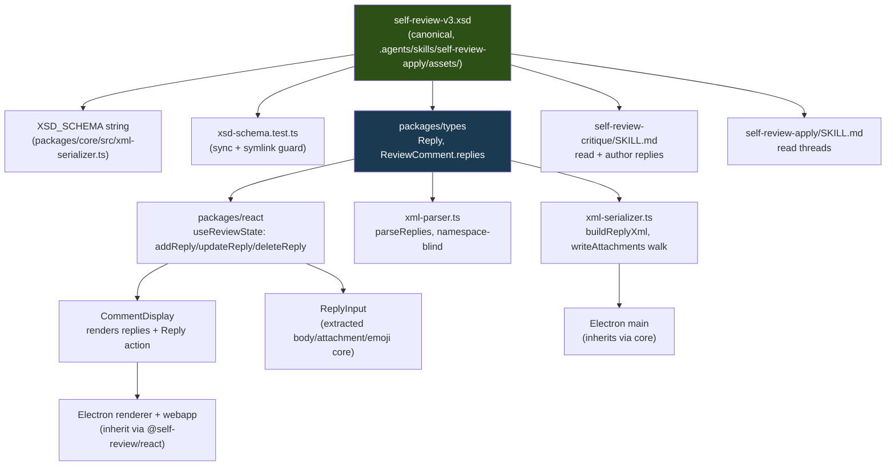
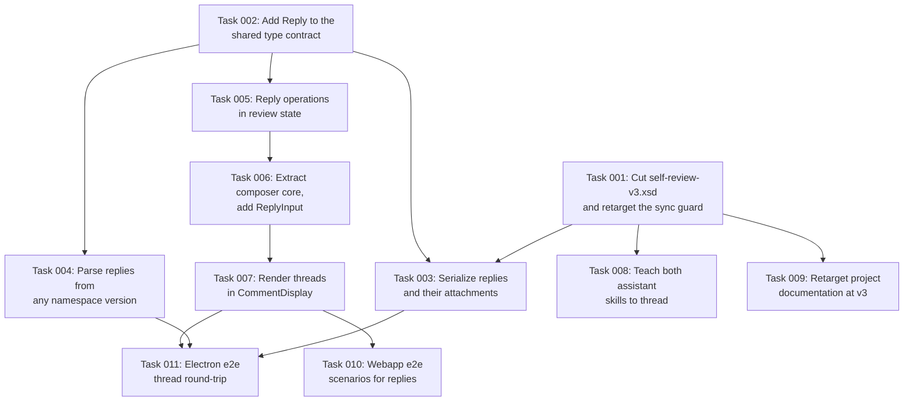

# Plan: Threaded Comment Replies

## Original Work Order

> I want to add a new feature to self-review. Whenever we execute one of the ways to generate a
> review.xml, that be by launching self-review and manually adding some comments or by using the
> self-review critique skill, we can then load self-review with that review.xml. This pre-loaded
> with some comments and also marks us viewed whatever the files that were viewed are in the XML
> document. We also have some confidence data and that is all loaded inside of the self-review UI.
> that be through the React library or via the desktop app. What I want to do is I want to be able
> to reply to the pre-existing comments. I want also LLMs to know how to reply to existing comments
> by updating the XML document. right now we don't have ideas for comments and that limits the
> relationship ability for comments on replies. How do we link them? We also don't have timestamps
> for comments which also limits our ability to have the implied conversation sorting that we need
> for this. We need to be able to reply and for that a comment comes first and then the reply comes
> after and then the reply to the reply comes after that. So we are lacking some underlying
> infrastructure that we may need to include. I would like to avoid creating a new schema. So
> probably we want to find a way to make this optional. If that is possible, if it's not possible,
> I'm totally okay bumping the schema. I mean, it's just a nice to have the two to avoid to bump up
> the schema. An implicit ID is the combination of the comment for the file path plus the line start
> plus the line end. Just adding comments on the same file with the same line start and same line
> end will render them correctly stacked on one another. However, the order is what is important
> here. So I want you to take all that information. and come up with the best solution and interview

## Plan Clarifications

| Question | Answer |
| --- | --- |
| Who consumes the resulting XML, and should that shape the design? | Out of scope. The file is the user's prerogative — it may go back to `self-review-critique` for another round, or to `self-review-apply` where the human's last word acts as tie-breaker. The format must serve both without preferring either. |
| Can two independent conversations exist on the same file + line-start + line-end anchor? | Yes, routinely. Therefore the implicit ID (path + line range) identifies a *location*, not a *comment*, and cannot serve as thread identity. |
| Explicit `<thread>` wrapper with N flat `<comment>` children, or replies nested inside the root comment? | Nested. The root `<comment>` *is* the thread; its anchor, category, severity and confidence are the thread's metadata by virtue of being first. A `<thread>` element has identical expressive power for this goal at roughly 5–10× the churn. |
| Is thread-level mutable state (`resolved`, renegotiated severity) wanted? | No. The review is one-shot (open → review → close), so threads do not outlive the session the way GitHub PR threads do. The last reply carries the verdict; no consumer would trust a `severity` attribute over the human's final word. |
| Can a `<reply>` carry a `<suggestion>`? | No. A suggestion on the root *and* on reply #3 forces every consumer to invent its own precedence rule. A concrete counter-proposal goes in the reply body as a fenced code block, which the UI already renders. |
| Timestamps on comments or replies? | No. Document order already gives strict conversation ordering, and it is authoritative in a way wall-clock is not when an LLM writes four replies in the same millisecond. `<review timestamp>` is unchanged. |
| Reply nesting depth? | Flat linear list. Reply #3 addressing reply #1 is conveyed in prose, not structure. |
| Explicit comment IDs persisted in the XML? | No. Parent linkage comes from the XML tree, ordering from document order. Nothing needs naming. |
| **Backwards compatibility / schema version** (explicitly confirmed per PRE_PLAN) | **Bump to `urn:self-review:v3`** with a new `self-review-v3.xsd`. `self-review-v1.xsd` and `self-review-v2.xsd` stay frozen on disk for consumers of older documents. |
| What happens when `--resume-from` loads a v1/v2 document and the user saves? | Read any, always write v3. The parser is namespace-blind today and stays that way, so old documents load at zero cost; saving silently rewrites as v3. |
| Which comments get a Reply affordance? | All of them, uniformly, regardless of author — including ones written in the current session. |
| Edit/delete permissions on replies? | Ungated, matching root comments, which are not author-gated today (`CommentDisplay.tsx:118`). Gating replies would make an LLM's reply more protected than its own comment. |
| Do the skill docs change? | Yes, both, read **and** write. `self-review-critique` and `self-review-apply` must both read threads, and critique must know how to author `<reply>` elements when re-run against a document containing human pushback. |
| Does `.agents/skills/st-code-review/SKILL.md` come along? | No — out of scope, reported only. See Notes. |

## Executive Summary

Today a review document records a set of independent assertions. When `self-review-critique`
claims a finding the human disagrees with, the only ways to record the disagreement are to edit the
LLM's comment (destroying its position) or to add a disconnected comment on the same line (losing
the linkage). There is no way to represent "the LLM said X, the human answered Y, the LLM conceded
Z" as a single legible unit.

This plan adds an optional, ordered list of `<reply>` elements nested inside `<comment>`. The root
comment *is* the thread: it owns the anchor and all thresholding metadata, and its replies are turns
in a conversation about it. Parent linkage falls out of the XML tree and ordering falls out of
document order, so the feature needs no comment IDs, no timestamps, and no `<thread>` wrapper — the
three pieces of infrastructure the work order assumed were prerequisites. A reply is deliberately
thin: `body`, an optional `author`, and optional `attachment` elements. It carries no category, no
severity, no confidence, and no suggestion, because all four are properties of the *finding*, and
the finding is the root.

The schema moves to `urn:self-review:v3`, following the precedent set when v2 was cut from v1 to add
two optional attributes. The parser is namespace-blind, so every existing v1 and v2 document
continues to load without change; the serializer always emits v3. Both assistant skills learn to
read threads and to author replies, so the conversation can proceed unattended as well as in the UI.

## Context

### Current State vs Target State

| Current State | Target State | Why? |
| --- | --- | --- |
| A `<comment>` is a terminal assertion with no way to respond to it | A `<comment>` may carry an ordered list of `<reply>` children | Disagreeing with an LLM finding currently requires destroying its position or orphaning the response |
| Disagreement is recorded by editing the LLM's comment or adding a sibling comment on the same anchor | Disagreement is recorded as a reply nested under the comment it answers | Sibling comments on the same anchor are ambiguous: the anchor identifies a location, not a comment |
| `ReviewComment.id` is regenerated on every parse (`xml-parser.ts:77`), so it is a React key, not an identity | Unchanged — still a render key, still not persisted | Nesting supplies linkage, so no persisted identity is needed; making `id` durable would be infrastructure with no consumer |
| Schema namespace is `urn:self-review:v2` | Schema namespace is `urn:self-review:v3`, with a new `self-review-v3.xsd` | Precedent: v2 was cut from v1 purely to add two optional attributes |
| `self-review-v1.xsd` frozen on disk; `self-review-v2.xsd` is live | Both v1 and v2 frozen on disk; v3 is live | Consumers holding older documents keep a working validator |
| Parser ignores namespaces entirely (`fast-xml-parser`, no NS options) | Unchanged — deliberately namespace-blind | Makes reading v1/v2/v3 free; the cost of the bump lands entirely on the write side |
| `xsd-schema.test.ts` guards two synced copies of the v2 schema plus two skill symlinks | Same guarantees, retargeted to v3 | The sync invariant is the thing that stops the embedded and on-disk copies from drifting |
| `ReviewComment` has no reply field | `ReviewComment` gains `replies?: Reply[]`; a new `Reply` interface is added | `packages/types` is the canonical contract for main, renderer, core and react |
| `CommentDisplay` renders a comment and nothing beneath it | `CommentDisplay` renders its replies beneath it and offers a Reply action | The React package is the single implementation both the webapp and Electron consume |
| `CommentInput` bundles body, category selector, suggestion panel, attachments and emoji autocomplete | Its body/attachment/emoji core is extracted so both the comment editor and a thinner reply composer consume it | AGENTS.md: extract before extending; a reply has no category and no suggestion |
| `writeAttachments` walks `file.comments[].attachments` only | It also walks `file.comments[].replies[].attachments` | A reply attachment that is never written to `.self-review-assets/` produces a dangling `path` reference in valid XML |
| Both skill docs describe a flat comment list | Both describe threads; critique additionally describes when and how to author a reply | Without a write-side instruction no LLM ever replies, and the feature is human-only |

### Background

Three design candidates were considered and two rejected:

1. **Implicit threading by document order alone** (zero schema change). Rejected: sibling comments
   on an identical anchor cannot distinguish "a reply" from "a second independent finding on the
   same line", and multiple independent conversations per anchor are routine.
2. **Explicit `<thread>` wrapper** containing flat `<comment>` children with thread-level metadata.
   Rejected on cost: `<comment>` would stop being a child of `<file>`, invalidating every existing
   document, forcing a rewrite of both skills, and turning `ReviewComment[]` into `Thread[]` through
   core, react and the Electron renderer. It buys exactly one capability — thread-level mutable
   state — which was ruled out as unwanted.
3. **Nested `<reply>` under `<comment>`** (chosen).

The chosen shape has one acknowledged wart, accepted deliberately rather than discovered later:
**the root comment is privileged.** It owns the anchor and all thresholding metadata; replies own
none. That asymmetry is the price of not restructuring `<file>`.

A note on the version bump: it was chosen despite being technically unnecessary for compatibility.
Because the parser never inspects the namespace, an in-place additive change to v2 would also have
worked, and a bump does not protect a stale consumer — it makes such a consumer fail on an
unrecognized root namespace instead of on an unrecognized child element. The bump was chosen for
consistency with the v1→v2 precedent and so the presence of replies is legible from the namespace
alone.

## Architectural Approach

The change moves outward from the schema: XSD defines the contract, the shared types encode it, core
reads and writes it, react renders and edits it, and the skill docs teach LLMs to participate.



### Schema v3

**Objective**: Define the reply contract as the single source of truth that every other component
derives from.

Create `self-review-v3.xsd` with `targetNamespace="urn:self-review:v3"`. It is a copy of v2 with two
changes: a `ReplyType` complex type, and an optional unbounded `<reply>` element appended to the end
of `CommentType`'s sequence, after `<attachment>`.

`ReplyType` contains a required `<body>` element and zero or more `<attachment>` elements, and
carries one optional `author` attribute with the same semantics as `CommentType/@author` (present ⇒
machine-authored; absent ⇒ the human reviewer). It has no line attributes, no `category`, no
`severity`, no `confidence`, and no `<suggestion>`.

The schema's header comment must carry a "Changes from v2" block, matching the existing "Changes
from v1" block, and the `ReplyType` annotation must state the four load-bearing rules explicitly,
because the XSD is fed to LLMs as the specification:

- Replies are ordered; document order is conversation order and is the only ordering signal.
- Replies are flat, never nested inside one another.
- A reply carries no thresholding metadata; the root comment's `severity`/`confidence` govern the
  whole thread.
- A reply carries no `<suggestion>`; a counter-proposal goes in the body as a fenced code block.

`self-review-v2.xsd` is frozen alongside `self-review-v1.xsd` and must not be edited. AGENTS.md's
XSD-sync convention is retargeted at v3, and `xsd-schema.test.ts` follows: same two-copy byte-equality
guarantee, same symlink assertions, same real-validator round-trip, now against v3.

Illustrative document shape (specification, not implementation):

```xml
<review xmlns="urn:self-review:v3" timestamp="...">
  <file path="src/parse.ts" change-type="modified" viewed="true">
    <comment new-line-start="42" new-line-end="44"
             author="Claude Opus 5" severity="major" confidence="medium">
      <body>`parseId` can return undefined here.</body>
      <category>bug</category>
      <reply>
        <body>The caller at line 40 guarantees non-null.</body>
      </reply>
      <reply author="Claude Opus 5">
        <body>Confirmed — withdrawing.</body>
      </reply>
    </comment>
  </file>
</review>
```

### Shared Types

**Objective**: Encode the contract once so main, renderer, core and react cannot disagree about it.

`packages/types/src/index.ts` gains a `Reply` interface — `id` (in-memory render key only), `body`,
optional `author`, optional `attachments` — and `ReviewComment` gains an optional `replies` array.

`Reply.id` must be documented as **not persisted**, mirroring `ReviewComment.id`, which is
regenerated on every parse. Nothing in the XML names a reply; the tree and document order carry all
the linkage.

### Core: Serializer

**Objective**: Emit v3 documents whose reply attachments actually exist on disk.

`buildXml` switches the root `xmlns` to `urn:self-review:v3`, and `serializeReview` validates against
the v3 schema. `buildCommentXml` emits `<reply>` children after its attachments, in array order.

Two reuse obligations, per AGENTS.md's no-duplication rule:

- Attachment element emission is currently inline in `buildCommentXml`. It is needed identically for
  replies, so it is extracted to a single helper both call sites use rather than copied.
- `writeAttachments` currently walks comment attachments to copy image blobs into
  `.self-review-assets/` and strip in-memory `data` buffers. It must also walk reply attachments.
  Missing this produces XML that validates but references files that were never written — a silent
  failure with no error surface. This is the single highest-risk detail in the serializer work.

### Core: Parser

**Objective**: Read replies, and keep reading every document ever written.

`parseReviewXmlString` gains reply parsing inside its per-comment loop, using the same
array-or-single normalization `fast-xml-parser` forces everywhere else in the file. The parser stays
namespace-blind: no namespace option is added, so v1, v2 and v3 documents parse identically. A
document with no `<reply>` elements yields `replies` undefined, not an empty array, matching how
`attachments` is already handled.

Attachment parsing is currently inline in the comment loop and derives synthetic ids as
`${comment.id}-att-${i}`. It is needed identically for replies and is extracted to a shared helper
that takes an id prefix, so replies produce `${reply.id}-att-${i}` without a second copy of the
logic.

### React UI

**Objective**: One implementation of the reply affordance, inherited by both the webapp and Electron.

`useReviewState` gains `addReply`, `updateReply` and `deleteReply`, following the shape of the
existing comment operations and locating a reply by comment id plus reply id. All three are exposed
through `ReviewContext`.

`CommentDisplay` renders its comment's replies beneath the comment body, visually indented and
attributed the same way comments are (author name with a bot icon, or "You" with a person icon), and
offers a Reply action on **every** comment regardless of author. Reply edit and delete controls are
ungated, matching root comments.

The reply composer is where the extract-before-extending rule bites. `CommentInput` today bundles the
MDEditor body, emoji autocomplete, the attachment drop zone, the category selector and the suggestion
panel. A reply needs the first three and must not offer the last two. The correct move is to extract
the body/emoji/attachment core into a shared component that both `CommentInput` and a new thinner
reply composer consume — not to add a prop to `CommentInput` that hides half its UI, and not to
copy-paste it.

### Assistant Skills

**Objective**: Let the conversation continue unattended, not just in the UI.

`self-review-apply/SKILL.md`: update its non-obvious-semantics list and its `xmllint` invocation to
v3, and state that a thread's replies must be read in order and that **the last human turn is the
tie-breaker** over any earlier machine assertion, including over the root comment's `severity` and
`confidence`.

`self-review-critique/SKILL.md`: same v3 updates, plus write-side instruction. When re-run against a
document that already contains comments, it must append `<reply>` elements to existing threads rather
than emitting duplicate root comments for findings it already raised; it must set `author` on every
reply it writes, consistent with the existing rule for comments; and it must not attempt to attach a
`<suggestion>` or thresholding attributes to a reply. It should also be told the honest thing: a
human reply that refutes a finding is evidence the finding was wrong, and conceding is a valid and
expected turn.

Both skill directories are reached through symlinks from `.opencode/skills/`, which must not be
replaced with copies — `xsd-schema.test.ts` asserts the symlinks are intact, and a drifted copy would
win nondeterministically under opencode.

## Risk Considerations and Mitigation Strategies

<details>
<summary>Technical Risks</summary>

- **Reply attachments are written into the XML but never copied to `.self-review-assets/`**: the
  `writeAttachments` walk is a separate code path from serialization, so a reply attachment can
  serialize into a schema-valid document while its blob is silently dropped. There is no error
  surface for this.
  - **Mitigation**: treat the attachment walk as a first-class requirement rather than a detail, and
    cover it with a unit test that serializes a review whose *only* attachment hangs off a reply and
    asserts the asset file exists on disk.
- **The two XSD copies drift**: the canonical file and the `XSD_SCHEMA` string in
  `xml-serializer.ts` must stay byte-identical, and a v3 bump touches both plus the test that guards
  them.
  - **Mitigation**: `xsd-schema.test.ts` already fails on drift; retarget it to v3 in the same change
    that introduces the schema, never after.
- **Silent v2→v3 upgrade on resume**: loading a v2 document and saving rewrites it as v3 with no
  notice. This was chosen deliberately, but it means a user cannot round-trip a document through the
  app and keep its original namespace.
  - **Mitigation**: accept and document it in AGENTS.md. The frozen v1 and v2 XSD files remain on
    disk so any external consumer retains a validator for documents it already holds.
- **`fast-xml-parser` array normalization**: a single `<reply>` parses as an object, several as an
  array — the same trap the file already works around for `file`, `comment` and `attachment`.
  - **Mitigation**: reuse the established normalization idiom; unit-test the one-reply and
    three-reply cases explicitly, since one-reply is the case that looks correct and is not.
- **XML escaping in reply bodies**: replies are the most likely place for a human to paste a fenced
  code block containing `<`, `&` or `]]>`, precisely because suggestions are unavailable there.
  - **Mitigation**: reply bodies go through the same `escapeXml` path as comment bodies; test with a
    body containing a fenced block with angle brackets and ampersands.

</details>

<details>
<summary>Implementation Risks</summary>

- **`CommentInput` is refactored rather than extracted**: the tempting shortcut is a `variant="reply"`
  prop that conditionally hides the category selector and suggestion panel. That produces a component
  with two modes and a growing set of mutually exclusive props.
  - **Mitigation**: extract the shared body/emoji/attachment core into its own component first, then
    build both the comment editor and the reply composer on top of it. AGENTS.md mandates this order.
- **Scope creep toward the rejected designs**: `resolved` state, per-reply severity, suggestions in
  replies, reply nesting and persisted comment IDs are all one small step away and all explicitly
  ruled out.
  - **Mitigation**: they are enumerated as non-goals in Success Criteria below; any of them appearing
    in the diff is a plan violation, not a bonus.
- **The critique skill duplicates instead of replying**: when re-run against an existing document,
  the path of least resistance for an LLM is to regenerate all findings as fresh root comments,
  producing duplicates rather than a conversation.
  - **Mitigation**: make "append a reply to the existing thread, do not re-raise a finding already
    present" an explicit exit criterion in the skill doc, not a suggestion.

</details>

<details>
<summary>Quality Risks</summary>

- **Replies are unreachable in the Electron app despite working in the webapp**: the two share
  `@self-review/react`, but the Electron app imports package *source* by relative path rather than
  through the workspace symlink, so an import that resolves in the Vite dev server can still be
  missing from the Electron build.
  - **Mitigation**: the self-validation step below exercises the real Electron app end to end, not
    only the webapp e2e suite.
- **Thread rendering degrades on long conversations**: a comment with many replies inside a diff
  gutter can overflow its container or push the diff layout.
  - **Mitigation**: capture a screenshot of a thread with at least three replies during validation
    and confirm the diff layout holds in both split and unified views.

</details>

## Success Criteria

### Primary Success Criteria

1. A `self-review-v3.xsd` exists with `targetNamespace="urn:self-review:v3"`, defines `ReplyType`,
   and appends an optional unbounded `<reply>` to `CommentType`. `self-review-v1.xsd` and
   `self-review-v2.xsd` are unmodified on disk.
2. `xsd-schema.test.ts` passes: the canonical v3 file and the embedded `XSD_SCHEMA` string are
   byte-identical, both `.opencode/skills/` entries are still symlinks, and serializer output
   validates against the real schema.
3. A review containing a comment with three replies serializes to a document that validates against
   v3, and parsing that document back yields the same three replies in the same order, with authors
   preserved and reply bodies byte-identical.
4. `--resume-from` loads an existing `urn:self-review:v2` document without error, its comments appear
   in the UI, and saving writes a `urn:self-review:v3` document.
5. Every comment in the UI offers a Reply action regardless of author; replies render beneath their
   comment with correct author attribution; and replies can be edited and deleted without
   author-gating.
6. A reply carrying an image attachment serializes with an `<attachment>` element **and** the
   referenced file exists under `.self-review-assets/`.
7. Both skill docs reference v3, describe reply semantics, and `self-review-critique` instructs
   appending replies to existing threads rather than re-raising findings as new root comments.
8. **Non-goals absent from the diff**: no `<thread>` element, no `resolved` state, no per-reply
   `category`/`severity`/`confidence`, no `<suggestion>` inside a reply, no nested replies, no
   persisted comment or reply IDs, and no comment-level timestamps.

## Self Validation

Execute these after all tasks are complete. Steps 4–7 must run on the host machine, not in the dev
container, per AGENTS.md.

1. Run `npm run test:unit` and confirm the whole suite passes, with particular attention to
   `packages/core/src/xsd-schema.test.ts`, `xml-parser.test.ts` and `xml-serializer.test.ts`.
2. Hand-author a fixture `review.xml` in the `urn:self-review:v3` namespace containing one comment
   with three replies (mixed authored and unauthored) and one comment with none, then run
   `xmllint --schema .agents/skills/self-review-apply/assets/self-review-v3.xsd fixture.xml --noout`
   and confirm it reports the document valid.
3. Take a real `urn:self-review:v2` document from a previous review, run
   `xmllint --schema .agents/skills/self-review-apply/assets/self-review-v2.xsd` on it to confirm the
   frozen v2 schema still validates it, then confirm the same document still validates against v2
   after the change (proving v2 was not edited).
4. Launch the Electron app with `--resume-from` pointed at the fixture from step 2, and screenshot
   the diff pane. Confirm the three replies render beneath their comment in document order, with the
   authored ones showing a bot icon and model name and the unauthored one showing "You".
5. In that same running app, add a reply to a comment that has none, add a second reply to the
   three-reply thread, edit one existing reply and delete another. Click Finish Review, then read the
   written XML from disk and confirm the reply set and its order match what the UI showed.
6. Repeat step 5 but attach an image to the new reply. After saving, list `.self-review-assets/` and
   confirm the referenced file is present and non-empty.
7. Run the webapp e2e suite (`npm run test:e2e`) and the Electron e2e suite
   (`npm run test:e2e:electron`) on the host, and confirm both pass.
8. Run `/self-review-critique --staged` against a working tree, then re-run it against its own output
   and confirm the second run appends `<reply>` elements to existing threads rather than emitting
   duplicate root comments, and that every reply it wrote carries an `author` attribute.

## Documentation

- **`AGENTS.md`** — retarget the XSD-sync convention and the "XSD Schema Location" section at
  `self-review-v3.xsd`; record that v1 and v2 are both frozen; add reply semantics to the Critical
  Conventions list alongside the existing severity/confidence entry; note that resuming a v1/v2
  document silently upgrades it to v3 on save.
- **`docs/PRD.md`** — add a short subsection describing threaded replies as a product capability,
  stating what a reply can and cannot carry and that the conversation order is document order. Keep
  it brief; this is one feature, not a restructure.
- **`README.md`** — update the single line at `README.md:275` showing `self-review-v2.xsd` in the
  directory tree.
- **`.agents/skills/self-review-apply/SKILL.md`** and
  **`.agents/skills/self-review-critique/SKILL.md`** — as described in the Assistant Skills section.
  Reached through symlinks from `.opencode/skills/`; do not replace the symlinks with copies.
- **`tests/webapp-features/03-commenting.feature`** — add scenarios for replying to a comment,
  replying to a comment that already has replies, and editing and deleting a reply.
- **`tests/features/07-xml-output.feature`** and **`tests/features/08-resume.feature`** — add
  scenarios covering reply serialization and the v2-in / v3-out resume round-trip.
- **`.ai/kenkeep/`** — the knowledge base holds several nodes naming the v2 schema and its location
  (`map-xsd-schema-location`, `map-self-review-apply-skill`, and the v2 schema map node). These
  become stale on the bump and should be updated through the normal kenkeep flow, not edited by hand.

## Resource Requirements

### Development Skills

XSD 1.0 authoring, including the limits of what it can express (the one-line-pair-or-none rule is
already enforced in application code rather than the schema, and the reply rules are likewise
prose-in-annotation rather than schema constraints). TypeScript across a Node main process and a
React renderer. Familiarity with `fast-xml-parser`'s array-or-single normalization behavior. React
component extraction under an explicit no-duplication mandate.

### Technical Infrastructure

Existing toolchain, no new dependencies. `xmllint-wasm` for in-process validation, the `xmllint` CLI
for manual fixture checks, Vitest for unit tests, Playwright + Cucumber for both e2e tiers, and a
host machine with a display for the Electron e2e and self-validation steps.

## Integration Strategy

The change is strictly additive at every layer, which keeps the integration surface small:

- **Electron main and renderer** inherit serializer and parser behavior through `@self-review/core`
  and UI through `@self-review/react`. Neither needs its own reply code, and no IPC channel changes:
  `resume:load` already carries `ReviewComment[]`, and replies travel nested inside those objects.
- **Large-payload mode** is unaffected. Replies live on comments, not on diff hunks, and the
  `diff:load-file` lazy path does not touch review state.
- **Orphaned comments** (`--resume-from` conflict handling, where a comment's line range no longer
  matches the current diff) carry their replies with them, because replies are nested inside the
  comment object rather than referenced by anchor. No additional handling is required.
- **Ordering** needs no reconciliation logic anywhere: the in-memory `replies` array order is the
  document order is the conversation order, in all three directions.

## Notes

**Out-of-scope finding, reported not fixed.** `.agents/skills/st-code-review/SKILL.md` emits
`urn:self-review:v2` and, at line 170, requires its output to validate against
`<root>/config/schemas/self-review-v2.xsd`, restating this as an exit criterion at line 286.
`<root>` resolves to `/workspace/.ai/strikethroo`, whose `config/` directory contains only
`TASK_MANAGER.md`, `config.yaml`, `hooks/` and `templates/` — there is no `schemas/` directory and
never was. Any agent that actually performs that validation step gets a file-not-found today, on v2,
independently of this work order. It is a Strikethroo harness skill rather than a self-review
deliverable, so per PRE_PLAN scope control it stays out of this plan and should be filed separately.
Note that it will continue to emit v2 after this change lands.

**Accepted asymmetry.** The root comment is privileged: it owns the anchor, `category`, `severity`
and `confidence`; replies own none of them. This is the deliberate price of not restructuring
`<file>`, recorded here so it reads as a decision rather than an oversight when someone later asks
why a reply cannot be graded.

**On the work order's premises.** Three pieces of infrastructure the work order treated as
prerequisites — comment IDs, timestamps, and an explicit parent link — turn out to be unnecessary
under the nested design. Nesting supplies the linkage and document order supplies the sorting. This
is worth stating plainly so that a later reader does not mistake their absence for an omission.

## Execution Blueprint

**Validation Gates:**
- Reference: `/config/hooks/POST_PHASE.md`

### Dependency Diagram



### ✅ Phase 1: Establish the v3 contract
**Parallel Tasks:**
- ✔️ Task 001: Cut `self-review-v3.xsd`, sync the embedded `XSD_SCHEMA`, flip the serializer namespace, retarget `xsd-schema.test.ts` and `xml-serializer.test.ts` — `completed`
- ✔️ Task 002: Add the `Reply` interface and `ReviewComment.replies` to `@self-review/types` — `completed`

### Phase 2: Core read/write, state, and prose
**Parallel Tasks:**
- Task 003: Emit `<reply>` children, extract attachment emission, walk reply attachments in `writeAttachments` (depends on: 001, 002)
- Task 004: Parse `<reply>` children, extract prefix-parameterized attachment parsing, stay namespace-blind (depends on: 002)
- Task 005: `addReply` / `updateReply` / `deleteReply` in `useReviewState` and `ReviewContext` (depends on: 002)
- Task 008: Update `self-review-apply/SKILL.md` and `self-review-critique/SKILL.md` for v3 and reply authoring (depends on: 001)
- Task 009: Update `AGENTS.md`, `docs/PRD.md` and `README.md` for v3 and threaded replies (depends on: 001)

### Phase 3: Composer extraction
**Parallel Tasks:**
- Task 006: Extract `ComposerCore` from `CommentInput` and build `ReplyInput` on it (depends on: 005)

### Phase 4: Thread rendering
**Parallel Tasks:**
- Task 007: Render replies, the Reply affordance, and ungated reply edit/delete in `CommentDisplay` (depends on: 006)

### Phase 5: End-to-end coverage
**Parallel Tasks:**
- Task 010: Webapp e2e scenarios for reply create / order / edit / delete (depends on: 007)
- Task 011: Electron e2e scenarios for reply serialization and the v2-in / v3-out resume round-trip (depends on: 003, 004, 007)

### Post-phase Actions

Each phase ends with `POST_PHASE.md`: lint must pass and a conventional-commit for the phase must be
created before the next phase starts. Phases 1 and 2 leave the repository in a deliberately
inconsistent state with respect to the e2e suites — `tests/features/07-xml-output.feature` still
asserts `urn:self-review:v2` until Task 011 lands. That is expected and is not a gate failure: the
e2e suites cannot run in the dev container and are not part of `POST_PHASE`.

### Execution Summary
- Total Phases: 5
- Total Tasks: 11
- Maximum Parallelism: 5 tasks (in Phase 2)
- Critical Path Length: 5 phases (002 → 005 → 006 → 007 → 010/011)
