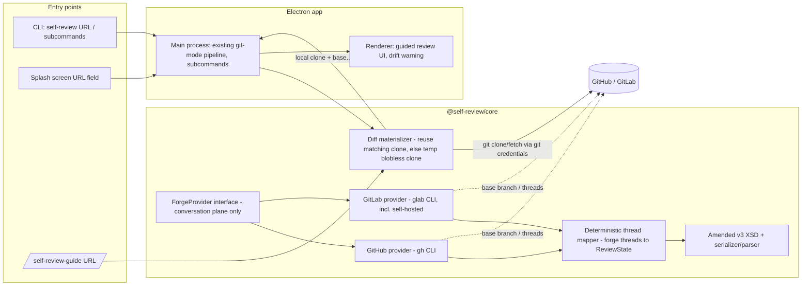
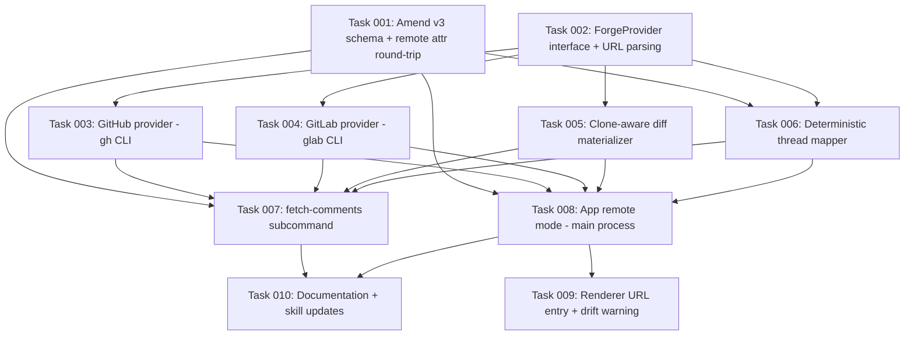

# Plan: Remote PR/MR Review (GitHub + GitLab)

## Original Work Order

> Create a Strikethroo plan for remote PR/MR review support in self-review, based on the
> confirmed intent document at docs/intent/remote-pr-review.md (GitHub + GitLab forge
> integration: guided review of remote PRs, deterministic fetch-comments/post subcommands,
> additive v3 schema amendment with remote-id and remote-* root attributes, ForgeProvider
> abstraction in @self-review/core)

The full confirmed statement of intent lives at `docs/intent/remote-pr-review.md` and is the
authoritative scope for this plan.

## Plan Clarifications

Resolved during the intent interview that produced `docs/intent/remote-pr-review.md`:

| Question | Answer |
| --- | --- |
| Why self-review instead of the forge's own review UI? | The guide. Guided walkthrough mode wrapped around the remote diff is the differentiator; commenting/posting are plumbing around it. |
| Who performs network I/O? | The app itself, as a documented opt-in exception to the "no network" rule, triggered only by a user-supplied URL. |
| Primary vs fallback transport? | `gh`/`glab` CLIs primary (private repos, comments, posting); anonymous `<URL>.diff` + raw-blob endpoints as fallback (public repos, no comment sync). |
| Is a local clone required? | No. The flow is CWD-independent; entry via CLI URL argument or a splash-screen URL field. |
| Backwards compatibility? | Required for existing v3 documents. Schema is amended **additively in place** — no v4 namespace. Local reviews stay byte-identical v3; every existing v3 document remains valid against the amended XSD. v1/v2 stay frozen. |
| Where does remote identity live? | New optional `remote-id` attribute on `<comment>`/`<reply>`. Never in `author`, which stays a pure display name (absent = human). |
| Comment mapping approach? | Fully deterministic pure code in `@self-review/core`; no LLM. Exposed as `self-review fetch-comments <URL>` and `self-review post <URL>` subcommands. |
| Degraded features in remote mode? | Full fidelity (expand-context, image/SVG previews) whenever the diff is materialized through a clone. Degradation applies only in the last-resort `.diff` tier, where expand-context is hidden and previews are unavailable. |

Resolved during the self-review of this plan document (2026-08-04):

| Question | Answer |
| --- | --- |
| What happens if the project is already cloned locally? | The clone is reused: base and head refs are fetched into it (no working-tree changes) and the existing local diff pipeline runs at full fidelity. Detection: a git repository at CWD whose remote matches the PR/MR's host and repository. |
| How does an agent (guide/critique) make sense of the PR without codebase access — a bare diff hides where a changed method is used or what a changed variable affects? | Through the materialized clone. Because materialization is git-based (existing clone or temporary clone), the skills read surrounding code from a real checkout instead of working from the diff alone. The `.diff`-only tier is accepted as blind, which is one reason it is last-resort. |
| Should the repo be cloned to a temp location and cleaned up? Does having the clone make this a peri-local task again? | Yes on both counts. When no matching local clone exists, a shallow temporary clone (base branch + PR/MR head ref) is created in the OS temp directory and removed on exit. After materialization, remote review is peri-local: everything downstream is the existing local machinery; the network is only touched for clone/fetch, thread sync, and posting. |

Resolved during plan refinement (2026-08-04, user-confirmed):

| Question | Answer |
| --- | --- |
| Do we keep the anonymous `<URL>.diff` last-resort tier? | No — deleted. Every scenario that would need it (private repo without auth, unreachable forge, oversized diff) also breaks `.diff` itself, so the tier only bought a second diff-ingestion path and the app's only degraded UI mode. Remote mode is always clone-backed, always full fidelity. |
| Who handles transport/auth for cloning and fetching? | Git, exclusively. All git-shaped work (clone, ref fetch, diff, blobs) runs through git and its own credential machinery (SSH keys, credential helpers, `gh auth setup-git`). There is no anonymous-vs-authenticated transport selection in our code. `gh`/`glab` serve only the conversation plane: base-branch lookup, thread fetch, posting. |
| Do we need `gh`/`glab` at all, given we never `git push`? | Yes, but only for the conversation plane. Correct that nothing is ever pushed to the git repository — comments are forge API objects, not git objects, so posting them (and fetching threads, and resolving the base branch on private repos) needs the forge API, which the CLIs provide with solved auth UX. Without them, a reviewable-by-git PR/MR still reviews fully; comment sync and posting report as unavailable. |
| Shallow (`--depth`) or blobless (`--filter=blob:none`) temporary clones? | Blobless. Depth-limited clones break merge-base computation when base and head diverge, corrupting three-dot diffs; blobless keeps full history and fetches blobs lazily through git (expand-context and previews included). |
| Is self-hosted GitLab in scope for v1? | Yes — git.drupalcode.org (Drupal MR review) is a prime use case. `remote-forge` stays in the schema. Launch-time detection: auto-resolved for any host by URL path shape (`/pull/N` is GitHub, `/-/merge_requests/N` is GitLab), so self-hosted GitLab needs no configuration to be recognized. |
| How is "re-running `post` pushes nothing" actually achieved? | `post` writes the forge-assigned IDs back into the `review.xml` as `remote-id` after each successful API call. Without write-back the idempotency criterion is unachievable; with per-call write-back, a partially failed run resumes without duplicating what already landed. |

Descoped during plan review (2026-08-04, user decision — supersedes the posting rows above):

| Question | Answer |
| --- | --- |
| Is posting `review.xml` back to the forge in scope? | No — descoped. This feature deals with the review only: materialize the diff, show existing threads, produce `review.xml`. Posting comments to the forge is out of scope for this plan (a possible future plan). The `post` subcommand, the posting direction of the thread mapper, suggestion-syntax translation, and the posting risks are removed. |
| Does `remote-id` survive the descope? | Yes — kept as machinery (user decision). Posting is wanted in a future feature, so `fetch-comments` records thread/comment IDs as `remote-id` now, and the parser/serializer preserve it through resume/save round-trips. Nothing consumes it in this plan; it exists so a future posting feature can distinguish fetched from new material without heuristics, and so documents saved today are not dead ends then. |
| What remains of the `gh`/`glab` role? | Base-branch lookup and thread fetch only. Both optional: without the CLI, a PR/MR that git can reach still reviews fully and thread sync reports as unavailable. |

## Executive Summary

This plan extends self-review — today a strictly local diff-review tool — to review GitHub
pull requests and GitLab merge requests directly from their URLs. The user hands the app (or
the guide skill) a PR/MR URL; the diff is materialized into a local git context, the guided walkthrough works
exactly as it does for local diffs, existing forge discussion threads appear as native comment
threads, and the finished review is written to `review.xml` as always. Posting the review
back to the forge is explicitly out of scope (descoped 2026-08-04).

The approach rests on four pillars. First, the reviewed diff is **always materialized
through local git**: an existing clone whose remote matches the URL is reused (base and head
refs are fetched into it), and otherwise a disposable blobless clone is created in a
temporary directory and removed afterwards — so the entire existing local pipeline
(diff parsing, expand-context, blob access for previews, and codebase access for the
guide/critique skills) works at full fidelity in every remote review; there is no degraded
mode. Git's own credential machinery handles all transport and auth for cloning and
fetching; our code contains no transport selection. Second, a `ForgeProvider` abstraction in
`@self-review/core` covers only the **conversation plane** — URL parsing and forge
detection, base-branch lookup, thread normalization — behind one interface with GitHub and
GitLab implementations backed by the `gh`/`glab` CLIs; when the CLI is absent, the review
itself is unaffected and only thread sync reports as unavailable. Third, the mapping from forge discussion
threads to `review.xml` is deterministic pure code — no LLM in the pipeline — exposed as a
headless `fetch-comments` subcommand so skills, CI, and the app share one implementation.
Fourth, the v3 schema is amended additively (optional `remote-url`, `remote-base-sha`,
`remote-head-sha`, `remote-forge` root attributes, plus `remote-id` on comments and replies
as forward machinery for a future posting feature) so remote provenance and drift detection
are first-class while every existing v3 document and every purely local review remains
untouched.

The outcome: the guide — self-review's differentiator, which no forge offers — becomes usable
on the diffs where it matters most, large agent-authored PRs, without the user manually
cloning or configuring anything (any required clone is a disposable implementation detail)
and without corrupting the tool's local-first posture beyond one documented, user-triggered
exception.

## Context

### Current State vs Target State

| Current State | Target State | Why? |
| --- | --- | --- |
| self-review only reviews local git diffs or directories | Accepts a GitHub PR / GitLab MR URL as a diff source (CLI arg and splash-screen field) | The guide is the product; PRs/MRs are where agent-authored diffs actually land |
| Zero runtime network access (except version check) | Documented opt-in exception: network I/O only when the user supplies a forge URL | Remote review is impossible without it; the exception is explicit, user-triggered, and documented |
| Existing PR/MR discussion is invisible while reviewing | Forge threads appear as v3 comment threads (root + ordered replies, `author` from the forge) | Reviewing without existing discussion context duplicates and contradicts prior review work |
| `<review>` source attributes cover git mode and directory mode only | Third mutually exclusive source shape: `remote-url` + `remote-base-sha` + `remote-head-sha` + `remote-forge` | Consumers (`--resume-from`, `self-review-apply`, guide skill) must be able to re-materialize the reviewed diff and detect drift |
| Guide skill takes git diff arguments only | `/self-review-guide <PR-URL>` resolves the URL through the same provider machinery | One run yields the guide sidecar for a remote PR just as for a local diff |

### Background

- The app's audience is solo developers reviewing large AI-generated changes. On forges these
  arrive as PRs/MRs whose flat alphabetical file lists offer no orientation; guided mode fixes
  exactly that, but today only for local diffs.
- The "no network access" convention in `AGENTS.md` is load-bearing and stays the default. The
  version-check exception establishes the precedent for a narrow, documented carve-out.
- Schema history: v1 and v2 are frozen; v3 shipped in release v1.41.0 and is the current write
  version. The freeze convention exists so holders of older documents keep a working
  validator. Additive-optional amendment of v3 preserves that guarantee (all existing v3
  documents validate against the amended XSD) while avoiding namespace churn. The accepted
  trade-off: a *remote-enabled* document fails against a stale copy of the v3 XSD.
- The v3 threaded-replies model (root comment owns anchor/category/severity/confidence;
  replies are flat, ordered, body + optional `author`) maps directly onto forge review
  threads. GitLab discussions are first-class threads; GitHub review comments form threads
  via `in_reply_to_id`. Both normalize into the same shape.
- Anchoring facts that shape the design: forge line comments carry path/line/side data that
  maps deterministically onto the exactly-one-pair rule (`newLine*` for added/context lines,
  `oldLine*` for deleted lines); GitHub comments on outdated diffs have no valid anchor and
  become file-level comments; GitLab positions require base/head SHAs, which reinforces
  recording them.
- Materialization facts that shape the design: blobless clones (`--filter=blob:none`) make
  a temporary clone cheap even for large repositories while keeping full history, so
  merge-base and three-dot diffs stay correct (depth-limited clones break them) and blobs
  arrive lazily through git for expand-context and previews. Both forges expose PR/MR head
  refs as well-known git refs (`refs/pull/N/head` on GitHub, `refs/merge-requests/N/head`
  on GitLab), fetchable by plain git with no API involved. Git's credential machinery
  (SSH keys, credential helpers, `gh auth setup-git`) covers public and private repos alike.
  Once a clone exists, the diff, expand-context, blob previews, and skill codebase access
  are all existing local machinery — remote review is peri-local after one materialization
  step, and the forge API is needed only for the base-branch name and threads.
- Forge detection is derivable from URL path shape — `/pull/N` is GitHub,
  `/-/merge_requests/N` is GitLab — which covers self-hosted GitLab hosts such as
  git.drupalcode.org (a prime use case: Drupal MR review) with zero configuration.
  `remote-forge` still lives in the document so consumers need not re-derive it.
- `.self-review.yaml`, the existing config plumbing, `--resume-from`, large-payload mode, and
  the guide sidecar discovery all continue to work unchanged in remote mode; remote is a new
  diff *source*, not a new review model.

## Architectural Approach

### Schema Amendment (v3, additive)

**Objective**: Give `review.xml` first-class remote provenance and round-trip identity without
breaking any existing v3 document or changing local-review output.

Amend `self-review-v3.xsd` in place with optional attributes only: `remote-url`,
`remote-base-sha`, `remote-head-sha`, and `remote-forge` (enumeration: `github`, `gitlab`)
on the review root as a third mutually exclusive source shape alongside
`git-diff-args`/`repository` and `source-path`; plus `remote-id` on `CommentType` and the
reply type. `remote-id` is deliberate forward machinery: `fetch-comments` records the
forge's thread/comment IDs in it, the parser and serializer preserve it through
resume/save round-trips, the UI ignores it, and nothing else consumes it in this plan — it
exists so a future posting feature can distinguish fetched from new material without
heuristics. `remote-forge` exists so
document consumers need not re-derive the forge from the URL. The
serializer emits these attributes only when set (mirroring the severity/confidence pattern);
the parser reads them tolerantly and leaves them undefined when absent. `author` semantics are
explicitly untouched: display name only, absent means human, last-human-turn tie-breaker
preserved. Remote identity never rides in `author`.

Both XSD copies (skill asset and the embedded `XSD_SCHEMA` string in
`packages/core/src/xml-serializer.ts`) change together; the byte-identity sync test enforces
this. The freeze convention text in `AGENTS.md` is reworded to: v1/v2 frozen; the current
version may gain optional attributes additively.

### Diff Materialization (always clone-backed)

**Objective**: Turn a PR/MR URL into a local git context, so everything downstream — diff
parsing, expand-context, blob previews, and skill codebase access — is the existing local
machinery running at full fidelity. There is no degraded mode.

Two paths, with the chosen path reported on stderr:

1. **Existing clone.** If CWD is inside a git repository whose remote matches the URL's host
   and repository, fetch the PR/MR base and head refs into it (read-only: no checkout, no
   working-tree changes) and produce the diff with local git against the fetched SHAs.
2. **Temporary clone.** Otherwise, create a blobless clone (`--filter=blob:none`, preserving
   full history so merge-base and three-dot diffs stay correct) in an OS temp directory,
   fetch the PR/MR head ref, run the same local pipeline against it, and remove it on exit.

All transport and auth belong to git: clone and fetch run through git's own credential
machinery (SSH keys, credential helpers, `gh auth setup-git`), and head refs come from the
forges' well-known git refs (`refs/pull/N/head`, `refs/merge-requests/N/head`) — no forge
API is involved in materialization except one base-branch lookup through the provider. If
git cannot reach the repository, materialization fails with git's own error; there is no
alternative ingestion path. Materialization fetches the live head by construction, so the
drift comparison against a recorded `remote-head-sha` happens here for free — no dedicated
network check exists anywhere.

**Binding for task generation**: after materialization, remote mode *is* git mode — the app
runs the existing git-mode pipeline against the clone path and the `base...head` range. The
only genuinely new UI surfaces are the splash-screen URL field and the drift warning.

### ForgeProvider Abstraction

**Objective**: Isolate every forge-specific behavior behind one interface in
`@self-review/core` so the app, subcommands, and skills share a single implementation, and a
future forge is an additional implementation rather than a redesign.

The provider owns the **conversation plane only**; everything git-shaped belongs to the
materializer. The interface covers: URL parsing and forge detection (owner, repo, number,
host; forge derived from URL path shape — `/pull/N` is GitHub, `/-/merge_requests/N` is
GitLab — which recognizes self-hosted GitLab hosts such as git.drupalcode.org with zero
configuration), base-branch lookup, and `fetchThreads` (normalized discussion threads). Two
implementations, GitHub and GitLab, each backed by its forge CLI (`gh`/`glab`, which also
solve auth for self-hosted hosts). There is no transport fallback: when the CLI is absent
or unauthenticated, the review itself proceeds untouched and the provider reports thread
sync as unavailable on stderr. All child-process execution follows the existing
`git.ts` patterns in the main process; core stays testable with mocked transports.

### Deterministic Thread Mapping

**Objective**: Convert forge discussion threads to v3 comment threads with pure, fully
testable code — no LLM, no heuristics. Fetch-only: the posting direction was descoped.

Forge threads normalize to root comment + ordered replies; forge usernames become `author`
values; thread/comment IDs are recorded as `remote-id` (forward machinery, no consumer in
this plan); line anchors map onto the exactly-one-pair rule (new-side lines to
`newLineStart`/`newLineEnd`, old-side lines to `oldLineStart`/`oldLineEnd`); GitHub
comments with outdated anchors degrade to file-level comments; GitLab fetch defaults to
unresolved threads only, with an option to include all.
The mapper lives in `@self-review/core` beside the diff parser and serializer.

### Headless Subcommand

**Objective**: Expose thread fetching as a first-class CLI operation usable without the
GUI, by skills, and in scripts.

One subcommand on the existing binary: `self-review fetch-comments <URL>` writes a v3
`review.xml` with remote provenance, per-thread `remote-id`s, and every file marked
viewed-appropriate for resume.
This is the first headless mode of a GUI-one-shot binary, so CLI parsing in
`src/main/cli.ts` grows explicit subcommand routing that bypasses window creation. It
honors the existing `output-file` config and stderr-only logging.

### App Remote Mode

**Objective**: Make the GUI review experience work end-to-end from a URL, whether or not the
user already has a clone.

The main process recognizes a forge URL as its argument, runs the materializer, then runs
the **existing git-mode pipeline** against the clone path and `base...head` range, feeding
the renderer through the existing `diff:load` / `resume:load` paths (guide sidecar discovery
as today) — remote mode composes with, rather than replaces, existing machinery. Existing
threads load exactly like `--resume-from` content. Expand-context and image/SVG previews
work unchanged in every remote review, because the diff source *is* a local git repository
(the reused clone or the temporary one); no feature is ever hidden or degraded. On open and
on resume, the head SHA fetched during materialization is compared with the recorded
`remote-head-sha`; the renderer shows a non-blocking warning when the PR/MR has moved. The
welcome/splash screen gains a URL input beside the directory picker (shadcn/ui, matching
the established welcome-screen pattern). "Finish Review" still writes `review.xml` locally
— the review's destination is the file, exactly as in local mode; nothing is ever sent to
the forge. Temporary clones live under the OS temp
directory and are removed on exit; this is a documented addition to the file-writes
convention.

### Skill Integration

**Objective**: Keep the one-run workflow — guide plus review — working for remote URLs.

`/self-review-guide` accepts a PR/MR URL and materializes the diff through the same
clone-aware machinery, then writes the guide sidecar as today. Because materialization is
always git-based, the guide and critique skills read *surrounding code* from the
materialized clone — call sites of a changed method, uses of a changed variable — instead
of reasoning from the bare diff. `/self-review-critique` inherits URL support through its
guide-first step. `self-review-apply` grows a third source branch: when `review.xml`
carries `remote-url`, it re-materializes diff context the same way (existing clone, else
temporary blobless clone).

## Risk Considerations and Mitigation Strategies

Technical Risks

- **Forge API divergence in thread anchoring** (GitHub side/line/position vs GitLab
  position objects with SHA triplets): subtle mapping bugs produce mis-anchored comments.
    - **Mitigation**: The mapper is pure code with fixture-based unit tests built from real
      captured API payloads for both forges, covering added/deleted/context lines,
      multi-line ranges, outdated anchors, and reply chains.
- **Temporary clone cost on very large repositories**: a naive clone of a huge repo makes
  URL launch unacceptably slow.
    - **Mitigation**: Blobless clones (`--filter=blob:none`) skip all blob transfer up
      front and fetch blobs lazily through git as the diff pipeline touches them, while
      keeping full history so merge-base and three-dot diffs stay correct (the reason
      depth-limited clones are explicitly not used).
- **Private repository that git cannot reach** (no SSH key, no credential helper): the
  clone fails and there is deliberately no alternative ingestion path.
    - **Mitigation**: Surface git's own error verbatim with a hint that `gh auth setup-git`
      / `glab auth git-credential` wires CLI credentials into git. This is an auth-setup
      problem with a standard fix, not something a second transport should paper over.
- **Temporary clone lifecycle**: a crash or force-quit leaks clones in the temp directory;
  a cleanup bug could delete the wrong path.
    - **Mitigation**: Clones go in a uniquely named directory under the OS temp root, created
      and removed by one owner (the materializer) using the existing exit-handler path;
      cleanup only ever deletes directories the materializer itself created this run, and
      leftovers from a crash sit in the OS temp area, which the OS reclaims.
- **PR/MR drift between fetch and resume**: line anchors reference a head that moved.
    - **Mitigation**: `remote-base-sha`/`remote-head-sha` recorded at materialization;
      resume compares against the live head (already fetched, no extra request) and warns
      so the reviewer knows the anchors may be stale.
- **Schema amendment breaks a stale validator**: a remote-enabled document fails against an
  old copy of the v3 XSD with a confusing error.
    - **Mitigation**: Accepted consciously in the intent interview. Documented in `AGENTS.md`
      alongside the reworded freeze convention; purely local documents remain byte-identical
      so only remote-feature users are exposed.

Implementation Risks

- **First headless mode in a GUI-one-shot binary**: subcommands must not initialize Electron
  windowing, and Electron-wrapped binaries have argv quirks.
    - **Mitigation**: Subcommand routing decided at the top of CLI parsing before any window
      creation; unit tests on the parser; Electron e2e coverage for the subcommand paths.
- **Scope creep via forge feature surface** (verdicts, resolved-state, live sync, more
  forges are all adjacent and tempting).
    - **Mitigation**: The intent document's out-of-scope list is binding; the provider
      interface is sized to v1 needs only.
- **Network code in a codebase with none**: no existing conventions for timeouts, retries,
  or offline behavior at runtime.
    - **Mitigation**: Follow the version-checker's minimal pattern (bounded timeout, fail
      with a clear stderr message); no retries, no background requests; every request is
      user-triggered.

Integration Risks

- **Existing consumers of `review.xml`** (critique, apply, st-code-review) meet documents
  with unfamiliar attributes.
    - **Mitigation**: Attributes are optional and ignorable; parser tolerance is tested;
      skills are updated in this plan where behavior must change (apply's third source
      branch), and unaffected consumers need no changes.

## Success Criteria

### Primary Success Criteria

1. `self-review <github-pr-url>` and `self-review <gitlab-mr-url>` open the full guided
   review UI — guide sidecar honored, existing forge threads visible as comment threads,
   expand-context and image previews working — from a directory that is not a clone of the
   target repo (via a temporary clone that is removed on exit).
2. Run from inside an existing clone of the target repo, the same command reuses that clone
   (refs fetched, no temporary clone created, working tree untouched) with identical UI
   behavior.
3. `self-review fetch-comments <URL>` deterministically produces a `review.xml` that
   validates against the amended v3 XSD, carries `remote-url`/`remote-base-sha`/
   `remote-head-sha`/`remote-forge` and per-thread `remote-id`s, renders the forge threads
   as comment threads with forge authors, and round-trips through `--resume-from` with
   `remote-id`s preserved.
4. Every pre-existing v3 `review.xml` still validates against the amended XSD, and a purely
   local review produces byte-identical output to the current release.
5. With neither `gh` nor `glab` available, a public PR/MR still opens at full fidelity via a
   temporary blobless clone, with thread sync cleanly reported as unavailable.
6. A git.drupalcode.org MR URL (self-hosted GitLab) is recognized and materialized with
   zero configuration.

## Self Validation

Concrete steps to execute after all tasks are complete (requires a scratch public GitHub repo
and a scratch GitLab project with an open PR/MR containing known threads; create them with
`gh`/`glab` as part of validation setup):

1. Run the full unit suite (`npm run test:unit`) and confirm the XSD byte-identity sync tests
   pass for the amended schema.
2. Validate backwards compatibility directly: take a `review.xml` produced by the previous
   release (fixture), run `xmllint --schema` against the amended v3 XSD, and confirm it
   validates; produce a local-mode review with the new build and diff it against the old
   build's output for byte identity.
3. Run `self-review fetch-comments <scratch-PR-URL>`, then `xmllint --schema`-validate the
   output and inspect it to confirm `remote-url`, `remote-forge`, both SHAs, and per-thread
   `remote-id`s are present and correct, and that thread order and authors match the PR.
4. Launch the app with the scratch PR URL from a directory that is not a clone (headless
   recipe from `.cursor/cloud-instructions.md` when in a container; otherwise directly), and
   capture screenshots confirming: guided tree when a guide sidecar is present, existing
   threads rendered with forge authors, expand-context working, image previews working, and
   the splash-screen URL field when launched bare. Confirm a temporary clone was created
   under the OS temp directory and is gone after exit.
5. Launch again from inside a clone of the scratch repo and confirm no temporary clone is
   created (watch the temp directory), the clone's working tree is untouched
   (`git status` clean before and after), and the UI behaves identically.
6. Add a new comment and a reply to an existing fetched thread in the UI, finish the
   review, and confirm the output `review.xml` validates, preserves the fetched threads
   with their `remote-id`s and forge authors intact (new material carries none), and that
   nothing was sent to the forge (`gh api` / `glab api` thread listing unchanged).
7. Repeat fetch + open on the GitLab scratch MR to confirm provider parity, including
   unresolved-only default fetching (resolve one thread first and confirm it is excluded).
8. Uninstall/rename `gh` in the environment, run the app with a public PR URL, and confirm
   the temporary blobless clone opens the review at full fidelity (expand-context and
   previews working) with a stderr notice that thread sync is unavailable.
9. Open a public git.drupalcode.org MR URL and confirm it is detected as GitLab from the
   URL path shape and materializes with zero configuration.
10. Run `/self-review-guide <scratch-PR-URL>` and confirm a valid guide sidecar is produced
    and picked up by the app on next launch with the same URL.

## Documentation

- `AGENTS.md`: amend the "No network access" convention with the documented remote-mode
  exception; amend the "File writes" convention with the temporary clone directory (OS temp,
  removed on exit); reword the XSD freeze convention (v1/v2 frozen, current version may gain
  optional attributes additively); document the `fetch-comments` subcommand, the remote
  source shape, `remote-id` (forward machinery, preserved on round-trip, no consumer yet),
  the materialization model, the ForgeProvider location, and the splash-screen URL entry
  point.
- `docs/PRD.md`: add the remote PR/MR review capability to the product requirements.
- `README.md` (user-facing): usage for URL launch, `fetch-comments`, and the
  materialization model (existing clone reuse, else temporary blobless clone; git's own
  credentials for private repos; `gh`/`glab` needed only for thread sync).
- Skill docs: `.agents/skills/self-review-guide/SKILL.md` and
  `.agents/skills/self-review-apply/SKILL.md` gain the URL source; XSD inline documentation
  for all new attributes.
- Kenkeep: existing schema/convention nodes flagged stale by this change (freeze wording,
  v3 schema map) should be updated during the work.

## Resource Requirements

### Development Skills

- TypeScript across Electron main process, `@self-review/core`, and React renderer.
- GitHub REST/GraphQL review-thread semantics and `gh` CLI; GitLab discussions/draft-notes
  API and `glab` CLI.
- XSD authoring and the project's schema-sync discipline.

### Technical Infrastructure

- `gh` and `glab` CLIs for development and validation (both optional at runtime by design).
- Scratch public GitHub repository and GitLab project with open PR/MR for integration
  validation.
- Existing toolchain only: no new runtime dependencies are anticipated beyond what child
  processes (`gh`, `glab`) and the standard fetch API provide; adding any runtime dependency
  requires justification against the "minimal dependencies" principle.

## Integration Strategy

Remote mode is a new diff *source* behind the existing pipeline: fetched diffs flow through
the existing diff parser, `diff:load`/`resume:load` IPC, large-payload mode, guide discovery,
and the serializer. The provider abstraction and thread mapper live in `@self-review/core`
next to the modules they extend (`git.ts`, `diff-parser.ts`, `xml-serializer.ts`,
`xml-parser.ts`), imported by the app via the established relative-path pattern. Subcommands
extend `src/main/cli.ts` without disturbing the pass-through-to-git default. All new UI uses
shadcn/ui per convention.

## Notes

- The intent document `docs/intent/remote-pr-review.md` is the binding scope statement,
  as amended on 2026-08-04 (clone-aware materialization from the plan self-review, then the
  refinement removing the `.diff` fallback and transport tiering). Its out-of-scope list
  (verdicts, live sync, resolved-state in schema, other forges, editing/deleting forge-owned
  comments) applies to every downstream task; there is no degraded remote mode anywhere.
- Posting `review.xml` back to the forge is **explicitly out of scope** (descoped
  2026-08-04). This plan is read-only toward the forge: materialize, sync threads in,
  review, write the file. Posting is wanted as a future feature, which is why `remote-id`
  ships now as consumerless forward machinery — fetched threads carry their forge IDs so a
  future posting plan can rely on documents produced today.
- `remote-forge` stays in the remote source shape so document consumers need not re-derive
  the forge. At launch time the forge is detected from the URL path shape (`/pull/N` →
  GitHub, `/-/merge_requests/N` → GitLab), which covers self-hosted GitLab hosts —
  git.drupalcode.org (Drupal MR review) is a prime use case — with zero configuration.
- Nothing is ever sent to the forge, and nothing is ever pushed to the git repository.
  `gh`/`glab` exist solely for read-only conversation-plane work (base-branch lookup,
  thread fetch); git covers all clone/fetch/diff/blob work with its own credentials.

### Change Log

- 2026-08-03: Plan created from the confirmed intent document.
- 2026-08-04: Applied plan self-review feedback — clone-aware materialization (reuse local
  clone, temp clone), skills read surrounding code from the clone, `.diff` demoted to last
  resort.
- 2026-08-04 (refinement): Deleted the `.diff` last-resort tier and all degraded-mode
  behavior; moved all git-shaped transport/auth to git itself (`gh`/`glab` = conversation
  plane only); mandated blobless clones over shallow; bound remote mode to the existing
  git-mode pipeline for task generation; corrected posting semantics (batched review for
  new threads + per-reply calls) and added `remote-id` write-back for idempotent, resumable
  posting; confirmed self-hosted GitLab (git.drupalcode.org) in scope with URL-path-shape
  forge detection; folded the drift check into materialization.
- 2026-08-04 (descope): Posting `review.xml` to the forge removed from scope entirely —
  the `post` subcommand, the posting direction of the thread mapper, suggestion-syntax
  translation, posting risks/criteria/validation steps all deleted; `gh`/`glab` reduced to
  base-branch lookup and thread fetch. Per user decision, `remote-id` is retained as
  consumerless forward machinery (written by `fetch-comments`, preserved on round-trip) so
  a future posting feature can build on documents produced today.

## Execution Blueprint

**Validation Gates:**
- Reference: `/config/hooks/POST_PHASE.md`

### Dependency Diagram

### Phase 1: Contracts (schema and provider abstraction)
**Parallel Tasks:**
- Task 001: Amend v3 schema additively and round-trip remote attributes
- Task 002: ForgeProvider interface, URL parsing, and normalized thread types

### Phase 2: Core machinery (providers, materializer, mapper)
**Parallel Tasks:**
- Task 003: GitHub provider backed by the gh CLI (depends on: 002)
- Task 004: GitLab provider backed by the glab CLI (depends on: 002)
- Task 005: Clone-aware diff materializer (depends on: 002)
- Task 006: Deterministic thread-to-ReviewState mapper (depends on: 001, 002)

### Phase 3: Entry points (headless subcommand and app remote mode)
**Parallel Tasks:**
- Task 007: Headless fetch-comments subcommand (depends on: 001, 003, 004, 005, 006)
- Task 008: App remote mode in the main process (depends on: 001, 003, 004, 005, 006)

### Phase 4: Surface (renderer UI and documentation)
**Parallel Tasks:**
- Task 009: Renderer splash-screen URL entry and drift warning (depends on: 008)
- Task 010: Documentation, conventions, and skill updates (depends on: 007, 008)

### Post-phase Actions

### Execution Summary
- Total Phases: 4
- Total Tasks: 10
