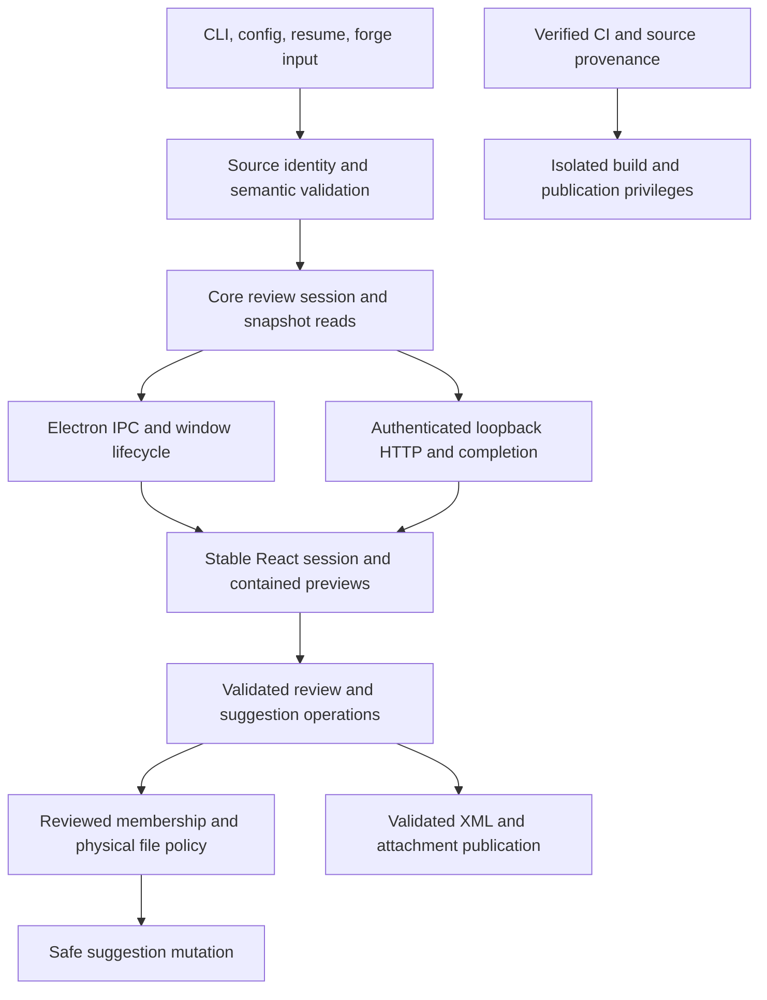
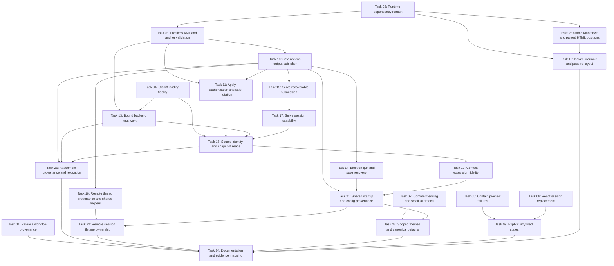

# Plan: Harden Review Integrity, Security, Persistence, and Shared Architecture

## Original Work Order

> $st-create-plan with the contents of the audit document.

The work order refers to [Codebase audit: bugs and simplification opportunities](../../../../docs/codebase-audit-2026-10-01.md), including its cross-references to [Security audit of self review](../../../../docs/security-audit-2026-10-01.md). Those documents and their evidence are the finding baseline, not a claim that every suggested implementation is already validated.

## Plan Clarifications

| Question | User answer | Binding consequence |
| --- | --- | --- |
| Should this hardening plan preserve existing review XML, CLI usage, and published package APIs, or may it introduce breaking changes? | Allow breaking changes | Compatibility layers, deprecated wrappers, and migration support are not required. Change contracts where doing so directly simplifies or hardens the approved behavior; do not introduce unrelated breaking changes. |
| Approve this scope: R01–R19, A1–A9, and the eight targeted simplifications; breaking changes allowed; optional product changes and rejected suspicions excluded? | Approve this scope | All retained finding groups and the eight simplifications are in scope. Optional changes to documented product behavior and rejected or deferred suspicions are excluded. |

## Executive Summary

This plan makes a local review dependable: ordinary quit and failed saves preserve human work, displayed content and comment anchors describe the selected snapshot, and suggestion/output operations cannot change unauthorized files. It covers the approved reliability findings R01–R19 and security findings A1–A9 across the Electron app, HTTP CLI, published React components, shared engine, and release workflow.

The approach consolidates duplicated policies and removes fragile paths where the audit demonstrated drift. Core owns source resolution, semantic validation, filesystem authorization, snapshot reads, and output publication. React owns stable rendering, bounded loading, and explicit session replacement. Each front end retains its own transport, dialogs, and lifetime behavior. Release provenance is enforced before checked-out code receives publication privileges. These are concrete improvements to existing behavior, not a new framework or product expansion.

Breaking changes are permitted, including changes to error handling, submission acknowledgement, and package interfaces. Existing contracts may remain when they already fit the requirements; no compatibility work is added merely to retain an obsolete path. Success requires direct reproductions of the audit failures, native UI evidence where the audit used jsdom, and verification of built package boundaries. This document is the PRD only; it does not generate tasks, execution phases, or application changes.

## Context

### Current State vs Target State

| Finding | Current state | Target state | Why? |
| --- | --- | --- | --- |
| R01 | User Quit bypasses confirmation; serialization/write failures exit; renderer timeout can produce empty output | Quit follows the intended save/discard/cancel workflow; failures retain the live review; failed saves cannot replace previous output | Preserve human work and earlier saved reviews |
| R02 | Failed config loading violates hook ordering; failed POST cannot retry and loses its close guard; acceptance precedes durable save | Connection errors render normally; failed submissions remain protected and retryable; success acknowledges published output | Recovery must work when the server or filesystem fails |
| R03 | Resume coerces text, normalizes original-code bytes, accepts invalid ranges, and can exit from library code | Text roundtrips correctly; anchors are semantically validated; library errors return to the host | Imported data must not corrupt suggestions or poison final save |
| R04 | Empty proposals insert a blank line; NaN reaches Apply; partial writes can be reported as refusal | Empty proposals delete the range; invalid anchors are refused; refusal leaves the original file intact | Protect the reviewed working file |
| R05 | GitLab position provenance is discarded and historical notes are treated as current | Only suggestions verified against the reviewed revision are actionable; stale discussion text remains visible | Old proposals must not overwrite unrelated current code |
| R06 | Trailing separators become phantom lines; binary/copy/conflict or configured output can disappear | Parser-compatible Git output and explicit handling of unsupported formats preserve review completeness | A review must not silently omit material changes |
| R07 | Expansion consumes revisions after bare context flags and loses rename pairing | Expansion preserves the comparison, paths, and intended file | More context must not change what is reviewed |
| R08 | Dynamic Markdown component identities remount comment inputs | Unrelated review updates preserve drafts | Prevent silent loss while composing feedback |
| R09 | Regex HTML tokenization assigns incorrect source ranges | Positions from an actual parse survive filtering and rendering | Comments must refer to the visible source block |
| R10 | Valid filenames break selectors; preview exceptions can remove the root UI | Safe scoped lookup and contained preview failure preserve navigation and save controls | A single file must not destroy the review interface |
| R11 | Attachment paths follow CWD/output rather than the resume document; clearing the last attachment fails; async URLs leak | Imported assets retain their origin, relocation publishes valid references, removals persist, and stale reads are cancelled | Attachment state must remain consistent with the saved document |
| R12 | Tracked and synthetic entries can share a path and collide in state and lazy lookup | One unambiguous session entry per reviewed path | Eliminate conflicting keys, anchors, and viewed state |
| R13 | Local image previews and expansion counts can read a different working-tree snapshot | Content and counts come from the exact reviewed source side | Prevent misleading previews and expansion controls |
| R14 | Failed lazy loads immediately retry; large mode still does eager allocation/loading | Explicit recoverable load states and limits applied before expensive work | Bound resource use and prevent request storms |
| R15 | Desktop/serve split, format, classify, and resolve startup input differently | Shared primitives preserve argv and resolve the exact source used for I/O | Remove demonstrated transport drift |
| R16 | Shared refs race; cancellation and cleanup do not span all remote bootstrap paths | Session-specific snapshot identity and cleanup/cancellation ownership cover the entire lifetime | Prevent wrong PRs, hung processes, and leaked clones |
| R17 | Published components keep obsolete adapters, files, or session state | Explicit initialization/replacement semantics clear obsolete state and hydrate once | Embedders must export the visible session |
| R18 | Editing an imported gap-spanning suggestion substitutes partial visible code | Original code is substituted only after full range coverage is verified | Avoid corrupting imported proposals |
| R19 | Deleted-file search, font-size, keyboard focus, and rejected image requests behave incorrectly | Search uses the display path; font-size works; focus targets the opened composer; image rejection settles visibly | Resolve the small confirmed defects |
| A1 | Successful branch-named CI can enter privileged release execution without sufficient provenance checks | Only verified trusted source/CI provenance can reach privileged release operations | Prevent untrusted checked-out code receiving release capabilities |
| A2 | A reachable loopback client has unauthenticated review/file/write capabilities | Sensitive routes require a private per-session capability in addition to browser-origin checks | Isolate reviews on shared hosts and forwarded connections |
| A3 | Apply accepts paths absent from the original reviewed diff, including repository control files | Authorization uses original reviewed membership and rejects repository control files | Imported placeholders must not grant write permission |
| A4 | Destination symlinks can redirect Apply outside its root | Shared mutation policy enforces physical containment and file identity | Lexical path containment alone does not authorize a write |
| A5 | Inherited project configuration and output links can cause unintended writes | Configuration provenance and safe diff/output policies prevent inherited write side effects | Distinguish repository data from explicit reviewer intent |
| A6 | Serve validates against one root and core opens against another | Authorization and I/O operate on the same resolved object | Close directory/file mode containment bypasses |
| A7 | Generated Mermaid SVG shares the application's document and can introduce CSS/passive HTML | Diagram rendering is isolated from application DOM and styling | Reviewed content must not alter review controls |
| A8 | Cyclic front matter recursively overflows without containment | Cycle/depth/node limits and a safe preview fallback contain malformed metadata | Keep the rest of the review usable |
| A9 | Attachment publication follows symlinked directories or leaves | Asset publication shares the output writer's no-follow and transaction policy | Avoid outside writes and destructive save failures |

### Background

The audit baseline is commit `5fd7aea81e646ebc1447548a850c63be9237b61a`, app version 1.45.0. The audit recorded 1,100 passing unit tests, five passing typecheck scripts, lint, package/serve builds, and release-script checks. Those results establish the prior baseline only; they do not validate future implementation or eliminate the reproduced defects. The [audit evidence](../../../../docs/codebase-audit-2026-10-01/evidence.md) distinguishes real Git/jsdom reproductions, synthetic forge input, fault injection, concurrency simulation, and source-only conclusions.

Core is Node-only, React is browser-only, and the types package contains types with no runtime dependencies. Electron exposes operations through preload/IPC; serve uses loopback HTTP. These boundaries remain. The intentionally duplicated file-type utilities do not become a reason to import Node core into React. The app remains local-only outside its documented startup version check and user-requested remote review traffic, never posts review feedback to a forge, writes XML to a file, and sends diagnostic/launch output to stderr. Supported desktop platforms remain macOS and Linux, x64/arm64; Windows expansion is excluded.

Release risk depends partly on fork approval, branch protection, and publisher/environment settings that the audit did not inspect. Serve exposure varies by network namespace and host users. These uncertainties qualify severity, not the requirement to enforce provenance and route authorization. Implementation must retain those distinctions and avoid claims of live compromise or renderer script execution.

The approved scope excludes changes to local untracked inclusion defaults, tracked ignore defaults, comment-only dirty detection policy, resumed-wins reply merging, and the supported remote-host/authentication model. It also excludes autosave, an asset garbage collector, a new serve output-path UI, a generic startup framework, arbitrary XML prefix support, new multi-panel product guarantees, and the deferred macOS activation race. Do not reinstate rejected XXE, copied-hook, mixed-selection, or parallel-save-corruption hypotheses as requirements.

## Architectural Approach

The requirements are organized by existing responsibilities, not execution phases. Cross-cutting policies belong in small shared functions and explicit session state; host-specific failure presentation remains in its front end.

### Review persistence and completion

**Objective**: Keep recorded review work recoverable until output has been successfully published, and make refusal/failure outcomes truthful.

Core provides one review-output publisher used by desktop, serve, and fetch-comments. Serialization validates before publication; output and asset operations obey the same filesystem policy. Staged writes must not truncate previous XML, follow an attacker-controlled output/asset link, or overwrite an asset still referenced by the previous document before a new document is committed. The XML publication is the commit point. Harmless unreferenced staged files after interrupted publication may be cleaned up as part of that operation; sweeping previously owned assets is outside scope.

The writer must preserve the intended permissions and explicitly reject filesystem cases where it cannot uphold its integrity contract. It reports actionable structured errors rather than `[object Object]`. Library code throws/returns errors instead of exiting. Hosts decide presentation and process lifetime. XML-illegal characters must produce an early, actionable error that preserves the session; there is no silent stripping of comment or original-code text.

Electron treats user Quit consistently with window close. Successful Save & Quit is the only save path that closes after a successful publication; Cancel retains the session, and explicit Discard remains available. A missing renderer response is an error, not authorization to write an empty review. Eliminate the destructive pull fallback if the existing state-push contract makes it unnecessary, including its polling leak.

Serve keeps hooks unconditional, retains its review UI and beforeunload protection after failed submission, and accepts retry. Successful submission acknowledges completed output publication; serialization/I/O failure returns an error and leaves the server/session available for retry. This intentionally changes the old acceptance-before-save contract. The output path remains fixed for the serve session; no new path chooser is required. Oversized submissions receive an actionable client/server error before work is discarded, and the client accounts for base64 expansion against the existing 32 MB body ceiling.

### Filesystem authorization and configuration provenance

**Objective**: Bind every read and mutation to the exact reviewed source or explicitly selected destination.

Core owns the authoritative original reviewed-path set. Resume placeholders and client-supplied state cannot extend it. Apply validates path membership, excludes repository control files, requires a verified suggestion/anchor, and compares original bytes as a concurrency check rather than permission. Invalid, nonfinite, fractional, reversed, or out-of-bounds anchors are refused before I/O.

One resolver identifies the physical source root and resolved file used by both validation and I/O. Read-only source and chosen Apply destination remain distinct, including temporary remote clones. Mutations reject leaf or ancestor symlink redirection and refuse file-identity changes detected between validation and commit. Safe replacement must account for permissions, ownership, hardlinks, and inode semantics; refusing unsupported cases is preferable to weakening the writes-nothing-on-refusal guarantee. Use the same policy across Electron and HTTP, not parallel transport checks with different roots.

Image reads require membership in the source review and a supported image type; the image route is not a generic repository-file reader. Imported attachment reads are restricted to their authorized document/asset origin, regular files, and bounded sizes. Attachment persistence cannot follow a linked asset root or linked output leaf. Directory, file, Git, and remote source paths all resolve through the same ownership rules, while trusted explicit destination choices remain distinct from automatically inherited paths.

Configuration loading retains origin information for output and diff settings. Write-capable Git options are rejected before any diff command can mutate a file; reviewer-selected XML output continues through the host's output mechanism. Repository-provided/default output paths cannot escape or redirect through links merely because their text looks local. Existing project filtering behavior is retained rather than expanded into a new filtering UI.

### XML and anchor semantics

**Objective**: Preserve review content and reject invalid imported semantics before a reviewer invests further work.

Disable XML text-value coercion and preserve numeric/boolean-looking text, categories, replies, and code verbatim. Design the serializer and parser together for carriage returns, line feeds, tabs, and valid path attributes. Literal entity-looking text must not be decoded twice or transformed by an after-the-fact replacement. Do not treat enabling all HTML entities or changing only the writer as the fix. The chosen bounded encoding/decoding contract must be standards-compatible and roundtrip tested.

Resume import verifies positive safe integer ranges, ordering, side, and supported suggestion shape. Unverifiable anchors are visibly downgraded to non-actionable/file-level feedback with diagnostics rather than poisoning final save or silently becoming a new actionable range. Empty proposed code means deletion of the selected lines. Trailing-newline proposal behavior is specified and tested consistently across UI, XML, and forge mapping.

Editing imported comments substitutes visible original code only when every line in the selected side/range is covered. Otherwise the stored original remains intact and the unresolved anchor is presented safely. Core parser functions return control to callers on failure; obsolete process-exiting public helpers may be removed or replaced without a compatibility wrapper. Existing XML versions need no new compatibility layer; retain current support only where it does not add an obsolete unsafe path.

### Source identity, Git parsing, and startup reuse

**Objective**: Make initial loading, expansion, preview, and suggestion operations describe the same comparison.

Represent source identity, comparison sides, invocation CWD, and structured argv explicitly in the session. Snapshot reads distinguish working tree, index, reviewed commit objects, and directory/file sources. Local staged/range previews and all expansion line counts use that identity rather than the current working tree. Shared contracts live in the types package; Node implementations remain in core.

Git invocations produce parser-compatible output: normalize color and prefixes and prevent unrequested external output drivers. Recognize binary patch/copy metadata and either support combined conflict output or report it as unsupported without presenting an empty successful review. Unsupported output-format flags receive a visible diagnostic. Validate hunk accounting and do not treat trailing separators or arbitrary malformed text as context lines.

Context expansion strips optional context flags without consuming a revision, preserves relative/pathspec interpretation, includes both rename paths where necessary, and selects the intended file rather than blindly taking the first parsed entry. Tracked/synthetic entries have one defined identity per path, with tracked representation taking precedence when both describe the same path. Preserve documented local untracked visibility rather than altering the default as a side effect of deduplication.

Reuse the existing tokenizer/formatter/classifier and source-root logic for desktop and serve. Application flags respect `--`, option values do not become source paths or forge URLs, and supported flag forms are consistent where transport intent is the same. Share config/guide/resume/load-mode primitives that have demonstrated duplication. Keep native dialogs, CLI-only modes, and frontend lifecycle policy separate rather than constructing a generalized startup framework.

### Stable React sessions and preview integrity

**Objective**: Keep the visible session consistent with exported review state and preserve composing work through unrelated updates.

Give initialization, same-session updates, and wholesale replacement distinct semantics. Adapter/source/file replacement loads and subscribes to the new session, cancels obsolete work, and removes old comments/viewed/source state, including an empty replacement. SingleFileReview's displayed path and provider state remain aligned. Initial comment hydration happens once after the relevant files exist; changing an array identity does not overwrite subsequent edits. These semantics may simplify/change published interfaces without retaining the old defective path.

Markdown block component types remain stable; position and actions flow as data or context. Real HTML parser positions replace regex token scanning and survive passive-content filtering. Comments inside source HTML, nested blocks, dropped forms/scripts/templates, and repeated tags cannot shift the visible block's anchor. Any parser library used directly is an explicit dependency, not a reliance on an incidental transitive install.

File navigation and expansion use scoped refs or safely escaped lookup. Preview error boundaries leave the session and Finish controls usable. Front-matter formatting detects cycles and enforces finite depth/node budgets with a safe fallback. Mermaid renders outside the application's active DOM, using an isolated image representation consistent with the existing SVG preview pattern; reviewed diagram CSS/passive HTML must not style or cover review controls. Contain passive HTML layout without reintroducing active elements/events or widening CSP.

Comment updates explicitly clear empty attachment lists. Attachment/image async work ignores stale results and revokes URLs created after cancellation. Rejected image adapter requests settle into a visible error state. Deleted-file search uses the displayed old/new path, configured font-size changes the UI, and keyboard hints rely on the opened composer rather than globally focusing the first text area.

Desktop consumes the same scoped compiled Prism themes as serve. Remove obsolete runtime global style injection and unneeded theme props where this simplifies the supported interface. Overlapping config defaults have one small browser-safe source bundled with their consumers; do not move runtime constants into the type-only package, import Node core into React, or add a new package solely to distribute defaults. Fix the internal browser parser's Buffer dependency with a portable decoder if keeping its export; otherwise remove the unused export and its false browser-safety claim.

### Bounded loading and remote session ownership

**Objective**: Bound costly work before allocation and retain a consistent remote snapshot through cancellation and failure.

Lazy files use explicit idle/loading/loaded/error states. Failed requests stop until user-directed retry; unmount/replacement invalidates outstanding results. Line-count-triggered large mode does not begin with all files eagerly expanded. Backend walking prunes ignored directories before visiting them; bounded reads avoid loading whole binary files merely to sample them. Aggregate source, guide, resume, attachment, and parser work has finite documented budgets enforced before expensive allocation. Limit failures are visible and never masquerade as complete empty/truncated reviews. Reuse existing image/request limits and configuration thresholds where appropriate rather than adding speculative settings.

Remote materialization uses per-session refs or equivalent immutable snapshot capture, including concurrent sessions for the same PR. Ref lifecycle must not remove another session's references. Register temporary-clone cleanup immediately on ownership acquisition and cover filtering/mapping as well as loading with one lifetime boundary. Git subprocesses have bounded, cancellable lifetimes; desktop startup, welcome, and headless behavior must not strand children or temporary clones on timeout. Preserve the documented credential machinery and self-hosted forge model rather than disabling all authentication prompting as an incidental cleanup.

Retain each GitLab note's position revision and compare it with the actual reviewed head before activating its proposal. Missing/unverifiable/stale positions retain discussion text but do not gain an Apply control. The GUI and fetch-comments share materialize/load/filter/map primitives and produce the same suggestions for the same effective configuration and diff. Remove preliminary mapping that is immediately discarded, while preserving the existing GUI degradation versus headless thread-fetch error policy. Optional resumed-reply merging and cross-PR import behavior expansion remain outside this plan.

### Serve capability and release provenance

**Objective**: Prevent unrelated local clients and untrusted CI code from gaining the reviewer's sensitive operations.

Serve creates a cryptographically random per-session capability and privately delivers it to the intended reviewer through its launch/bootstrap flow. Sensitive API routes require it independently of Host/Origin/Fetch Metadata checks. An unauthenticated bootstrap/static response must not reveal the capability. Avoid query/log/referrer leakage and preserve loopback binding and existing browser protections. This is session authorization, not a user/account/login system; expected SSH forwarding must remain usable. Apply/read membership checks remain necessary after authentication.

The release workflow verifies successful trusted CI provenance, same-repository source, intended event/branch, and the checked-out commit before executing repository-controlled scripts with privilege. Isolate dependency installation/build from publication permissions and minimize credential persistence/job permissions. Inspect fork approval, branch protection, and trusted-publisher/environment settings as deployment prerequisites; record anything that requires an owner-managed setting rather than treating it as verified by workflow text. Validate guards with synthetic events without executing a live fork or publishing a test release.

Classify dependency advisories against actual built Electron/serve/package contents and reachable APIs. Update applicable runtime dependencies, particularly isolated diagram rendering and the shipped Electron runtime, to maintained versions verified during implementation. The audit's 99 package entries are not 99 demonstrated exploitable defects. Do not blanket-update tooling or add signing/notarization systems under this plan merely because the report mentioned further assessment. Rejected XML amplification/XXE hypotheses do not become acceptance tests for claimed exploits.

### Simplification traceability

**Objective**: Ensure each approved simplification removes a demonstrated source of drift without introducing a new architecture project.

| Audit simplification | Required outcome |
| --- | --- |
| 1. One safe output publisher | Desktop, serve, and fetch-comments use the same validated XML/asset publication contract; failure leaves earlier output usable |
| 2. Structured source/snapshot model and shared startup primitives | Structured argv and physical/source identity survive load, expand, preview, and Apply; frontend dialogs/lifecycles remain separate |
| 3. One authoritative session boundary | Initialization, update, and replacement are explicit; no stale adapter/source/comment export or repeated initial hydration |
| 4. Stable preview components and parser-derived positions | Dynamic Markdown component factories and regex HTML mapping no longer cause draft loss or shifted anchors |
| 5. Small shared remote helpers | Materialize/filter/map is reused where outputs must agree; redundant pre-diff mapping is removed; failure policies remain intentional |
| 6. Scoped prebuilt Prism themes | Desktop and serve consume scoped assets; obsolete global injection and unnecessary props are removed without wrappers |
| 7. Canonical browser-safe defaults | Overlapping defaults share a small pure source while core/React/types dependency boundaries remain valid |
| 8. Retire process-exiting/dead paths | Remove the empty renderer fallback and obsolete internal paths; exported process-exiting helpers may be replaced/removed under the approved breaking-change policy |

## Risk Considerations and Mitigation Strategies

Technical Risks

- **Filesystem replacement semantics**: Rename can change hardlinks/ownership and path checks can race. Specify refusal and supported-file policy, verify file/root identity at mutation, and test partial I/O plus leaf/ancestor links on supported platforms. Do not claim a lexical/realpath-only check resolves every race.
- **Multi-file publication**: Asset and XML writes cannot be treated as one ordinary filesystem write. Stage without damaging assets referenced by previous output, validate the complete document first, and use XML publication as the commit point. Test interruption before/after each boundary.
- **Snapshot ambiguity**: Git flags, revisions, relative paths, and staged/working-tree mixtures can represent different content. Centralize source identity and keep unsupported combinations visibly unsupported rather than returning a plausible wrong file.
- **XML interoperability**: Serializer-only escaping and recursive numeric decoding corrupt literal text. Validate encoder/decoder together with conformant XML tooling and byte-sensitive Apply checks.
- **Resource ceilings**: A cap applied after reading does not bound memory, and stopping early can conceal files. Enforce before allocation, expose explicit failure/partial-state semantics, and keep transport thresholds distinct from safety budgets.

Implementation Risks

- **Wide scope and duplicated responsibility**: Map every finding to the owning requirement and reuse shared policy before changing callers. Keep adapter/IPC/HTTP wiring thin and preserve intentionally duplicated browser-safe file-type helpers.
- **Breaking package contracts**: Changes are allowed but must be intentional, reflected in exported types/builds/examples, and released with appropriate versioning. No compatibility wrapper is required; unrelated API churn remains excluded.
- **Regression evidence that merely mirrors code**: Promote the audit's behavioral probes into focused regressions and exercise real Git, HTTP, and packaged Electron paths. Assertions must prove the corrected outcome, not just that a helper was invoked.
- **Concurrent work**: The workspace contains unrelated local tooling changes and another active plan. Preserve those changes and coordinate edits to shared UI files rather than silently overwriting them.

Integration and Deployment Risks

- **External release settings**: Workflow fixes cannot prove fork approval or publisher restrictions. Inspect available settings read-only, document exact owner-managed prerequisites, and do not claim deployment completion while required configuration remains unresolved.
- **Capability delivery**: A secret returned by an unauthenticated endpoint provides no isolation. Test private bootstrap delivery, missing/wrong tokens, SSH forwarding, and absence from ordinary static responses or referrers/logs.
- **UI evidence limits**: jsdom does not prove native close/menu behavior or Mermaid visual isolation. Require Electron/browser evidence while retaining source-only qualifications for untested platforms.
- **Dependency applicability**: A lockfile rating does not establish exposure in a shipped binary. Inspect generated bundles/package contents and primary advisories at implementation time; avoid broad unrelated upgrades.

## Success Criteria

### Primary Success Criteria

1. Every R01–R19 and A1–A9 requirement in the current/target matrix has behavior-based verification evidence or a clearly recorded external prerequisite; no retained finding disappears without a justified decision tied to the approved scope.
2. User Quit, window close, renderer timeout, config/POST failure, schema failure, and output I/O failure cannot silently discard recorded review state or overwrite earlier output. Serve reports success only after publication and permits recovery from failure.
3. Unauthorized requests cannot read sensitive review content, submit/finish a review, or mutate a file. Apply rejects unreviewed/control files, invalid anchors, stale forge positions, symlink escapes, and changed identity, while ordinary authorized proposals—including deletion—produce the expected bytes.
4. Parsed files/hunks, expanded context, image previews, line counts, and rendered Markdown/HTML anchors match the selected source snapshot. Copies/binaries/conflicts or unsupported formats cannot become a silently empty successful review.
5. Drafts survive unrelated updates; replacement sessions do not export old source/comments; attachment removal/relocation and asynchronous cancellation behave correctly; malformed previews leave other files and save controls usable.
6. Persistent lazy failures do not loop automatically, expensive input is bounded before allocation, and remote cancellation/concurrency never returns another session's SHAs or leaves owned resources after handled failure.
7. Privileged release execution rejects untrusted triggering provenance before running checked-out scripts, and built-runtime dependency exposure is classified with applicable fixes validated rather than inferred from advisory totals.
8. All eight simplification outcomes are reflected in the final architecture, with no Node dependencies in React, no runtime additions to the types package, no new generic framework, and no excluded product changes or compatibility layers.
9. Unit/e2e/build/typecheck/lint/format verification and direct validation below pass against the final implementation on supported environments; documentation describes the final behavior and any deliberate contract breaks.

## Self Validation

These are completion-verification procedures for the later implementation. Run them against disposable inputs and preserve commands, actual outcomes, relevant screenshots/logs, and limitations. Audit baseline output is not evidence of the implemented fix.

### Persistence and publication

Launch packaged Electron against a disposable repository with a resumed review containing comments and attachments. Add feedback, exercise menu Quit/Cmd+Q/Ctrl+Q, window close, Cancel, Discard, and successful Save & Quit; inspect the resulting file with a conformant XML parser. Force output EISDIR/EACCES and injected ENOSPC, an XML-illegal pasted character, and an unavailable renderer response. Confirm the review remains visible/recoverable and the previous XML/assets remain unchanged on failed publication. For serve, invoke actual completion against a failing output, observe a failed HTTP acknowledgement and retained session, repair the failure, retry, and inspect the completed output before process exit.

### Filesystem and capability boundaries

Create safe reviewed files, an unreviewed sentinel, repository control files, leaf/ancestor symlinks, and a separate chosen destination. Exercise both real session handlers and actual HTTP routes in Git/directory/file modes launched from another CWD. Requests for unreviewed/control/escaping targets and malformed anchors must fail without changing sentinel bytes. A partial-write fault must not truncate the target or report a no-op refusal after mutation. Query the serve listener without a capability, with an incorrect one, and with the intended bootstrap capability; confirm sensitive read/write/submit paths reject unauthorized clients, static/bootstrap responses do not reveal the token, and ordinary SSH-forwarded authorized access still works. Where available, repeat the unauthenticated access from a separate OS user in the same namespace; distinguish this from same-user tests.

### XML and attachment roundtrips

Save, parse, resume, edit, and save actual reviews containing `00123`, `007`, `1e3`, `0`, `false`, literal entity-looking strings, CRLF/lone CR/tab text, and legal quote/backslash/newline filenames. Compare original/proposed code and paths exactly, and validate output with the applicable XSD and conformant parser. Import malformed/reversed/gap-spanning anchors and demonstrate warning/non-actionable behavior without process exit or poisoning unrelated feedback. Resume attachments from a different CWD, save into another output directory, remove the final attachment, and confirm the published document's references resolve to correct bytes. Observe cancellation during an attachment load without unreclaimed URLs or stale results.

### Real Git and snapshot fidelity

Use isolated Git fixtures with distinct HEAD/index/working-tree contents. Review staged and explicit commit ranges; compare previews and counts with `git show`/index blobs. Exercise bare context flags, edited renames, nested relative paths, quoted names, exact/edited copies, binary patches, and merge-conflict output. Compare parsed hunk counts and visible file inventory with Git's output; expansion must retain the original baseline and file identity. Stage a deletion while retaining an untracked same-name file, toggle untracked visibility, and verify a single deterministic session entry. Run equivalent spaced search/path/default-config argument cases through desktop and serve.

### UI and preview behavior

Use the product-native collaborative browser for manual browser validation when available, with preview status/open before interaction; run the repository's supported automated e2e suites separately. Type a Markdown draft and mark another file viewed, add another comment, or change theme; capture the surviving draft. Comment on HTML following source comments, nested blocks, and dropped tags, then inspect saved line ranges against source. Mark/resume a quoted-path file viewed and verify navigation/Finish stay usable. Open cyclic/deep front matter and Mermaid style/HTML payloads from the prior audit; confirm the file falls back or the diagram stays isolated and unrelated review controls remain visible and interactive. Test config-request failure, POST rejection/413 then retry, cancelled attachment/image loads, deleted-file search, font-size, and two open composers with keyboard hints.

### Loading, remote lifetime, and package boundaries

Throttle/fail lazy content requests and record that error state remains stable until Retry; line-count-triggered large mode must not immediately fetch every file. Use large ignored trees, binary files, resume/guide data, and attachment payloads around the documented budgets; measure that rejection/pruning occurs before whole-input allocation and that the UI reports incomplete/unsupported input honestly. Exercise controlled concurrent materialization for different and same PRs, clone/fetch cancellation, and injected filter/mapper exceptions; inspect refs, returned SHAs, child processes, and temporary directories. Feed current/stale/missing GitLab position revisions through GUI/headless mapping and verify Apply availability and identical outputs for the same effective ignore configuration. Build published packages and mount an embedding harness that replaces adapters/files with same-name, different-name, and empty sessions; compare exported state with the visible session, and inspect bundles for Node leakage and scoped themes/defaults.

### Release and final project checks

Evaluate the release provenance guard against synthetic successful/failed CI events from a fork, wrong event/branch/repository, and the intended trusted source. Rejected cases must never execute checked-out install/build scripts under publication permissions. Inspect permissions, persisted credentials, required publisher/environment settings, and final packaged dependency contents; use current primary advisories to record applicability. Do not publish or run a live fork attack as a validation shortcut.

Run `npm run test:unit`, `npm run lint`, `npm run format:check`, `npm run typecheck`, `npm run typecheck:tests`, `npm run typecheck:unit`, `npm run typecheck:packages`, and `npm run typecheck:configs`. Build with `npm run build:packages` and the serve workspace build. Run `npm run test:e2e`, `npm run test:e2e:serve`, and `npm run test:e2e:electron` with their documented dependencies, plus both release-tag/flake-hash shell regression suites if the workflow changes affect those contracts. Inspect the cumulative diff and final finding-to-evidence mapping, confirming the approved scope, excluded behavior, and package/documentation changes before claiming completion.

## Documentation

**Yes: existing documentation and AGENTS.md need updates.** Update only material changed contracts: README configuration/font-size/CLI/quit/save behavior; package READMEs for session replacement and errors; serve README for private capability bootstrap, forwarding, retry, and durable completion acknowledgement; review XML/XSD documentation if the format changes; and release documentation for trust/permission prerequisites. Update `docs/PRD.md` where final behavior changes its documented contract.

Root and affected package AGENTS.md must describe the new shared ownership, source/snapshot and write boundaries, library error policy, supported preview isolation, and any new verification command/fixture conventions. Correct the current claim of identical remote suggestions to match the implemented effective-filter behavior. Keep the types package's type-only and React's browser-only rules. Record deliberate public API/CLI/schema breaks with normal versioning/release notes; no migration guide or compatibility layer is required by this work order.

Preserve the audit documents as historical evidence, and record completion/evidence mapping without rewriting their baseline observations as if the original audit exercised the fixes. Do not curate the knowledge base, update vendored assistant tooling, or generate unrelated documentation as part of this plan.

## Resource Requirements

### Development Skills

TypeScript/Node filesystem and subprocess semantics, Git diff/object/ref behavior, Electron lifecycle and IPC, React component identity/hooks and browser rendering, XML parsing/XSD interoperability, local HTTP authorization, GitHub Actions trust/permissions, and behavioral regression testing with Vitest/Playwright/Cucumber. Supported-platform filesystem testing is needed for safe replacement and link handling.

### Technical Infrastructure

Use existing npm workspaces, Forge/webpack, package tsup/CSS builds, and test harnesses. Browser tests need installed Chromium and its system dependencies; Electron tests need packaging, xvfb, xauth, and libgtk-3-0 as documented. Disposable Git repositories, synthetic forge responses, isolated HTTP sessions, and deterministic filesystem/subprocess fault injection supply repeatable evidence. Explicit dependencies are acceptable for the real HTML parser and applicable runtime updates; no new framework, package, account system, or listening service is required.

### External Prerequisites

Read-only access to relevant release/fork/branch/publisher settings, and a macOS validation environment where container-only checks cannot establish desktop behavior. Any owner-only deployment configuration remains an explicitly recorded prerequisite rather than an assumed success. Live forge credentials are not required for synthetic regression cases; optional live checks must use reviewer-authorized resources and never post feedback.

## Integration Strategy

Shared behavior flows through core session handlers, with Electron IPC and HTTP adapting the same contracts. New semantic/source types belong in `@self-review/types`; pure runtime defaults must stay outside that package. React continues to depend on browser-safe state and ReviewAdapter operations without Node imports. Keep the original source review separate from writable destinations and from resume placeholders. Desktop, serve, and fetch-comments all use the same output/authorization/snapshot rules while retaining intentional presentation and remote-failure differences.

Breaking contracts are updated consistently across producer, consumer, exported types, tests, examples, and release metadata. No old API is retained solely for compatibility. Existing active work and unrelated local changes must be preserved; review shared-file overlaps before implementation. The later task-generation step may order dependencies using the audit's risk priorities, but this plan contains no execution blueprint.

## Notes

Priority is release provenance and recoverable persistence, followed by authorization/stale anchors, diff/snapshot/preview integrity, then recovery/resource/session correctness and the small UI defects. This is priority guidance, not a phase list. Security severity remains conditional as stated in the audits; native renderer effects, other-user access, and external release settings require evidence rather than inference. The approved breaking-change policy allows simplification but does not authorize silent loss of currently valid human feedback.

## Task Dependency Diagram

The graph is acyclic. Task 24 depends on every other task; only its edges from leaf tasks are drawn.

## Execution Blueprint

**Validation Gates:**
- Reference: `/config/hooks/POST_PHASE.md`

### ✅ Phase 1: Independent foundations
**Parallel Tasks:**
- ✔️ Task 01: Enforce trusted provenance before privileged release execution (A1)
- ✔️ Task 02: Classify shipped dependency advisories and update runtime dependencies
- ✔️ Task 04: Enforce the diff format contract and one entry per path (R06, R12)
- ✔️ Task 05: Contain preview failures, safe lookup, bounded front matter (R10, A8)
- ✔️ Task 06: React session initialization/update/replacement semantics (R17)
- ✔️ Task 07: Comment editing integrity and small UI defects (R11 UI, R18, R19)

### ✅ Phase 2: XML semantics and rendering foundations
**Parallel Tasks:**
- ✔️ Task 03: Lossless XML, anchor validation, library errors (R03) (depends on: 02)
- ✔️ Task 08: Stable Markdown components and parsed HTML positions (R08, R09) (depends on: 02)
- ✔️ Task 09: Explicit lazy-load states (R14 UI) (depends on: 05, 06)

### ✅ Phase 3: Publication, isolation and budgets
**Parallel Tasks:**
- ✔️ Task 10: Safe review-output publisher (R01 core, R11, A5, A9) (depends on: 03)
- ✔️ Task 12: Isolate Mermaid and contain passive layout (A7) (depends on: 02, 08)
- ✔️ Task 13: Bound backend input work (R14 backend) (depends on: 03, 04)

### ✅ Phase 4: Apply, hosts and forge provenance
**Parallel Tasks:**
- ✔️ Task 11: Apply authorization and safe mutation (R04, A3, A4) (depends on: 03, 10)
- ✔️ Task 14: Electron quit and save recovery (R01 desktop) (depends on: 10)
- ✔️ Task 15: Serve recoverable submission (R02) (depends on: 10)
- ✔️ Task 16: Remote thread provenance and shared helpers (R05) (depends on: 10)

### ✅ Phase 5: Serve authorization
**Parallel Tasks:**
- ✔️ Task 17: Serve per-session capability (A2) (depends on: 15)

### ✅ Phase 6: Source identity
**Parallel Tasks:**
- ✔️ Task 18: Source identity and snapshot reads (R13, A6) (depends on: 04, 11, 13, 17)

### Phase 7: Expansion and attachments
**Parallel Tasks:**
- Task 19: Context expansion fidelity (R07) (depends on: 18)
- Task 20: Attachment provenance and relocation (R11 core) (depends on: 10, 13, 18)

### Phase 8: Startup reuse and configuration provenance
**Parallel Tasks:**
- Task 21: Shared startup primitives and config provenance (R15, A5) (depends on: 10, 14, 19)

### Phase 9: Remote lifetime and architecture cleanup
**Parallel Tasks:**
- Task 22: Remote session lifetime ownership (R16) (depends on: 16, 21)
- Task 23: Scoped themes, canonical defaults, browser parser (depends on: 07, 21)

### Phase 10: Documentation
**Parallel Tasks:**
- Task 24: Documentation and evidence mapping (depends on: all)

### Post-phase Actions
After each phase: run the POST_PHASE hook (lint/format where defined), update task statuses, mark the phase ✅, and create a conventional commit.

### Execution Summary
- Total Phases: 10
- Total Tasks: 24
