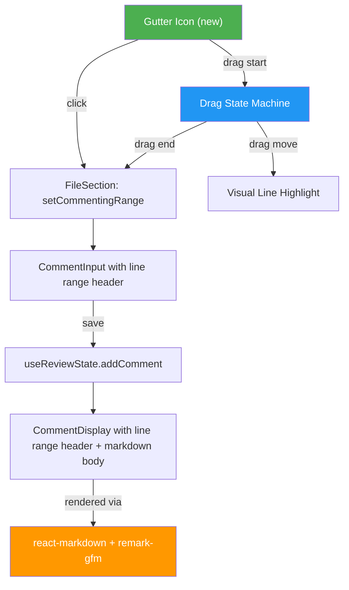
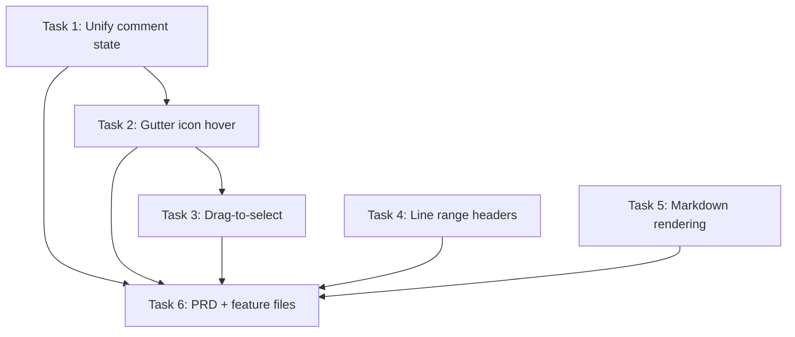

# Plan: Commenting Experience Revamp

## Original Work Order

> I want to create a new feature. As with any new feature, we need to update the PRD and the
> test-slash-features. This new feature updates the current commenting experience. Right now, in
> order to add a comment, we need to put cursor on the line number, click, and then add the comment.
> When we save the comment, we get a rendered version of the comment and a comment box. We want to
> revamp this experience. The changes are that we want to have an experience that is more consistent
> with GitHub, but respecting our own design. In GitHub, when you hover on a code line, an icon
> appears on the left of the code line. If you click on the icon, you can add the comment. That is
> the experience that we want. Also, notice that when we save the comment, we don't get a new
> comment box, a new input to add an additional comment. If we need to add an additional comment, we
> will click the icon again. In addition to this, we want to introduce a multi-line commenting
> experience. In fact, this will be the only commenting experience, as we will treat commenting on a
> line, a special case on commenting on n lines. We want to have a single code path for this.
> Commenting on multiple lines will work just as it does in GitHub and GitLab, etc. Dragging up or
> down the commenting icon from the commenting icon will make the comment apply to those lines of
> code. Also note that dragging or commenting is limited to the div ranges. You cannot add a comment
> that applies to different div ranges. Moreover, we want to add some visual feedback for when we
> are dragging to know what are the lines that we are going to apply the comment to. Also, we should
> see a small heading in the comment input that is offered to us saying what lines this comment
> applies to, and also a visual indication for the rendered comment to understand where the comment
> applies. Adding an inspiration.md file to see this visual feedback for the comment box, for the
> rendered comment. You don't need to implement this exact design, be consistent with our current
> design, it's just for inspiration. We want to render the comments markdown. Interpret the user
> input as markdown and render it using a markdown renderer.

## Plan Clarifications

| Question                                                      | Answer                                                                                                         |
| ------------------------------------------------------------- | -------------------------------------------------------------------------------------------------------------- |
| Comment icon in split view: both sides or relevant side only? | Only the relevant side — icon only appears on the side that has a line number (no icon on empty padding cells) |
| Markdown scope: basic or GitHub-flavored?                     | GitHub-flavored markdown (GFM) — tables, task lists, strikethrough, fenced code blocks                         |
| Comment position after multi-line selection?                  | Below the last line of the selected range (GitHub-style)                                                       |
| "Div ranges" meaning for drag bounds?                         | Selection cannot span hunk boundaries (@@ separators). Drag is limited to lines within a single hunk.          |
| Post-save behavior?                                           | Comment input closes after saving. User clicks the icon again for another comment.                             |

## Executive Summary

This plan revamps the commenting experience in self-review to match GitHub's PR review UX patterns
while maintaining the existing design system. The three core changes are: (1) replacing the current
line-number-click activation with a hover-triggered "+" icon in the gutter, (2) unifying single-line
and multi-line commenting into one drag-based interaction model where a single click is a degenerate
case of a range selection, and (3) rendering comment bodies as GitHub-flavored markdown instead of
plain text.

The approach reuses the existing `CommentInput`, `CommentDisplay`, `useReviewState`, and
`ReviewContext` infrastructure, modifying the interaction layer (gutter icons, drag handling) in
`SplitView` and `UnifiedView`, adding line range headers to comment UI, and integrating a markdown
renderer into `CommentDisplay`. The data model (`LineRange`, `ReviewComment`) already supports
ranges and requires no changes.

## Context

### Current State vs Target State

| Current State                                                                                            | Target State                                                                                     | Why?                                                                |
| -------------------------------------------------------------------------------------------------------- | ------------------------------------------------------------------------------------------------ | ------------------------------------------------------------------- |
| Comment activated by clicking on line number text                                                        | Comment activated by clicking a "+" icon that appears on hover in the gutter                     | More discoverable, consistent with GitHub UX                        |
| Single-line and multi-line comments are separate code paths (click vs mousedown/mouseup on line numbers) | Unified interaction: click = single-line (start=end), drag = multi-line. One code path for both. | Simpler code, consistent behavior                                   |
| Drag selection uses mousedown/mouseup on line number gutters with no visual feedback during drag         | Drag from the "+" icon with real-time highlight on lines being selected                          | Clear visual indication of selection range                          |
| No heading in comment input indicating which lines are referenced                                        | Header showing "Comment on line X" or "Comment on lines X to Y"                                  | Context for the user while writing                                  |
| No line range indicator in rendered comments                                                             | Header in `CommentDisplay` showing which lines the comment applies to                            | Visual clarity on what code the comment references                  |
| Comment body rendered as plain text with `whitespace-pre-wrap`                                           | Comment body rendered as GitHub-flavored markdown (bold, italic, code, tables, lists, etc.)      | Richer review comments                                              |
| After saving a comment, a new empty comment input box appears                                            | After saving, input closes. Click icon again to add another.                                     | Cleaner UX, matches GitHub behavior                                 |
| Selection range validated only by side (old/new) matching                                                | Selection additionally constrained to not span hunk boundaries                                   | Prevents comments that reference lines from different code contexts |

### Background

The existing commenting infrastructure is solid. `useReviewState` and `ReviewContext` handle CRUD
for `ReviewComment` objects. `LineRange` already has `side`, `start`, and `end` fields. `SplitView`
and `UnifiedView` already have `commentingLine`, `selectionRange`, `onLineClick`, and
`onLineRangeSelect` props. The `FileSection` component orchestrates these. The main work is in the
interaction layer (replacing line number clicks with icon-based hover/drag) and the rendering layer
(markdown, line range headers).

No changes are needed to the data model, IPC contract, XML serializer, or main process.

## Architectural Approach

### Comment Trigger Icon

**Objective**: Replace line-number-click activation with a hover-triggered "+" icon in the gutter.

In both `SplitView` and `UnifiedView`, a small "+" icon (using lucide-react's `Plus` or
`MessageSquarePlus`) will be rendered inside the line number gutter cell. The icon is hidden by
default and shown on hover via CSS (`opacity-0 group-hover:opacity-100`). Clicking the icon triggers
comment activation for that single line. The icon appears only on cells that have a valid line
number — in split view, empty padding cells on the opposite side get no icon.

The current `onLineClick` handler on the line number `div` will be removed. The click handler moves
to the icon element. The line number text itself becomes non-interactive (just a display element).

### Drag-to-Select Multi-Line Comments (Unified Code Path)

**Objective**: Implement a single interaction model where clicking = single-line comment, dragging =
multi-line comment.

The drag interaction starts on `mousedown` on the "+" icon and ends on `mouseup` anywhere in the
document. During the drag, the component tracks the start line and current hovered line (constrained
to the same hunk and same side). The selection state is managed in `FileSection` to keep it
file-scoped.

Key behaviors:

- **Single click** (mousedown + mouseup on same line): Treated as a range where `start === end`.
- **Drag** (mousedown on line A, mousemove over lines, mouseup on line B): Range is `min(A,B)` to
  `max(A,B)`.
- **Hunk boundary constraint**: The drag calculates which hunk the start line belongs to and clamps
  the end line to that hunk's line range. Lines outside the hunk are not selectable.
- **Visual feedback during drag**: Lines within the current drag range get a highlight CSS class
  (e.g., `bg-blue-100 dark:bg-blue-900/30`) applied dynamically. This reuses the existing
  `isLineSelected` pattern but driven by a transient drag state rather than committed
  `selectionRange`.
- **Side constraint**: In split view, drag is locked to the side (old/new) where it started. You
  cannot drag across sides.

The existing separate `commentingLine` (single) and `selectionRange` (multi) states in `FileSection`
will be unified into a single
`commentRange: { start: number; end: number; side: 'old' | 'new' } | null` state. When set, it opens
`CommentInput` below the last line of the range. This replaces both `commentingLine` and
`selectionRange`.

The `rangeStart`/`handleLineMouseDown`/`handleLineMouseUp` state currently duplicated in both
`SplitView` and `UnifiedView` will be lifted to `FileSection` and passed down as props, eliminating
the duplication.

### Line Range Header in Comment UI

**Objective**: Show which lines a comment applies to in both the input and display components.

**CommentInput**: A small header above the textarea showing "Comment on line 13" or "Comment on
lines 6 to 10" (matching the inspiration screenshot). Derived from the `lineRange` prop. For
file-level comments (lineRange is null), no header is shown.

**CommentDisplay**: A similar header in the comment card showing the line range. Derived from
`comment.lineRange`. This replaces the current "You" author label position or sits alongside it.

### Markdown Rendering in Comments

**Objective**: Render comment bodies as GitHub-flavored markdown.

Install `react-markdown` and `remark-gfm` as dependencies. In `CommentDisplay`, replace the current
`
{comment.body}
` with
`<ReactMarkdown remarkPlugins={[remarkGfm]}>{comment.body}</ReactMarkdown>`. Apply appropriate CSS
classes to the rendered markdown elements for consistent styling with the app's theme (prose-like
styling scoped to the comment body).

The comment input (`CommentInput`) remains a plain `<Textarea>` — no live preview, no rich text
editor. Users type raw markdown.

### PRD and Test Feature Updates

**Objective**: Update project documentation and test specifications to reflect the new commenting
behavior.

**PRD.md**: Update sections 5.4.1 (Line Comments) and 5.4.2 (Multi-Line Comments) to describe the
new icon-based activation, unified code path, drag interaction, hunk boundary constraints, line
range headers, and markdown rendering. Remove references to "clicking on a line number."

**test/features**: Create feature files describing the new commenting behavior using BDD/Gherkin
format. Cover: icon visibility on hover, single-line comment via click, multi-line comment via drag,
hunk boundary constraints, line range headers in input and display, markdown rendering, comment
input closing after save.

## Risk Considerations and Mitigation Strategies

Technical Risks

- **Drag interaction across rapid mouse movements**: Mouse events may fire on elements outside the
  intended gutter column during fast dragging.
  - **Mitigation**: Use `mousedown` on the icon to initiate, then listen for `mousemove` and
    `mouseup` on `document` (not just the gutter). Track the target lines via data attributes or
    coordinate-based hit testing.
- **Hunk boundary detection**: Determining which hunk a line belongs to requires mapping line
numbers back to hunks. - **Mitigation**: Build a lookup map (line number + side → hunk index) once
per file render and pass it to the drag handler. This is a pure function of `DiffFile.hunks`.

Implementation Risks

- **Markdown XSS**: Rendering user-provided markdown could introduce XSS if not sanitized.
  - **Mitigation**: `react-markdown` does not use `dangerouslySetInnerHTML` for user content. It
    renders React elements. Combined with the app being local-only (no external input), risk is
    minimal. Additionally, disable `allowedElements` that could be problematic (e.g., `script`,
    `iframe`).
- **CSS conflicts with markdown output**: GFM-rendered tables, code blocks, and lists may clash with
the app's existing Tailwind styles. - **Mitigation**: Scope markdown styles within a `.prose`
container or use Tailwind's `@apply` directives for markdown elements within the comment body.

## Success Criteria

### Primary Success Criteria

1. Hovering over a code line shows a "+" icon in the gutter; clicking it opens a comment input for
   that line
2. Dragging from the "+" icon across lines within a hunk selects a range, with real-time visual
   feedback (highlighted lines), and opens a comment input for the range
3. Drag selection cannot span across hunk boundaries
4. Comment input and rendered comment both display a header indicating the line range (e.g.,
   "Comment on lines 6 to 10")
5. Comment body is rendered as GitHub-flavored markdown
6. After saving a comment, the input closes (no automatic new input)
7. Single-line and multi-line commenting share a single code path (unified `commentRange` state)
8. PRD.md sections 5.4.1 and 5.4.2 are updated to reflect the new behavior
9. BDD feature files in `test/features` cover the new commenting behavior

## Documentation

- **PRD.md** (sections 5.4.1, 5.4.2): Update to describe icon-based activation, drag-to-select, hunk
  boundary constraints, line range headers, and markdown rendering
- **CLAUDE.md**: No changes needed — existing conventions remain valid

## Resource Requirements

### Development Skills

- React state management and event handling (mouse events, drag interactions)
- CSS hover states and transitions (Tailwind utility classes)
- Markdown rendering in React (`react-markdown`, `remark-gfm`)

### Technical Infrastructure

- **New dependency**: `react-markdown` — React component for rendering markdown
- **New dependency**: `remark-gfm` — Plugin for GitHub-flavored markdown support (tables,
  strikethrough, task lists, autolinks)
- All other infrastructure (Electron, React, Tailwind, shadcn/ui, Prism.js) is already in place

## Integration Strategy

This change is fully contained within the renderer process. No changes to the main process, IPC
contract, preload bridge, XML serializer, or shared types are needed. The `ReviewComment` type
already supports `LineRange` with `start`, `end`, and `side` — the data model is unchanged.

The primary integration points are:

- `SplitView` and `UnifiedView`: Gutter rendering and drag interaction
- `FileSection`: State management (unified `commentRange` replaces `commentingLine` +
  `selectionRange`)
- `CommentInput`: Line range header addition
- `CommentDisplay`: Line range header + markdown rendering

## Notes

- The inspiration screenshot (`screenshot-1.png`) shows the visual patterns for line range headers:
  "Comment on lines 6 to 7", "Comment on lines 6 to 10", "Comment on line 13". These headers sit at
  the top of both the input box and the rendered comment card.
- File-level comments (activated via the file header button) are unaffected by this change. They
  continue to have no line range and no header.
- The `getCommentsForLine` function in `useReviewState` already handles range-based lookups
  (checking if a given line falls within `comment.lineRange.start` to `comment.lineRange.end`). No
  changes needed there.

## Execution Blueprint

### Dependency Diagram

### ✅ Phase 1: Foundation & Independent UI

**Parallel Tasks:**

- ✔️ Task 1: Unify comment state in FileSection and refactor view props
- ✔️ Task 4: Add line range headers to CommentInput and CommentDisplay
- ✔️ Task 5: Add markdown rendering to CommentDisplay

### ✅ Phase 2: Gutter Icon

**Parallel Tasks:**

- ✔️ Task 2: Add hover "+" icon to gutter for comment activation (depends on: 1)

### ✅ Phase 3: Drag Interaction

**Parallel Tasks:**

- ✔️ Task 3: Implement drag-to-select with hunk boundary constraints (depends on: 2)

### ✅ Phase 4: Documentation

**Parallel Tasks:**

- ✔️ Task 6: Update PRD and create BDD feature files (depends on: 1, 2, 3, 4, 5)

### Execution Summary

- Total Phases: 4
- Total Tasks: 6
- Maximum Parallelism: 3 tasks (in Phase 1)
- Critical Path Length: 4 phases (1 → 2 → 3 → 6)

## Execution Summary

**Status**: ✅ Completed Successfully **Completed Date**: 2026-02-11

### Results

All 6 tasks across 4 phases were executed successfully on the `feature/1--commenting-revamp` branch:

- **Phase 1** (3 tasks in parallel): Unified comment state in FileSection, added line range headers
  to CommentInput/CommentDisplay, added markdown rendering with react-markdown/remark-gfm
- **Phase 2** (1 task): Added hover "+" icon to gutter in SplitView/UnifiedView, removed line number
  click handlers
- **Phase 3** (1 task): Implemented drag-to-select with hunk boundary constraints via document-level
  event listeners and a memoized hunk-line lookup map
- **Phase 4** (1 task): Updated PRD sections 5.4.1/5.4.2 and expanded BDD feature file from 8 to 22
  scenarios

Commits: 4 feature commits on `feature/1--commenting-revamp`

### Noteworthy Events

- Parallel Task 4 and Task 5 both modified `CommentDisplay.tsx` — changes merged cleanly without
  conflicts (Task 4 modified the header JSX, Task 5 modified the body JSX)
- Removed unused `onCommentRange` prop from SplitView/UnifiedView during Phase 3 cleanup after the
  drag interaction replaced direct icon click handlers
- Removed unused `Checkbox` import from FileSection.tsx during Phase 3 lint cleanup
- Used Tailwind v4 arbitrary variant selectors (`[&_p]:my-1`, etc.) instead of
  `@tailwindcss/typography` plugin for markdown styling, since the project uses Tailwind v4 without
  a config file

### Recommendations

- Run manual visual QA to verify: hover icon appearance, drag highlight feedback, hunk boundary
  clamping, markdown rendering in comments
- Consider adding E2E test step definitions for the new Gherkin scenarios in `tests/steps/`
- The non-null assertions in UnifiedView.tsx (lines 100, 122) are safe (guarded by
  `line.oldLineNumber &&` / `line.newLineNumber &&`) but could be refactored to avoid the lint
  warnings
