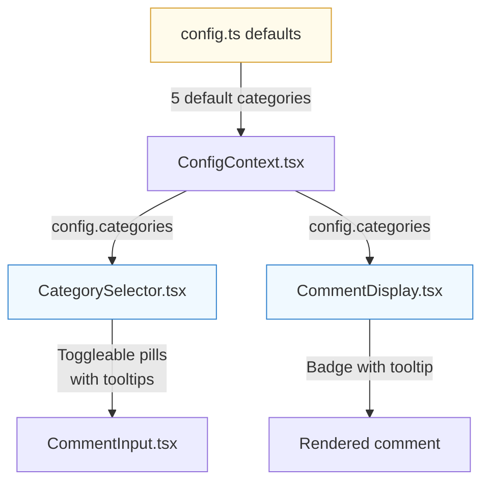
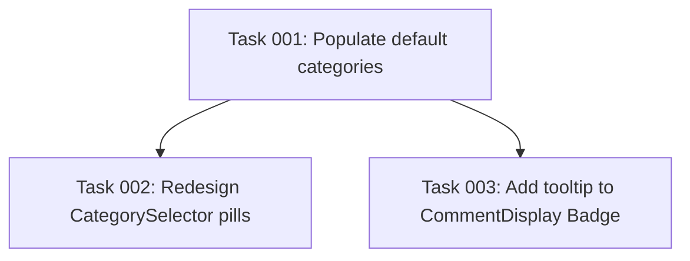

# Plan: Category Pill Selector with Defaults and Tooltips

## Original Work Order

> The PRD notes that we have support for custom categories for comments. These categories are defined in the configuration files, but we should have a set of defaults. However, we don't have a way to input the category for a comment. Your task is to add support for creating, for inputting the category or categories. Are multiple categories supported according to the PRD or not? We'll treat the PRD as the source of truth. Once we have selected the category of a comment, it should be visually represented in the rendered comment as a pill. In the input box for the comment, categories should be also represented as toggleable pills. Each category will have a visual color indicator. This visual color in the configuration for each category, there should be a default for the default set of categories. In addition to this, hovering over each category should display the category description.

## Plan Clarifications

| Question | Answer |
|---|---|
| "Talkable pills" or "toggleable pills"? | Toggleable pills — clickable chip/pill buttons that tap to select/deselect |
| Multiple categories per comment? | No. PRD Section 5.4.5 specifies a single category per comment (`category: string \| null`). One pill active at a time. |
| CommentDisplay redesign needed? | No. Enhance existing colored Badge with a hover tooltip showing the category description. |

## Executive Summary

The application has a category system structurally in place — the `CategoryDef` type exists, the config loading supports categories from YAML, and `CommentDisplay` already renders a colored Badge when a category is set. However, there are two gaps: (1) the built-in defaults are empty (`categories: []`), meaning out-of-the-box users see no categories unless they write a YAML config, and (2) the `CategorySelector` uses a plain `<Select>` dropdown without color indicators, descriptions, or the pill-based interaction the PRD envisions.

This plan replaces the dropdown with toggleable colored pill buttons in `CommentInput`, adds tooltip descriptions to both the input pills and the display Badge, and populates the built-in defaults with the five categories defined in PRD Section 7.4.

## Context

### Current State vs Target State

| Current State | Target State | Why? |
|---|---|---|
| `categories: []` in both `config.ts` and `ConfigContext.tsx` defaults | 5 default categories (bug, security, style, question, nit) with names, descriptions, and colors from PRD Section 7.4 | Users should see useful categories out-of-the-box without needing a YAML config file |
| `CategorySelector` is a `<Select>` dropdown with small color dots | Toggleable pill/chip buttons with prominent color indicators | Matches PRD's "dropdown or chip selector" specification; pills are more scannable and faster for a small fixed set |
| No hover descriptions on categories anywhere | Tooltip on each pill (in selector) and on the Badge (in display) showing `CategoryDef.description` | Users need to understand what each category means; the PRD defines descriptions for this purpose |
| Category Badge in `CommentDisplay` has color but no tooltip | Badge with tooltip showing description on hover | Consistency: category descriptions should be accessible everywhere a category appears |

### Background

- **PRD Section 5.4.5**: "each comment can optionally be tagged with a category... This appears as a dropdown or chip selector in the comment input UI."
- **PRD Section 7.4**: Defines 5 categories with `name`, `description`, and `color` fields.
- **Type constraint**: `ReviewComment.category` is `string | null` — singular category per comment. No type changes needed.
- **Existing UI primitives**: The project already has `Tooltip`, `TooltipTrigger`, `TooltipContent` from shadcn/ui (Base UI Tooltip), and `Badge` for pill rendering. No new dependencies needed.

## Architectural Approach

### Default Categories

**Objective**: Provide sensible out-of-the-box categories so the app is useful without any YAML configuration.

The five categories from PRD Section 7.4 will be set as the built-in defaults in `config.ts` (main process) and `ConfigContext.tsx` (renderer fallback). These are:

| Name | Description | Color |
|---|---|---|
| bug | Likely defect or incorrect behavior | `#e53e3e` |
| security | Security vulnerability or concern | `#dd6b20` |
| style | Code style, naming, or formatting issue | `#3182ce` |
| question | Clarification needed — not necessarily a problem | `#805ad5` |
| nit | Minor nitpick, low priority | `#718096` |

User/project YAML configs override these entirely (existing array-replace behavior in `mergeConfig` is correct). If a config specifies `categories: []`, the user gets no categories — this is intentional.

### CategorySelector Pill Redesign

**Objective**: Replace the `<Select>` dropdown with a row of toggleable colored pill buttons that provide color context, single-select toggle behavior, and hover descriptions.

The redesigned `CategorySelector.tsx` will:

- Render each category from `config.categories` as a small pill button (using shadcn's `Badge`-like styling or custom-styled buttons)
- Each pill shows: a color dot/indicator + the category name
- **Toggle behavior**: Clicking an unselected pill selects it (calls `onChange(cat.name)`). Clicking the already-selected pill deselects it (calls `onChange(null)`). Only one pill can be active at a time.
- **Active state**: The selected pill gets a filled background using the category's color (at reduced opacity), a matching border, and the text in the category color — matching the existing `CommentDisplay` Badge style for visual consistency.
- **Tooltip**: Each pill is wrapped in a `Tooltip` component. On hover, a tooltip shows the category's `description` text.
- **Compact sizing**: Pills use the same `h-7 text-xs` sizing as surrounding action bar buttons for visual harmony.
- When `config.categories` is empty, the component renders nothing (existing behavior preserved).

The component's public interface (`value: string | null`, `onChange: (category: string | null) => void`) remains unchanged. `CommentInput.tsx` requires no modifications.

### CommentDisplay Tooltip Enhancement

**Objective**: Add a hover tooltip to the existing category Badge in `CommentDisplay` so users can see the category description.

The existing Badge in `CommentDisplay.tsx` (lines 96-109) will be wrapped with a `Tooltip` + `TooltipTrigger` + `TooltipContent`. The tooltip shows `categoryDef.description`. The Badge markup and styling remain unchanged — only the tooltip wrapper is added. When no `categoryDef` is found (e.g., a category from a prior config that no longer exists), no tooltip is shown.

## Risk Considerations and Mitigation Strategies

Technical Risks

- **Tooltip inside flex layout**: Wrapping a Badge with Tooltip components could break flex alignment in the header row.
    - **Mitigation**: Use `asChild` on `TooltipTrigger` to avoid extra DOM wrappers, or ensure the wrapper element is inline-flex.

Implementation Risks

- **Config override behavior**: Users with `categories: []` in their YAML would lose defaults, which may be confusing.
    - **Mitigation**: This is the existing documented behavior (PRD Section 7.2: project config overrides built-in defaults). No change needed, but worth noting.
- **Tooltip provider**: The shadcn Tooltip requires a `TooltipProvider` ancestor. Need to verify one exists in the component tree.
    - **Mitigation**: Check if `App.tsx` or a parent already wraps with `TooltipProvider`; add one if not.

## Success Criteria

### Primary Success Criteria

1. Categories (bug, security, style, question, nit) appear as colored toggleable pills in `CommentInput` when using default config (no YAML files)
2. Clicking a pill selects it; clicking the selected pill deselects it; only one can be active
3. Hovering over any category pill (in selector) or Badge (in display) shows the category description
4. Existing functionality is preserved: category is saved to comment, serialized to XML, shown in CommentDisplay Badge with color

## Documentation

- No PRD update needed — this implements what the PRD already specifies in Sections 5.4.5 and 7.4
- No README update needed — categories are a UI feature, not a CLI change

## Resource Requirements

### Development Skills

- React component development (functional components, hooks)
- shadcn/ui component usage (Tooltip, Badge)
- CSS-in-JS inline styles for dynamic category colors

### Technical Infrastructure

- Existing shadcn/ui components: `Tooltip`, `TooltipTrigger`, `TooltipContent`, `Badge`
- No new dependencies required

## Notes

- The `<Select>` component import in `CategorySelector.tsx` can be removed entirely once the pill-based implementation replaces it
- The `toggle-group.tsx` UI component exists but is designed for joined segmented buttons — not suitable for separate pills with gaps. Individual buttons are the better approach.

## Execution Blueprint

**Validation Gates:**
- Reference: `/config/hooks/POST_PHASE.md`

### Dependency Diagram

### ✅ Phase 1: Configuration Defaults
**Parallel Tasks:**
- ✔️ Task 001: Populate default categories in config.ts and ConfigContext.tsx

### ✅ Phase 2: UI Component Updates
**Parallel Tasks:**
- ✔️ Task 002: Redesign CategorySelector as toggleable pill buttons with tooltips (depends on: 001)
- ✔️ Task 003: Add tooltip to CommentDisplay category Badge (depends on: 001)

### Post-phase Actions
- Verify app compiles and renders categories as pills in CommentInput
- Verify tooltip appears on hover for both pill selector and display Badge
- Verify selecting/deselecting pills works correctly

### Execution Summary
- Total Phases: 2
- Total Tasks: 3
- Maximum Parallelism: 2 tasks (in Phase 2)
- Critical Path Length: 2 phases

## Execution Summary

**Status**: ✅ Completed Successfully
**Completed Date**: 2026-02-11

### Results
- Populated 5 default categories (bug, security, style, question, nit) in both `config.ts` and `ConfigContext.tsx`
- Replaced `<Select>` dropdown in `CategorySelector.tsx` with toggleable colored pill buttons using `Button` + `Tooltip`
- Added tooltip with category description to the category Badge in `CommentDisplay.tsx`
- All files pass TypeScript type-checking and ESLint (no new issues introduced)
- 4 files modified across 2 commits on `feature/02--category-pill-selector` branch

### Noteworthy Events
- Pre-existing ESLint errors in `ConfigContext.tsx` (empty functions in default context) and warnings in `config.ts` (explicit `any` in YAML parser) — not introduced by this plan, not addressed to keep scope minimal.
- The `create-feature-branch.cjs` script failed due to untracked `.ai/task-manager/plans/` files being detected as uncommitted changes; branch was created manually.

### Recommendations
- Consider suppressing the pre-existing ESLint `no-empty-function` errors in `ConfigContext.tsx` with inline comments, or refactoring to avoid them.
