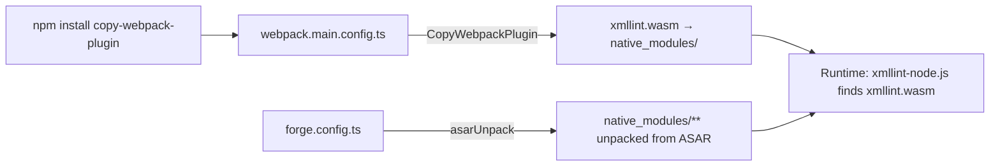
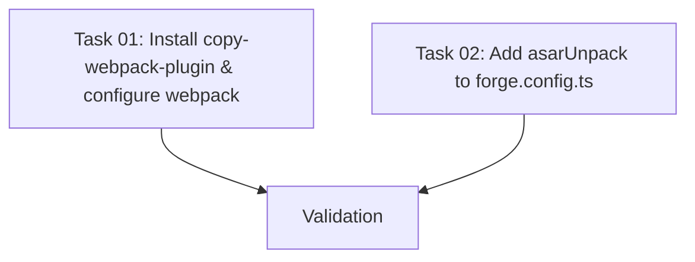

# Plan: Fix xmllint.wasm ENOENT During XML Validation

## Original Work Order

> Fix: xmllint.wasm not found during XML validation. XML generation is completely broken. When the
> window closes and the app tries to validate the generated XML against the XSD schema,
> `xmllint-wasm` fails with
> `ENOENT: no such file or directory, open '.../.webpack/main/native_modules/xmllint.wasm'`.

## Executive Summary

XML output is completely broken because `xmllint.wasm` is not copied to the correct location during
webpack bundling. The `@vercel/webpack-asset-relocator-loader` in `webpack.rules.ts` relocates
`xmllint-node.js` to `.webpack/main/native_modules/`, but does not copy the companion `xmllint.wasm`
file. At runtime, the Emscripten-generated code resolves `__dirname + "/xmllint.wasm"` to the
`native_modules/` directory where the file does not exist.

The fix uses `copy-webpack-plugin` to explicitly copy the WASM file to the expected location, and
adds `asarUnpack` for production builds so the WASM file remains accessible outside the ASAR
archive.

## Context

### Current State vs Target State

| Current State                                               | Target State                                       | Why?                                                                 |
| ----------------------------------------------------------- | -------------------------------------------------- | -------------------------------------------------------------------- |
| `xmllint.wasm` missing from `.webpack/main/native_modules/` | WASM file copied to `native_modules/` during build | Runtime resolution finds the file where `xmllint-node.js` expects it |
| No `asarUnpack` in `forge.config.ts`                        | `asarUnpack` for `**/native_modules/**`            | WASM loading fails inside ASAR archives in production builds         |
| `copy-webpack-plugin` not installed                         | Installed as devDependency                         | Required to copy the WASM file during webpack build                  |

### Background

- `xmllint-wasm` v5.1.0 uses a worker thread pattern: `index-node.js` spawns a Worker loading
  `xmllint-node.js`, which loads `xmllint.wasm` via `__dirname` resolution
- The existing `@vercel/webpack-asset-relocator-loader` in `webpack.rules.ts` (configured with
  `outputAssetBase: 'native_modules'`) handles `.node` binaries and `.js`/`.mjs` files from
  `node_modules`, but does not handle companion `.wasm` files that those JS files reference
- `forge.config.ts` has `asar: true` but no `asarUnpack`, which would break WASM loading in packaged
  builds since worker threads cannot read from inside ASAR archives
- The XML serializer at `src/main/xml-serializer.ts` imports `validateXML` from `xmllint-wasm` and
  calls it on every window close, making this a total blocker for the app's core output
  functionality

## Architectural Approach

### CopyWebpackPlugin Configuration

**Objective**: Copy `xmllint.wasm` from `node_modules/xmllint-wasm/` to
`.webpack/main/native_modules/` during build.

Add `CopyWebpackPlugin` to `webpack.main.config.ts` (not the shared `webpack.plugins.ts`, since
xmllint is only used in the main process). The `to` path `native_modules/xmllint.wasm` is relative
to webpack's output directory, placing the file exactly where the relocated `xmllint-node.js`
expects it.

The `from` path uses `require.resolve('xmllint-wasm/xmllint.wasm')` or a direct
`node_modules/xmllint-wasm/xmllint.wasm` path to locate the source WASM file.

### ASAR Unpack Configuration

**Objective**: Ensure WASM files are accessible in production builds.

Add `asarUnpack: ['**/native_modules/**']` to `packagerConfig` in `forge.config.ts`. Worker threads
and WASM loading cannot read from inside ASAR archives, so these files must be unpacked. This is a
single-line addition to the existing `packagerConfig` object.

## Risk Considerations and Mitigation Strategies

Technical Risks

- **WASM path mismatch**: The `to` path in CopyWebpackPlugin must exactly match where
`xmllint-node.js` resolves `__dirname + "/xmllint.wasm"` - **Mitigation**: Verified that
asset-relocator places `xmllint-node.js` in `native_modules/`, so `native_modules/xmllint.wasm` is
the correct target

Implementation Risks

- **copy-webpack-plugin version compatibility**: Must be compatible with the project's webpack 5
(used by Electron Forge) - **Mitigation**: Latest version (12.x) supports webpack 5

## Success Criteria

### Primary Success Criteria

1. `.webpack/main/native_modules/xmllint.wasm` exists after build
2. `npm start` runs without ENOENT errors related to `xmllint.wasm`
3. Closing the window produces valid XML on stdout (validation passes)

## Documentation

No documentation updates needed. This is an internal build configuration fix with no user-facing or
assistant-facing changes.

## Resource Requirements

### Technical Infrastructure

- `copy-webpack-plugin` (new devDependency)

## Files to Modify

| File                     | Change                                                                         |
| ------------------------ | ------------------------------------------------------------------------------ |
| `package.json`           | Add `copy-webpack-plugin` devDependency (via `npm install --save-dev`)         |
| `webpack.main.config.ts` | Import and add `CopyWebpackPlugin` to copy `xmllint.wasm` to `native_modules/` |
| `forge.config.ts`        | Add `asarUnpack: ['**/native_modules/**']` to `packagerConfig`                 |

## Dependency Diagram

No circular dependencies. Both tasks are independent.

## Execution Blueprint

**Validation Gates:**

- Reference: `/config/hooks/POST_PHASE.md`

### ✅ Phase 1: Build Configuration

**Parallel Tasks:**

- ✔️ Task 01: Install copy-webpack-plugin and configure webpack.main.config.ts
- ✔️ Task 02: Add asarUnpack configuration to forge.config.ts

### Post-phase Actions

- Lint check
- Commit phase changes

### Execution Summary

- Total Phases: 1
- Total Tasks: 2
- Maximum Parallelism: 2 tasks (in Phase 1)
- Critical Path Length: 1 phase

## Execution Summary

**Status**: ✅ Completed Successfully **Completed Date**: 2026-02-11

### Results

- Installed `copy-webpack-plugin` as devDependency
- Configured `CopyWebpackPlugin` in `webpack.main.config.ts` to copy `xmllint.wasm` to
  `native_modules/`
- Added `asarUnpack: ['**/native_modules/**']` to `packagerConfig` in `forge.config.ts`
- All changes committed on branch `feature/03--fix-xmllint-wasm`

### Noteworthy Events

- Feature branch creation script failed due to untracked `.ai/task-manager/plans/` directory being
  detected as uncommitted changes. Branch was created manually.
- Pre-existing lint errors (87 errors, 49 warnings) exist in test files and other source files. No
  lint errors were introduced by this plan's changes.

### Recommendations

- Run the app (`npm start`) and close the window to verify XML validation works end-to-end
- Consider adding `.ai/` to `.gitignore` if task manager files should not trigger the feature branch
  script's uncommitted changes check
