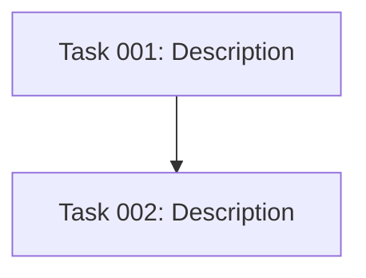

# POST_TASK_GENERATION_ALL Hook

After all tasks have been generated, perform these two steps:

## 1. Review Task Complexity

For each generated task, do a quick sanity check:

- **Too complex?** If a task spans 3+ technologies or requires 3+ skills, split it.
- **Too vague?** If acceptance criteria are unclear, sharpen them.
- **Too trivial?** If two tasks could be one without adding complexity, merge them.

Target: every task should be completable with 1-2 skills and have clear acceptance criteria.

## 2. Update Plan with Blueprint

After finalizing tasks, append to the plan document:

### Dependency Diagram

If tasks have dependencies, add a Mermaid graph:

Verify there are no circular dependencies.

### Execution Phases

Group tasks into phases:

- **Phase 1**: Tasks with no dependencies (run in parallel)
- **Phase N**: Tasks whose dependencies are all in earlier phases

Use the template in `.ai/task-manager/config/templates/BLUEPRINT_TEMPLATE.md` for structure.

Before finalizing, verify:

- Every task is in exactly one phase
- No task runs before its dependencies complete
- Phase 1 has only zero-dependency tasks
