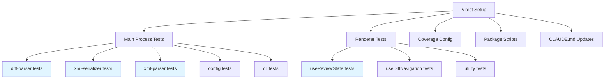
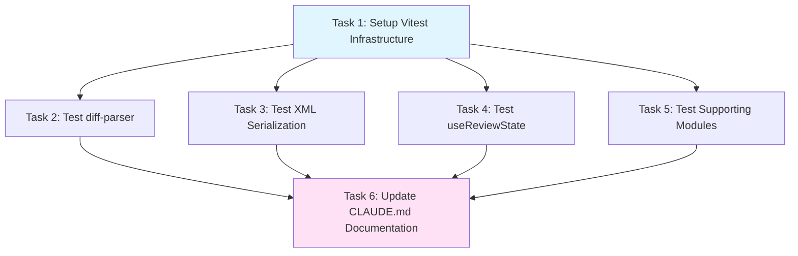

# Plan: Add Vitest Unit Testing Infrastructure and Comprehensive Test Coverage

## Original Work Order

> I need you to add test coverage using vitest. This is an architecture decision so it should be documented in @CLAUDE.md

## Plan Clarifications

| Question | Answer |
|----------|--------|
| Which parts of the codebase should have unit test coverage? | Main process modules (diff-parser, xml-serializer, etc.) + Renderer hooks and utilities |
| Should I write initial tests for existing code, or just set up the testing infrastructure? | Set up + write comprehensive tests |
| What should happen to the existing Playwright e2e tests? | Keep them (they serve different purposes from unit tests) |
| What level of test coverage are you targeting? | ~50-60% coverage |
| How should Vitest be configured for the Electron two-process architecture? | Separate configs for main/renderer (vitest.config.main.ts and vitest.config.renderer.ts) |
| Should test files be colocated with source files or in a separate directory? | Colocated (place test files next to source files) |
| Should I set up coverage reporting and add it to CI/package scripts? | Yes, but minimal setup (enable coverage but don't enforce thresholds initially) |
| Are there specific modules you're most concerned about testing? | diff-parser, xml-serializer, xml-parser, useReviewState hook |
| Should vitest be configured to work within the Dev Container environment? | Yes, ensure tests work in both dev container and host machine |

## Executive Summary

This plan establishes a comprehensive unit testing infrastructure for the self-review Electron application using Vitest. Currently, the project has only end-to-end tests using Playwright + Cucumber. Adding unit tests will provide faster feedback cycles, enable test-driven development, and improve code confidence without replacing the existing e2e test suite.

The implementation focuses on testing business logic in the main process (diff parsing, XML serialization, git operations) and state management in the renderer (React hooks). We'll configure Vitest to handle the unique challenges of Electron's two-process architecture and ensure compatibility with both the dev container and host environments.

This architectural decision will be documented in CLAUDE.md to guide future development and maintain consistent testing practices across the codebase.

## Context

### Current State vs Target State

| Current State | Target State | Why? |
|--------------|--------------|------|
| Only e2e tests with Playwright + Cucumber | e2e tests + unit tests with Vitest | Enable faster test feedback and test individual modules in isolation |
| No unit test infrastructure | Vitest configured with separate main/renderer configs | Support testing both Node.js (main) and React (renderer) code appropriately |
| ~0% unit test coverage | ~50-60% unit test coverage on critical modules | Improve code confidence and catch regressions early |
| No testing for diff-parser, xml-serializer, hooks | Comprehensive tests for priority modules | Protect critical business logic from bugs |
| Testing architecture not documented | Testing approach documented in CLAUDE.md | Establish clear patterns for future development |
| Long test feedback loop (e2e only) | Fast unit tests + slower e2e tests | Enable TDD workflow and rapid iteration |
| No coverage reporting | Coverage collection enabled with npm scripts | Visibility into what code is tested without enforcement |

### Background

The self-review application has a solid e2e test suite that validates the complete user workflow. However, e2e tests are slow, harder to debug, and don't provide granular feedback about individual module behavior. As the codebase grows, the lack of unit tests creates challenges:

1. **Slow feedback**: E2e tests take 30+ seconds to run
2. **Debugging difficulty**: When e2e tests fail, it's hard to pinpoint the exact module causing issues
3. **Untested edge cases**: E2e tests cover happy paths but miss edge cases in parsing, XML validation, etc.
4. **Refactoring risk**: No safety net when refactoring internal modules

Adding Vitest provides:
- Sub-second test execution for unit tests
- Isolated testing of business logic
- Better developer experience with watch mode
- Foundation for test-driven development

The Electron architecture requires careful setup: main process tests run in Node.js while renderer tests need DOM mocking and React support.

## Architectural Approach



### Component 1: Vitest Infrastructure Setup

**Objective**: Install and configure Vitest with separate environments for main and renderer processes, ensuring compatibility with Electron's architecture and the dev container.

**Implementation Details**:

1. **Dependencies**: Install `vitest`, `@vitest/ui` (for test UI), and `@vitest/coverage-v8` (for coverage reporting)

2. **Main Process Configuration** (`vitest.config.main.ts`):
   - Target: Node.js environment
   - Test file pattern: `src/main/**/*.test.ts`
   - No DOM globals needed
   - Use native Node.js APIs
   - Handle TypeScript with `ts-node` or `esbuild`

3. **Renderer Configuration** (`vitest.config.renderer.ts`):
   - Target: jsdom environment (simulated browser)
   - Test file pattern: `src/renderer/**/*.test.{ts,tsx}`
   - Mock DOM APIs and browser globals
   - Support React Testing Library (optional, for future component tests)
   - Handle ES modules and React JSX transformation

4. **Shared Configuration**:
   - TypeScript path aliases matching `tsconfig.json`
   - Test timeout: 5000ms default
   - Coverage output directory: `coverage/`
   - Coverage reporters: text, html, json-summary
   - Exclude: `node_modules/`, `.webpack/`, `out/`, `.features-gen/`, `tests/` (e2e tests)

5. **Dev Container Compatibility**:
   - Ensure Node.js version in container matches host
   - No X11 or display required for unit tests (unlike e2e)
   - Document in CLAUDE.md that unit tests work in container (unlike e2e)

### Component 2: Package Scripts and Coverage

**Objective**: Add convenient npm scripts for running tests and collecting coverage with minimal enforcement.

**Scripts to Add**:
```json
{
  "test:unit": "vitest",
  "test:unit:main": "vitest --config vitest.config.main.ts",
  "test:unit:renderer": "vitest --config vitest.config.renderer.ts",
  "test:unit:run": "vitest run",
  "test:coverage": "vitest run --coverage"
}
```

**Coverage Configuration**:
- Enable coverage collection with v8 provider
- Generate HTML reports for local viewing
- JSON summary for potential CI integration
- No thresholds enforced initially (minimal setup per requirements)
- Track coverage for: `src/main/**/*.ts`, `src/renderer/**/*.{ts,tsx}`, `src/shared/**/*.ts`
- Exclude test files, UI components (initially), type definitions

### Component 3: Priority Module Tests

**Objective**: Write comprehensive tests for the four priority modules identified: diff-parser, xml-serializer, xml-parser, and useReviewState.

#### 3.1 diff-parser Tests (`src/main/diff-parser.test.ts`)

**Coverage Goals**:
- Parse basic file additions, deletions, modifications
- Handle binary files correctly
- Parse multiple hunks per file
- Handle empty diffs
- Parse line numbers accurately
- Handle edge cases: rename detection, mode changes, no newline at EOF
- Validate output structure matches TypeScript types

**Test Structure**:
```
describe('parseDiff', () => {
  describe('basic operations', () => {
    - parses file addition
    - parses file deletion
    - parses file modification
  });

  describe('hunks and line numbers', () => {
    - parses single hunk correctly
    - parses multiple hunks
    - tracks old/new line numbers
  });

  describe('edge cases', () => {
    - handles empty diff
    - handles binary files
    - handles rename detection
    - handles no newline at EOF
  });
});
```

**Approach**: Use real git diff output samples stored as fixture strings. Test both parsing correctness and edge cases.

#### 3.2 xml-serializer Tests (`src/main/xml-serializer.test.ts`)

**Coverage Goals**:
- Serialize ReviewState to valid XML
- Include all required attributes (timestamp, git-diff-args, repository)
- Serialize files with/without comments
- Serialize line-level and file-level comments
- Serialize suggestions correctly
- Validate against embedded XSD schema
- Handle special characters and escaping
- Reject invalid ReviewState

**Test Structure**:
```
describe('serializeReviewToXML', () => {
  describe('basic serialization', () => {
    - serializes empty review
    - serializes review with single file
    - includes required root attributes
  });

  describe('comments', () => {
    - serializes file-level comments
    - serializes line-level comments
    - serializes comments with suggestions
    - escapes special XML characters
  });

  describe('validation', () => {
    - produces valid XML against XSD
    - rejects invalid line ranges
  });
});
```

**Approach**: Create test ReviewState objects, serialize them, and validate both structure and XSD compliance using xmllint-wasm.

#### 3.3 xml-parser Tests (`src/main/xml-parser.test.ts`)

**Coverage Goals**:
- Parse valid XML into ReviewComment[]
- Extract file path, line ranges, body, category correctly
- Handle file-level vs line-level comments
- Parse suggestions
- Handle missing optional fields
- Reject malformed XML
- Round-trip: serialize then parse should yield equivalent data

**Test Structure**:
```
describe('parseReviewXML', () => {
  describe('basic parsing', () => {
    - parses empty review
    - parses single comment
    - extracts all comment fields correctly
  });

  describe('line ranges', () => {
    - parses newLineStart/newLineEnd
    - parses oldLineStart/oldLineEnd
    - handles file-level comments (no line range)
  });

  describe('suggestions', () => {
    - parses suggestion blocks
  });

  describe('error handling', () => {
    - rejects invalid XML
    - handles missing required fields gracefully
  });

  describe('round-trip', () => {
    - serialize then parse yields same data
  });
});
```

**Approach**: Use fixture XML strings (valid and invalid), parse them, and validate the resulting TypeScript objects.

#### 3.4 useReviewState Tests (`src/renderer/hooks/useReviewState.test.ts`)

**Coverage Goals**:
- Add comments to files
- Update existing comments
- Delete comments
- Toggle viewed status
- Get comments for file
- Get comments for specific line
- Handle empty state
- Generate unique IDs for comments

**Test Structure**:
```
describe('useReviewState', () => {
  describe('addComment', () => {
    - adds file-level comment
    - adds line-level comment
    - generates unique ID
    - includes all fields
  });

  describe('updateComment', () => {
    - updates existing comment
    - preserves unchanged fields
    - no-op for non-existent ID
  });

  describe('deleteComment', () => {
    - removes comment by ID
    - no-op for non-existent ID
  });

  describe('toggleViewed', () => {
    - marks file as viewed
    - toggles back to unviewed
  });

  describe('getters', () => {
    - getCommentsForFile returns file comments
    - getCommentsForLine returns line comments
    - filters by old/new side correctly
  });
});
```

**Approach**: Use `@testing-library/react-hooks` or Vitest's built-in hook testing. Test state transitions and data integrity.

### Component 4: Additional Module Tests

**Objective**: Write tests for other testable modules to reach 50-60% coverage.

**Modules**:

1. **config.ts**: Test YAML loading, merging, default values
2. **cli.ts**: Test argument parsing (may need to mock process.argv)
3. **git.ts**: Test git command construction (mock child_process)
4. **useDiffNavigation.ts**: Test scroll sync logic, file navigation

**Approach**: Focus on pure functions and testable logic. Mock external dependencies (filesystem, child processes, DOM) as needed.

### Component 5: Documentation Updates

**Objective**: Document the testing architecture, conventions, and commands in CLAUDE.md.

**Additions to CLAUDE.md**:

Add a new "## Testing" section after "## Shared Types":

```markdown
## Testing

The app has two testing layers:

1. **Unit tests** (Vitest) — Fast, isolated tests for business logic and state management
2. **E2E tests** (Playwright + Cucumber) — Slow, comprehensive tests for user workflows

### Unit Tests

Unit tests use Vitest with separate configurations for main and renderer processes:

- **Main process tests** (`src/main/**/*.test.ts`): Test Node.js modules (diff parsing, XML serialization, git operations). Run in Node.js environment.
- **Renderer tests** (`src/renderer/**/*.test.{ts,tsx}`): Test React hooks and utilities. Run in jsdom environment.

**Test file location**: Colocate test files with source files (e.g., `diff-parser.test.ts` next to `diff-parser.ts`).

**Running tests**:
```bash
npm run test:unit              # Run all unit tests in watch mode
npm run test:unit:run          # Run all unit tests once
npm run test:unit:main         # Run only main process tests
npm run test:unit:renderer     # Run only renderer tests
npm run test:coverage          # Run tests with coverage report
```

**Dev Container**: Unit tests work in both the dev container and host machine (unlike e2e tests).

**Coverage target**: ~50-60% coverage on business logic. Coverage is collected but thresholds are not enforced.

### E2E Tests

E2E tests use Playwright with Cucumber BDD:
- **Cannot run in dev container** — requires host machine with display
- Test complete user workflows from CLI invocation to XML output
- Run with `npm run test:e2e` (headless) or `npm run test:e2e:headed`

### Testing Conventions

- Test pure functions and business logic, not implementation details
- Use descriptive test names: `it('parses file addition with single hunk', ...)`
- Group related tests with `describe` blocks
- Mock external dependencies (filesystem, child processes, network)
- For hooks: test state transitions and data integrity
- For parsers: use fixture strings of real input samples
```

## Risk Considerations and Mitigation Strategies

<details>
<summary>Technical Risks</summary>

- **Electron Multi-Process Architecture**: Main and renderer processes have different globals and APIs
  - **Mitigation**: Use separate Vitest configs with appropriate environments (Node.js vs jsdom). Test each process in its native environment.

- **DOM Mocking Limitations**: jsdom doesn't perfectly replicate browser behavior
  - **Mitigation**: Focus renderer tests on hooks and utilities, not complex component interactions. Use e2e tests for full browser behavior.

- **TypeScript Path Aliases**: Vitest needs to resolve the same paths as the app
  - **Mitigation**: Configure Vitest to use the same path mappings from tsconfig.json.

- **XML Validation Dependencies**: xmllint-wasm may have loading issues in tests
  - **Mitigation**: Ensure wasm files are accessible in test environment. Consider mocking if needed.
</details>

<details>
<summary>Implementation Risks</summary>

- **Test Maintenance Burden**: Comprehensive tests require ongoing maintenance
  - **Mitigation**: Follow the principle of testing behavior, not implementation. Focus on stable APIs and contracts.

- **Dev Container Compatibility**: Tests must work in both container and host
  - **Mitigation**: Avoid display dependencies in unit tests (those are only for e2e). Document environment requirements clearly.

- **Coverage Target Pressure**: 50-60% might be hard to achieve initially
  - **Mitigation**: Focus on priority modules first. Coverage is a guide, not a requirement. No thresholds enforced initially.

- **Breaking Changes to Test Fixtures**: Real git diffs might change format
  - **Mitigation**: Use stable, well-documented git diff examples. Add comments explaining expected format.
</details>

<details>
<summary>Integration Risks</summary>

- **CI/CD Integration**: May need to add unit tests to future CI pipelines
  - **Mitigation**: Tests run quickly and don't require display. Easy to integrate. Document commands clearly.

- **Conflicting with E2E Tests**: Developers might be confused about which test to write
  - **Mitigation**: Document clear decision criteria in CLAUDE.md: unit tests for logic, e2e for workflows.
</details>

## Success Criteria

### Primary Success Criteria

1. Vitest installed and configured with separate main and renderer configurations
2. Unit tests run successfully with `npm run test:unit` in both dev container and host
3. Comprehensive tests written for the four priority modules (diff-parser, xml-serializer, xml-parser, useReviewState)
4. Overall unit test coverage reaches 50-60% on src/ directory (excluding e2e tests and UI components)
5. Coverage reports generated with `npm run test:coverage`
6. Testing architecture documented in CLAUDE.md with clear conventions and commands
7. All tests pass and no regressions introduced to existing e2e test suite
8. Test execution time is under 5 seconds for the full unit test suite

## Documentation

### CLAUDE.md Updates

Add a new "## Testing" section (detailed in Component 5 above) that covers:
- Overview of two-layer testing strategy (unit + e2e)
- Vitest configuration approach (separate main/renderer configs)
- Test file organization (colocated with source)
- npm scripts for running tests
- Dev container compatibility notes
- Coverage targets and reporting
- Testing conventions and best practices

### README Updates (if applicable)

If the project has a README.md, add a "Testing" section with:
- Brief overview of unit and e2e tests
- Commands to run tests
- How to add new tests

## Resource Requirements

### Development Skills

- **Vitest Expertise**: Understanding of Vitest API, configuration, mocking
- **Electron Architecture**: Knowledge of main vs renderer process differences
- **TypeScript Testing**: Experience with testing TypeScript code
- **React Testing**: Familiarity with testing React hooks (for renderer tests)
- **XML/XSD Knowledge**: Understanding of XML validation for serializer tests

### Technical Infrastructure

**Dependencies to Install**:
- `vitest` (^3.0.0 or latest)
- `@vitest/ui` (test UI dashboard)
- `@vitest/coverage-v8` (coverage reporting)
- `happy-dom` or `jsdom` (DOM environment for renderer tests)
- `@testing-library/react` (optional, for future component tests)

**Development Tools**:
- Node.js 20+ (matching Electron's Node version)
- Text fixtures: Real git diff samples for parser tests
- XML fixtures: Valid/invalid XML samples for XML parser tests

**Environment**:
- Dev container must support running Vitest (no display needed)
- Host machine for running complete test suite

## Integration Strategy

The unit test infrastructure integrates with the existing project as follows:

1. **Coexistence with E2E Tests**: Unit and e2e tests serve different purposes and run independently
   - Unit tests: Fast feedback on individual modules
   - E2E tests: Validation of complete user workflows

2. **Build Process**: Unit tests don't affect the build or packaging process
   - Tests are excluded from webpack bundles (already in .gitignore patterns)
   - Coverage reports go to `coverage/` directory (should be .gitignored)

3. **Development Workflow**:
   - Developers run unit tests in watch mode during development
   - E2E tests run before committing or in CI
   - Coverage reports provide guidance but don't block PRs initially

4. **File Structure**: Test files colocated with source files maintain locality
   - Easy to find tests for a given module
   - Clear 1:1 mapping between source and test files

## Notes

- **No PRD.md Updates Required**: This plan adds internal developer tooling (unit tests) and does not change user-facing features or product requirements. PRD.md remains focused on product requirements and does not need testing methodology documentation.

- **E2E Tests Unchanged**: Existing Playwright + Cucumber tests in `tests/features/` remain as-is and continue to validate end-to-end workflows. Unit tests complement but do not replace e2e tests.

- **No React Component Tests Initially**: Per requirements, we're not testing React components, only hooks and utilities. Components are tested via e2e tests. This can be added later if needed.

- **Coverage Threshold Strategy**: Starting without enforced thresholds allows the team to establish a baseline and adjust targets based on real-world experience.

- **Fixture Management**: Git diff and XML fixtures should be real examples, not hand-crafted minimal cases. This ensures tests validate against actual data formats.

- **Performance**: Unit tests should be fast (<5s total). If tests become slow, investigate mocking or splitting test suites.

- **Architecture Improvements**: This plan improves architecture through:
  - Clear separation of test environments (main/renderer configs)
  - Improved code confidence through isolated testing of business logic
  - Better maintainability via colocated test files
  - Faster feedback loops enabling test-driven development
  - Foundation for future refactoring with safety net of tests

- **Future Expansion**: This foundation allows for future additions like:
  - Component testing with React Testing Library
  - Snapshot testing for XML output
  - Property-based testing for parsers
  - Integration tests for IPC communication

---

## Execution Blueprint

### Dependency Diagram



**Validation Gates:**
- Reference: `.ai/task-manager/config/hooks/POST_PHASE.md`

### ✅ Phase 1: Infrastructure Setup
**Parallel Tasks:**
- ✔️ Task 1: Setup Vitest Infrastructure and Configuration (status: completed)

**Description**: Install dependencies and create separate Vitest configurations for main and renderer processes. This must complete before any tests can be written.

### Phase 2: Write Comprehensive Tests
**Parallel Tasks:**
- Task 2: Test diff-parser Module (depends on: 1)
- Task 3: Test XML Serializer and Parser Modules (depends on: 1)
- Task 4: Test useReviewState Hook (depends on: 1)
- Task 5: Test Supporting Modules (depends on: 1)

**Description**: Write comprehensive unit tests for all priority and supporting modules. These tasks can run in parallel since they test independent modules.

### Phase 3: Documentation
**Parallel Tasks:**
- Task 6: Update CLAUDE.md Documentation (depends on: 1, 2, 3, 4, 5)

**Description**: Document the testing architecture, conventions, and commands in CLAUDE.md after all tests are complete.

### Post-phase Actions

After each phase, verify:
- **Phase 1**: `npm run test:unit:run` executes without errors (may show "no tests found")
- **Phase 2**: All tests pass with `npm run test:unit` and coverage reaches ~50-60%
- **Phase 3**: CLAUDE.md accurately reflects the implemented testing infrastructure

### Execution Summary
- **Total Phases**: 3
- **Total Tasks**: 6
- **Maximum Parallelism**: 4 tasks (in Phase 2)
- **Critical Path Length**: 3 phases (must complete sequentially)
- **Estimated Duration**: Phase 1 (~30 min), Phase 2 (~2-3 hours), Phase 3 (~15 min)
