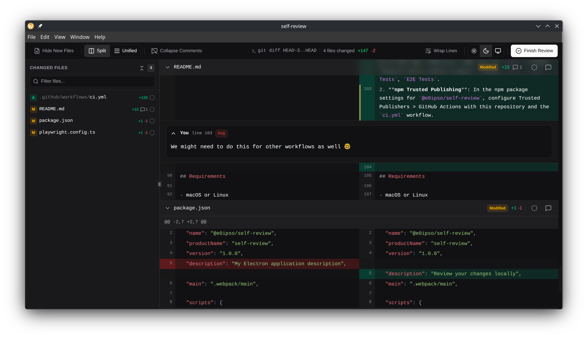

# self-review

[](https://github.com/e0ipso/self-review/actions/workflows/ci.yml)
 
https://github.com/user-attachments/assets/ab7b0a16-af82-4774-90cd-022219b0a114

A local code review tool for developers working with AI coding agents.

When you use tools like Claude Code to generate code changes, you need to review those changes
before accepting them. Today your options are: push to GitHub (exposing unfinished work to a remote
server) or squint at diffs in the terminal.

**self-review** gives you GitHub's pull request review UI on your local machine — no remote, no
account, no setup. Launch it from the terminal, review the diff, leave comments and suggestions,
close the window. Your feedback is written to a file as structured XML that you feed directly back
to your AI agent.



## Installation

Download the latest release from [GitHub Releases](https://github.com/e0ipso/self-review/releases).

<details>
<summary>Linux (Debian/Ubuntu)</summary>

Download the `.deb` package and install it:

```bash
# Replace X.Y.Z with the version you downloaded
sudo dpkg -i self-review_X.Y.Z_amd64.deb
```

The `self-review` command will be available system-wide.

</details>

<details>
<summary>Linux (Fedora/RHEL)</summary>

Download the `.rpm` package and install it:

```bash
# Replace X.Y.Z with the version you downloaded
sudo rpm -i self-review-X.Y.Z-1.x86_64.rpm
```

The `self-review` command will be available system-wide.

</details>

<details>
<summary>macOS</summary>

Download the `.zip` archive, extract it, and move the app to your Applications folder:

```bash
unzip Self.Review-darwin-*.zip -d /Applications
```

Because the app is not yet code-signed, macOS Gatekeeper will flag it as damaged. Remove the
quarantine attribute before opening:

```bash
xattr -cr /Applications/Self\ Review.app
```

To use the `self-review` command from the terminal, create a symlink:

```bash
sudo ln -s "/Applications/Self Review.app/Contents/MacOS/Self Review" /usr/local/bin/self-review
```

</details>

## How it works

Instead of seeing your changes with `git diff <arguments>` execute `self-review <arguments>`. This will open the app
and will record all the feedback in an XML file (`review.xml` by default).

You can continue your saved review if you didn't finish it:

```bash
# Resume a previous review
self-review --staged --resume-from review.xml
```

### Examples

```bash
# Review staged changes — produces ./review.xml by default
self-review --staged

# Review changes between branches
self-review main

# Review the last commit
self-review HEAD^

# Review the current changes
self-review
```

## Claude Code Skill

self-review ships with a Claude Code skill that closes the feedback loop: it reads your review XML,
prioritizes the feedback, and executes the changes.

### Install

Copy the skill directory into your project:

```bash
# From the self-review repo (or download the folder from GitHub)
cp -r .claude/skills/self-review-apply /path/to/your/project/.claude/skills/
```

### Usage

After running self-review and producing a `review.xml`, invoke the skill in Claude Code:

```
/self-review-apply review.xml
```

<details>
<summary>Details</summary>
Your project should end up with:

<code>
your-project/
└── .claude/
    └── skills/
        └──self-review-apply/
            ├── SKILL.md
            └── self-review-v1.xsd
</code>

The skill will:

1. Read the XSD schema to understand the review format
2. Parse your review XML
3. Categorize and prioritize comments (security > bug > style > nit)
4. Output a task plan showing parallel and sequential work groups
5. Execute the changes — applying suggestions first, then addressing open-ended
   feedback

</details>

## Configuration

Customize **self-review** with YAML configuration files:

- **User config:** `~/.config/self-review/config.yaml` — personal preferences for all projects
- **Project config:** `.self-review.yaml` — per-project settings (committable)

Project config overrides user config, which overrides built-in defaults.

### Available options

- `theme`: light, dark, or system (default: system)
- `diff-view`: split or unified (default: split)
- `font-size`: editor font size in pixels (default: 14)
- `output-file`: path for the review XML output (default: `./review.xml`)
- `ignore`: file patterns to exclude from diff (glob syntax)
- `categories`: custom comment tags (see example above)
- `default-diff-args`: default arguments passed to `git diff`
- `show-untracked`: show new files not yet added to git (default: true)
- `word-wrap`: wrap long lines in the diff viewer (default: true)

<details>
<summary>Example: Custom comment categories</summary>

```yaml
# .self-review.yaml
categories:
  - name: bug
    description: 'Likely defect or incorrect behavior'
    color: '#e53e3e'
  - name: security
    description: 'Potential security vulnerability'
    color: '#d69e2e'
  - name: nit
    description: 'Minor style or formatting suggestion'
    color: '#718096'
  - name: question
    description: 'Clarification needed'
    color: '#3182ce'
```

</details>

See [docs/PRD.md](docs/PRD.md#7-configuration) for complete documentation.

## Design principles

- **CLI-first.** Launched from the terminal, writes review output to a file. Behaves like a Unix tool.
- **One-shot.** Open → review → close → done. No servers, no persistent state.
- **Local-only.** No network access, no accounts, no telemetry. Your code stays on your machine.
- **AI-native output.** The XML format is designed to be parsed by LLMs, with an XSD schema they can
  reference for structure.
