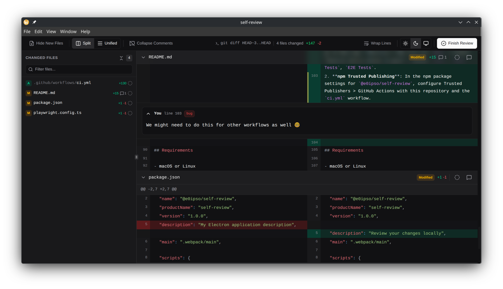
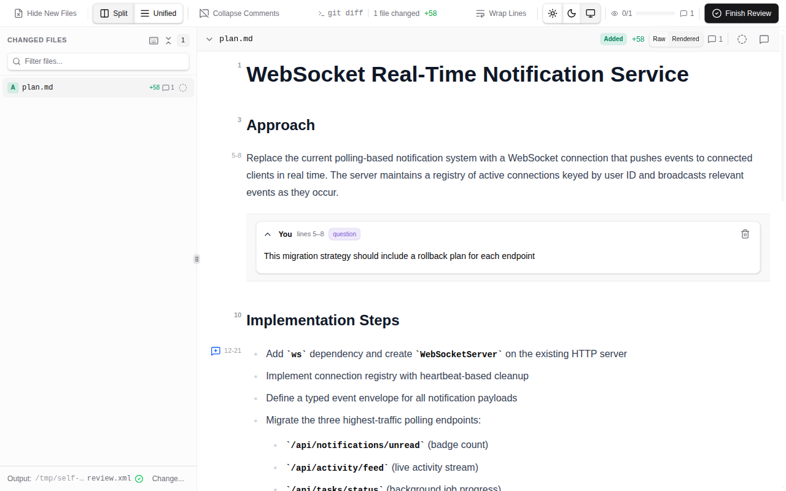
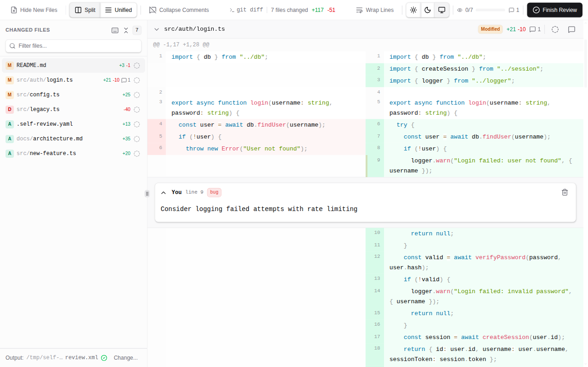
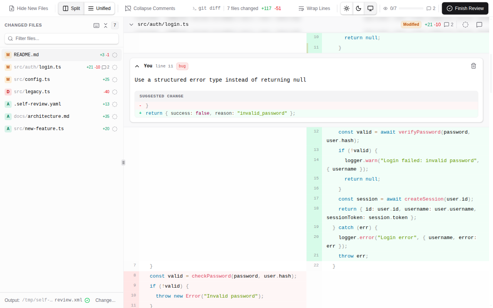
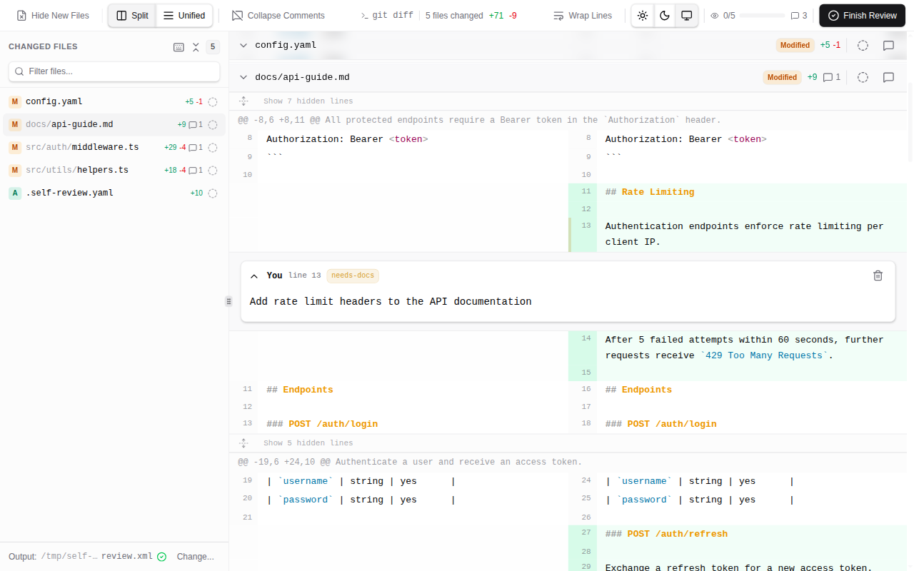
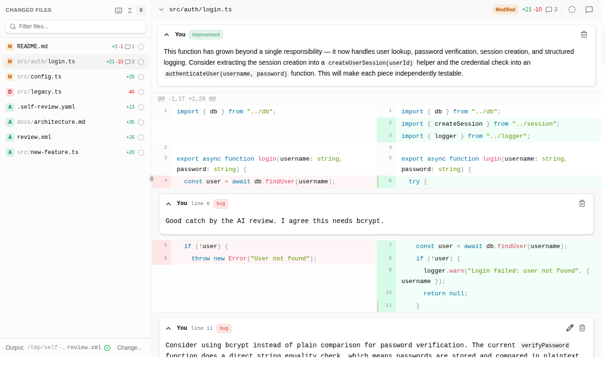

# self-review 

[](https://github.com/e0ipso/self-review/actions/workflows/ci.yml)
 
https://github.com/user-attachments/assets/ada04c50-9107-4f0d-a1ee-789016bbf2de

A local code review tool for developers working with AI coding agents.

When you use tools like Claude Code to generate code changes, you need to review those changes
before accepting them. Today your options are: push to GitHub (exposing unfinished work to a remote
server) or squint at diffs in the terminal.

**self-review** gives you GitHub's pull request review UI on your local machine — no remote, no
account, no setup. Launch it from the terminal, review the diff, leave comments and suggestions,
close the window. Your feedback is written to a file as structured XML that you feed directly back
to your AI agent.



## Use Cases

### 1. Reviewing AI Assistant Plans

Review **rendered markdown** plans and leave **inline feedback** on specific sections. The XML output feeds directly back to the assistant to improve the plan.

<details>
<summary>Learn more</summary>

Plans generated by AI assistants are often long markdown documents. Reviewing them in the terminal is difficult — by the time you reach the end, you've lost track of feedback from the beginning. self-review solves this with two features: **rendered markdown view** for readability, and **in-context comments** attached to specific paragraphs and sections.

Open the plan file, switch to rendered view, and comment directly on the sections that need changes. The XML output preserves the exact location of each comment, so the assistant knows precisely what to fix.

```bash
# Review a Claude Code plan
self-review ~/.claude/plans/path-to-my-plan.md
```




</details>

### 2. Reviewing AI-Generated Code

Review code diffs in a **GitHub-style split view** with **inline comments and code suggestions**, all without leaving your machine.

<details>
<summary>Learn more</summary>

After an AI assistant generates code, you need to review the diff before accepting it. You could push to GitHub and open a pull request, but that has drawbacks:

- **Slower iteration** — push, wait for CI, pull down comments, address them, push again
- **Noisy git history** — "address review comments" commits clutter the remote
- **Privacy** — unfinished code is exposed to the remote server and your team
- **Wasted CI** — intermediate pushes burn CI minutes on code that isn't ready

With self-review, you review locally. The code that leaves your machine is code you **own intellectually** — you've read it, understood it, and refined it. Your team only sees the finished result.

```bash
self-review --staged
```





</details>

### 3. Codebase Exploration

Open any directory and **annotate the code** with categorized comments — questions, improvements, documentation gaps — then feed the XML to an LLM to act on your notes.

<details>
<summary>Learn more</summary>

When onboarding to a new project, you need to understand the codebase before you can contribute. self-review lets you browse the files and leave **categorized notes** as you go. Tag comments as `question`, `improvement`, or `needs-docs` using **custom categories** defined in `.self-review.yaml`.

Once you're done, the XML file contains all your annotations with file paths, line numbers, and categories. Feed this to an LLM and ask it to create tickets for the improvements, generate documentation for the gaps, or explain the parts you didn't understand. No awkward copy-pasting of file names and line numbers into a prompt.

```bash
self-review
```



</details>

### 4. AI-Assisted Review

Have an AI assistant **pre-generate a review**, then open it in self-review to **validate, edit, or discard** each comment before feeding it back.

<details>
<summary>Learn more</summary>

Instead of starting your review from scratch, ask a second AI assistant to critique the changes first. Using the `/self-review-critique` skill included in this repo, the assistant generates an XML review file compatible with self-review. Load it with `--resume-from` to see the comments in context.

From there, **curate the review**: discard comments that are wrong, keep the ones that are useful, and add your own feedback on top. The final XML contains exactly the comments you approved — AI-suggested minus what you removed, plus what you added — ready to feed back to the coding assistant.

```bash
/self-review-critique --staged
self-review --staged --resume-from review.xml
```



</details>

## Installation

Download the latest release from [GitHub Releases](https://github.com/e0ipso/self-review/releases).

<details>
<summary>Linux (Debian/Ubuntu)</summary>

Download the `.deb` package and install it:

```bash
# Replace X.Y.Z with the version you downloaded
sudo dpkg -i self-review_X.Y.Z_amd64.deb
```

The `self-review` command will be available system-wide.

</details>

<details>
<summary>Linux (Fedora/RHEL)</summary>

Download the `.rpm` package and install it:

```bash
# Replace X.Y.Z with the version you downloaded
sudo rpm -i self-review-X.Y.Z-1.x86_64.rpm
```

The `self-review` command will be available system-wide.

</details>

<details>
<summary>macOS</summary>

Download the `.zip` archive, extract it, and move the app to your Applications folder:

```bash
unzip Self.Review-darwin-*.zip -d /Applications
```

Because the app is not yet code-signed, macOS Gatekeeper will flag it as damaged. Remove the
quarantine attribute before opening:

```bash
xattr -cr /Applications/Self\ Review.app
```

To use the `self-review` command from the terminal, create a wrapper script:

```bash
sudo tee /usr/local/bin/self-review > /dev/null << 'SCRIPT'
#!/bin/bash
exec "/Applications/Self Review.app/Contents/MacOS/Self Review" "$@"
SCRIPT
sudo chmod +x /usr/local/bin/self-review
```

</details>

## How it works

Instead of seeing your changes with `git diff <arguments>` execute `self-review <arguments>`. This will open the app
and will record all the feedback in an XML file (`review.xml` by default).

You can continue your saved review if you didn't finish it:

```bash
# Resume a previous review
self-review --staged --resume-from review.xml
```

### Examples

```bash
# Review staged changes — produces ./review.xml by default
self-review --staged

# Review changes between branches
self-review main

# Review the last commit
self-review HEAD^

# Review the current changes
self-review
```

### Output format

The review is written to `review.xml` (configurable). Each comment includes the **file path**,
**line numbers**, a **category** tag, and optionally a **code suggestion** with original and
proposed code. Files you marked as viewed but left no comments on are also recorded, so an AI
agent can distinguish "reviewed, no issues" from "not yet reviewed."

```xml
<review timestamp="2026-03-04T10:30:00Z" git-diff-args="--staged"
        repository="/home/user/my-project">

  <!-- A line comment with a code suggestion -->
  <file path="src/auth/login.ts" change-type="modified" viewed="true">
    <comment new-line-start="14" new-line-end="14">
      <body>Use bcrypt instead of plain comparison</body>
      <category>bug</category>
      <suggestion>
        <original-code>  return input === hash;</original-code>
        <proposed-code>  return await bcrypt.compare(input, hash);</proposed-code>
      </suggestion>
    </comment>
  </file>

  <!-- A file-level comment (no line attributes) -->
  <file path="src/config.ts" change-type="added" viewed="true">
    <comment>
      <body>Consider splitting DB and server config into separate files</body>
      <category>improvement</category>
    </comment>
  </file>

  <!-- Reviewed with no comments -->
  <file path="README.md" change-type="modified" viewed="true"/>
</review>
```

The full schema is defined in
[self-review-v1.xsd](.claude/skills/self-review-apply/assets/self-review-v1.xsd).

## Claude Code Skill

self-review ships with a Claude Code skill that closes the feedback loop: it reads your review XML,
prioritizes the feedback, and executes the changes.

### Install

Copy the skill directory into your project:

```bash
# From the self-review repo (or download the folder from GitHub)
cp -r .claude/skills/self-review-apply /path/to/your/project/.claude/skills/
```

### Usage

After running self-review and producing a `review.xml`, invoke the skill in Claude Code:

```
/self-review-apply review.xml
```

<details>
<summary>Details</summary>
Your project should end up with:

<code>
your-project/
└── .claude/
    └── skills/
        └──self-review-apply/
            ├── SKILL.md
            └── self-review-v1.xsd
</code>

The skill will:

1. Read the XSD schema to understand the review format
2. Parse your review XML
3. Categorize and prioritize comments (security > bug > style > nit)
4. Output a task plan showing parallel and sequential work groups
5. Execute the changes — applying suggestions first, then addressing open-ended
   feedback

</details>

## Configuration

Customize **self-review** with YAML configuration files:

- **User config:** `~/.config/self-review/config.yaml` — personal preferences for all projects
- **Project config:** `.self-review.yaml` — per-project settings (committable)

Project config overrides user config, which overrides built-in defaults.

### Available options

- `theme`: light, dark, or system (default: system)
- `diff-view`: split or unified (default: split)
- `font-size`: editor font size in pixels (default: 14)
- `output-file`: path for the review XML output (default: `./review.xml`)
- `ignore`: file patterns to exclude from diff (gitignore-compatible syntax; defaults cover common vendor/build dirs and lock files)
- `categories`: custom comment tags (see example above)
- `default-diff-args`: default arguments passed to `git diff`
- `show-untracked`: show new files not yet added to git (default: true)
- `word-wrap`: wrap long lines in the diff viewer (default: true)
- `max-files`: maximum number of files before the large payload guard triggers (default: 500). Set to `0` to disable.
- `max-total-lines`: maximum total diff lines before the large payload guard triggers (default: 100000). Set to `0` to disable.

When either threshold is exceeded, a confirmation dialog appears. Cancelling exits the app; continuing enters large-payload mode with lazy content loading (file hunks are fetched on demand as you scroll).

<details>
<summary>Example: Custom comment categories</summary>

```yaml
# .self-review.yaml
categories:
  - name: bug
    description: 'Likely defect or incorrect behavior'
    color: '#e53e3e'
  - name: security
    description: 'Potential security vulnerability'
    color: '#d69e2e'
  - name: nit
    description: 'Minor style or formatting suggestion'
    color: '#718096'
  - name: question
    description: 'Clarification needed'
    color: '#3182ce'
```

</details>

See [docs/PRD.md](docs/PRD.md#7-configuration) for complete documentation.

## Design principles

- **CLI-first.** Launched from the terminal, writes review output to a file. Behaves like a Unix tool.
- **One-shot.** Open → review → close → done. No servers, no persistent state.
- **Local-only.** No network access, no accounts, no telemetry. Your code stays on your machine.
- **AI-native output.** The XML format is designed to be parsed by LLMs, with an XSD schema they can
  reference for structure.
