# self-review 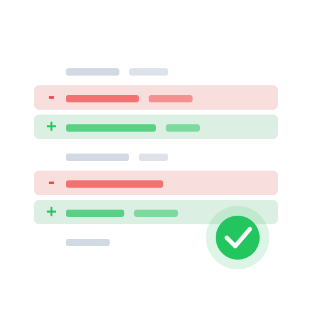

[](https://github.com/e0ipso/self-review/actions/workflows/ci.yml)
 
https://github.com/user-attachments/assets/ada04c50-9107-4f0d-a1ee-789016bbf2de

A local code review tool for developers working with AI coding agents.

When you use tools like Claude Code to generate code changes, you need to review those changes
before accepting them. Today your options are: push to GitHub (exposing unfinished work to a remote
server) or squint at diffs in the terminal.

**self-review** gives you GitHub's pull request review UI on your local machine, no remote, no
account, no setup. Launch it from the terminal, review the diff, leave comments and suggestions,
close the window. Your feedback is written to a file as structured XML that you feed directly back
to your AI agent.

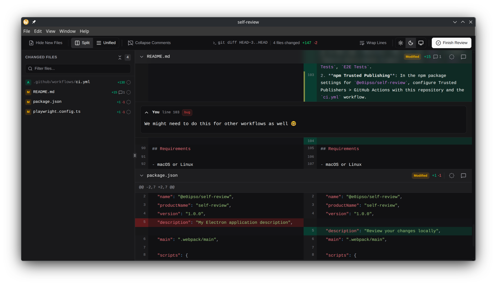

## Use Cases

### Reviewing AI Assistant Plans

Review **rendered markdown** plans from AI assistants and leave **inline feedback** on specific sections. Feed the structured XML back to improve the plan.

<details>
<summary>Learn more</summary>

Plans generated by AI assistants are often long markdown documents. Reviewing them in the terminal is difficult, by the time you reach the end, you've lost track of feedback you had at the beginning. self-review solves this with two features: **rendered markdown view** for readability, and **in-context comments** attached to specific paragraphs and sections.

Open the plan file in self-review, switch to the rendered view, and comment directly on the sections that need changes. The XML output preserves the exact location of each comment, so the AI assistant knows precisely what to fix.

```bash
# Review an AI-generated plan (as an untracked new file)
self-review
```

| | |
|---|---|
| 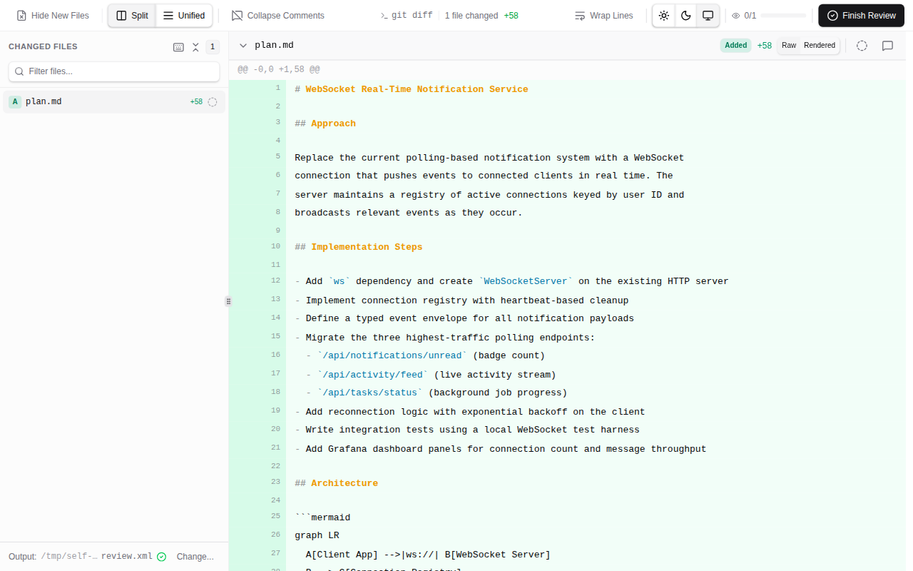 | 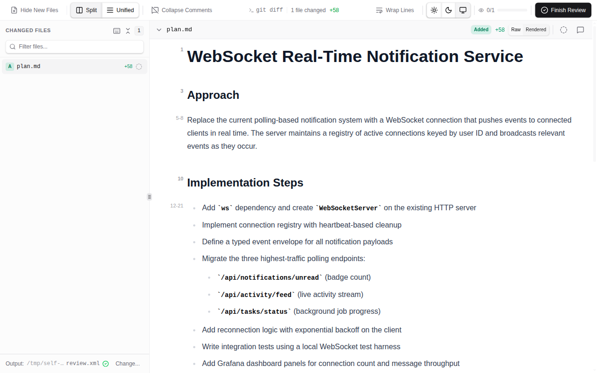 |
| Raw diff of the plan file | Rendered markdown for easier reading |
| 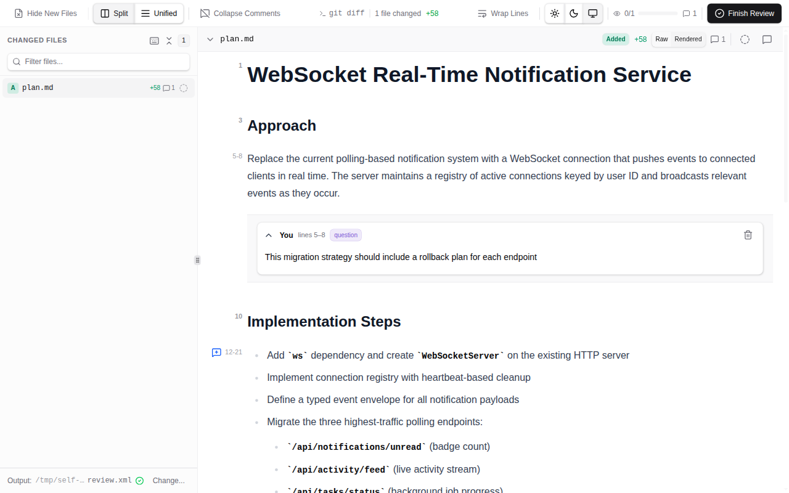 | |
| Comment attached to a specific section | |

</details>

### Reviewing AI-Generated Code

Review code diffs in a **GitHub-style split view** with **inline comments and suggestions**, all without leaving your machine.

<details>
<summary>Learn more</summary>

After an AI assistant generates code changes, you need to review the diff before accepting it. You could push to GitHub and use a pull request, but that has drawbacks:

- **Slower iteration**, push, wait for CI, pull down comments, address them, push again
- **Noisy git history**, "address review comments" commits clutter the remote
- **Privacy**, unfinished or experimental code is exposed to the remote server and your team
- **Wasted CI**, intermediate pushes burn CI minutes on code that isn't ready

With self-review, you review locally. The code that eventually leaves your machine is code you **own intellectually**, you've read it, understood it, and refined it. Your team only sees the finished result.

```bash
# Review staged changes
self-review --staged

# Review changes between branches
self-review main
```

| | |
|---|---|
| 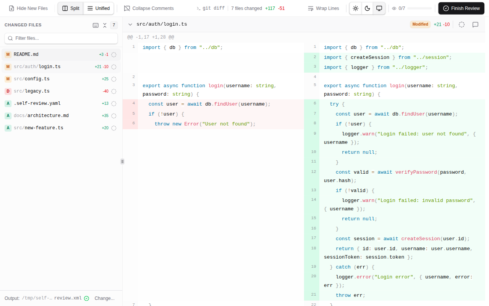 | 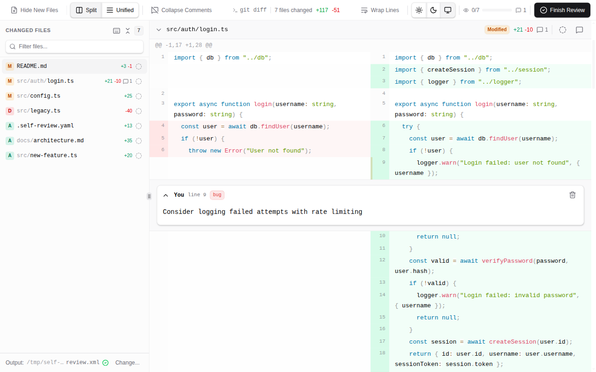 |
| Side-by-side diff view | Inline comment on a specific line |
| 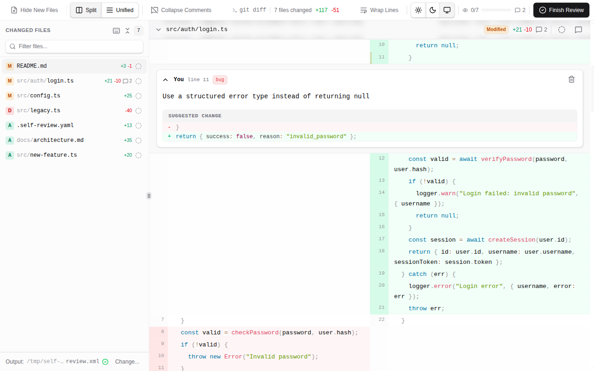 | |
| Suggestion with proposed replacement code | |

</details>

### Codebase Exploration

Open any directory and **annotate the code** with categorized comments, questions, improvements, documentation gaps, then feed the XML to an LLM to act on your notes.

<details>
<summary>Learn more</summary>

When onboarding to a new project, you need to understand the codebase before you can contribute. self-review lets you open a directory, browse the files, and leave **categorized notes** as you go. Tag comments as `question`, `improvement`, or `needs-docs` using **custom categories** defined in `.self-review.yaml`.

Once you're done, the XML file contains all your annotations with file paths, line numbers, and categories. You can feed this to an LLM and ask it to: create tickets for the improvements, generate documentation for the gaps, or explain the parts you didn't understand. No need to awkwardly copy file names, line numbers, and class names into a prompt.

```bash
# Review all changes in the working tree
self-review
```

| | |
|---|---|
| 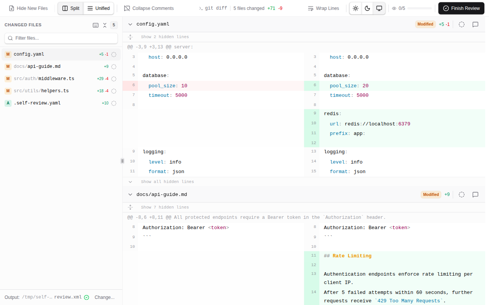 | 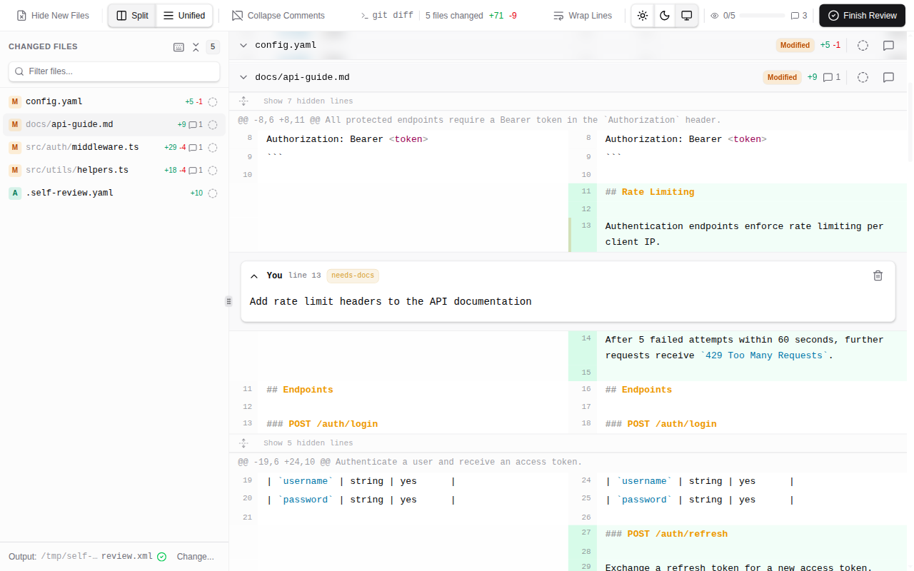 |
| File tree showing the directory structure | Comments tagged with different categories |
| 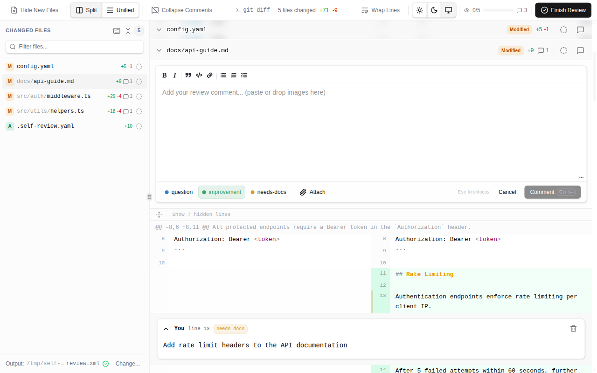 | |
| Custom category selector for organizing notes | |

</details>

### AI-Assisted Review

Have an AI assistant **pre-generate a review**, then open it in self-review to **validate, edit, or discard** each comment before feeding it back.

<details>
<summary>Learn more</summary>

Instead of starting your review from scratch, you can ask a second AI assistant to critique the changes first. Using the `/self-review-critique` skill included in this repo, the assistant generates an XML review file compatible with self-review. You then open self-review with `--resume-from` to load those comments.

The critique run also produces a **walkthrough guide** sidecar (`review.guide.xml`) via the `/self-review-guide` skill, which critique invokes as its first step (the guide skill also runs standalone). When self-review finds the guide next to its output file, the file tree reorganizes into named, ordered reading groups with rationales, each file gets a one-line description of its role in the change, and an overview appears before the first file. A Guided/Flat toggle always restores the plain alphabetical view, every file stays reachable, and a missing or invalid guide simply falls back to the flat view.

From there, you **curate the review**: discard comments that are wrong, keep the ones that are useful, and add your own feedback on top. The final XML contains exactly the comments you approved, AI-suggested minus what you removed, plus what you added, ready to feed back to the coding assistant.

```bash
# Generate an AI review, then validate it
/self-review-critique --staged
self-review --staged --resume-from review.xml
```

| | |
|---|---|
| 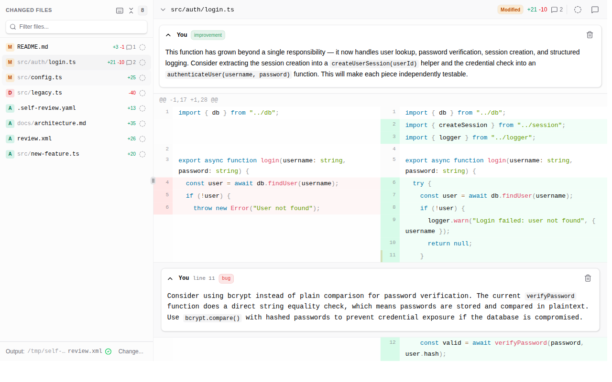 | 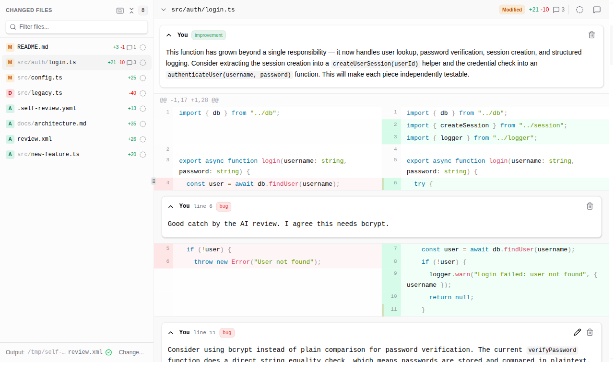 |
| AI-generated comments loaded from XML | Your own comments added alongside AI feedback |

</details>

## Installation

### macOS

Install with [Homebrew](https://brew.sh/):

```bash
brew install --cask e0ipso/self-review/self-review
```

To upgrade later:

```bash
brew upgrade --cask self-review
```

<details>
<summary>Advanced Installation Instructions</summary>

Prefer to install manually? Download the latest release from
[GitHub Releases](https://github.com/e0ipso/self-review/releases).

Download the `.zip` archive, extract it, and move the app to your Applications folder:

```bash
unzip Self.Review-darwin-*.zip -d /Applications
```

</details>

Because the app is not yet code-signed, macOS Gatekeeper will flag it as damaged. Remove the
quarantine attribute before opening:

```bash
xattr -cr /Applications/Self\ Review.app
```

To use the `self-review` command from the terminal, create a wrapper script:

```bash
sudo tee /usr/local/bin/self-review > /dev/null << 'SCRIPT'
#!/bin/bash
exec "/Applications/Self Review.app/Contents/MacOS/Self Review" "$@"
SCRIPT
sudo chmod +x /usr/local/bin/self-review
```

### Linux

Install with [Homebrew](https://brew.sh/):

```bash
brew install e0ipso/self-review/self-review
```

To upgrade later:

```bash
brew upgrade self-review
```

<details>
<summary>Advanced Installation Instructions</summary>

Prefer to install manually? Download the latest release from
[GitHub Releases](https://github.com/e0ipso/self-review/releases).

**Debian/Ubuntu** — download the `.deb` package and install it:

```bash
# Replace X.Y.Z with the version you downloaded
sudo dpkg -i self-review_X.Y.Z_amd64.deb
```

**Fedora/RHEL** — download the `.rpm` package and install it:

```bash
# Replace X.Y.Z with the version you downloaded
sudo rpm -i self-review-X.Y.Z-1.x86_64.rpm
```

The `self-review` command will be available system-wide.

</details>

## How it works

Instead of seeing your changes with `git diff <arguments>` execute `self-review <arguments>`. This will open the app
and will record all the feedback in an XML file (`review.xml` by default).

You can continue your saved review if you didn't finish it:

```bash
# Resume a previous review
self-review --staged --resume-from review.xml
```

### Examples

```bash
# Review staged changes, produces ./review.xml by default
self-review --staged

# Review changes between branches
self-review main

# Review the last commit
self-review HEAD^

# Review the current changes
self-review

# Review a remote pull/merge request by URL
self-review https://github.com/owner/repo/pull/42
self-review https://gitlab.com/group/project/-/merge_requests/7
```

### Reviewing a remote PR/MR

Hand self-review a GitHub pull request or GitLab merge request URL (self-hosted GitLab works
too — the forge is detected from the URL shape) and review it in the same UI, existing
discussion threads included. The review is still written to a local `review.xml`; nothing is
ever sent back to the forge.

Under the hood the diff is materialized through local git: if you run the command from inside a
clone of that repository, self-review reuses it (it only fetches refs — your working tree is
untouched); otherwise it creates a temporary blobless clone under your system temp directory
and removes it when you close the app. Private repositories work through git's own credentials
(SSH keys or credential helpers — `gh auth setup-git` / `glab auth git-credential` wire your
forge CLI login into git). The `gh` / `glab` CLIs are only needed to sync the PR/MR discussion
threads; without them the review itself still works at full fidelity, just without the threads.

There is also a headless subcommand that fetches the discussion threads into a review file
without opening a window:

```bash
# Write the PR's discussion threads to ./review.xml (no window)
self-review fetch-comments https://github.com/owner/repo/pull/42

# Include threads GitLab marks resolved (default is unresolved only)
self-review fetch-comments https://gitlab.com/group/project/-/merge_requests/7 --all-threads
```

## Serve mode

Run the review UI as an HTTP server instead of opening a window, so it can be reviewed from a
browser that isn't on the machine holding the code:

```bash
self-review serve --output=review.xml
```

This exists for the case where the diff lives somewhere your desktop can't reach directly — the
motivating one is code inside an isolated VM (e.g. Lullabot's
[sandbar](https://github.com/Lullabot/sandbar)), whose security model is that nothing is mounted
onto the host and nothing needs to be pushed to be reviewed. Forward the bound port to wherever
your browser is and open it there; no branch push, no guest filesystem mount.

### Flags

- **`--address=HOST:PORT`** — where to bind. Defaults to `127.0.0.1:7738`. Accepts `PORT`,
  `:PORT`, `HOST:PORT`, or `[IPv6]:PORT` — for example `--address=:8080`, `--address=9000`,
  `--address=[::1]:9000`. The space form `--address :8080` works too.
- **`--output <file>`** / **`--output=<file>`** — where the review XML is written. Same flag the
  desktop app accepts, but in serve mode the path is **fixed for the life of the process**: there
  is no browser equivalent of the native save dialog, so the served UI offers no control for
  changing it. Choose the path before starting the server.

Everything else — git diff arguments, `--resume-from` — works exactly as it does for the desktop
app.

### No authentication — loopback binding is the entire protection

Serve mode has **no authentication**. `serve` refuses to bind anything but a loopback address
(`127.0.0.1`, `::1`, `localhost`); that refusal is the whole of v1's security posture, not an
omission pending a future release. Binding the port publicly would expose an unauthenticated
review session with filesystem read access scoped to the served repository to anyone who can
reach it — there is no login, no token, nothing standing between a request and the diff. Reach a
remote serve-mode instance by forwarding the loopback port (SSH, your VM tooling's port
forwarding, and so on), never by binding a routable interface.

### Finishing the review stops the server

Submitting the review writes the XML and then **stops the server** — the process exits once the
response has been sent. This is intentional: process lifetime is review lifetime, so there is
nothing left to serve once the review is written and nothing keeps listening on a port after
you're done.

The corollary is that **nothing is written before you finish**. Closing the browser tab, dropping
the SSH tunnel, or killing the terminal saves nothing, the same as quitting the desktop app
without choosing Save & Quit. If writing the file fails (for example the output directory stopped
being writable), the server stays up so you can fix the problem and submit again.

## Assistant Skill

self-review ships with an AI assistant skill that closes the feedback loop: it reads your review XML,
prioritizes the feedback, and executes the changes. It works with any assistant that supports
skill directories, such as **Claude Code**, **Codex**, **OpenCode**, and others.

The repo also ships two companion skills under `.agents/skills/`: `self-review-critique`
(pre-generates a review for you to curate) and `self-review-guide` (generates the walkthrough
guide sidecar that powers guided mode; critique runs it as its first step). Install them the
same way as `self-review-apply` below.

### Install

Copy the skill directory into your project:

```bash
# From the self-review repo (or download the folder from GitHub)
cp -r .agents/skills/self-review-apply /path/to/your/project/.agents/skills/
```

### Usage

After running self-review and producing a `review.xml`, invoke the skill in your assistant:

```
/self-review-apply review.xml
```

<details>
<summary>Details</summary>
Your project should end up with:

<code>
your-project/
└── .agents/
    └── skills/
        └── self-review-apply/
            ├── SKILL.md
            └── self-review-v3.xsd
</code>

The skill will:

1. Read the XSD schema to understand the review format
2. Parse your review XML
3. Categorize and prioritize comments, honouring `--min-severity` / `--min-confidence` floors when given
4. Output a task plan showing parallel and sequential work groups
5. Execute the changes, applying suggestions first, then addressing open-ended
   feedback

</details>

## Configuration

Customize **self-review** with YAML configuration files:

- **User config:** `~/.config/self-review/config.yaml`, personal preferences for all projects
- **Project config:** `.self-review.yaml`, per-project settings (committable)

Project config overrides user config, which overrides built-in defaults.

### Available options

- `theme`: light, dark, or system (default: system)
- `diff-view`: split or unified (default: split)
- `font-size`: editor font size in pixels (default: 14)
- `output-file`: path for the review XML output (default: `./review.xml`)
- `guide-file`: path to the walkthrough guide sidecar (default: derived from `output-file` as `<output-basename>.guide.xml`, e.g. `review.guide.xml`)
- `ignore`: file patterns to exclude from diff (gitignore-compatible syntax; defaults cover common vendor/build dirs and lock files)
- `categories`: custom comment tags (see example above)
- `default-diff-args`: default arguments passed to `git diff`
- `show-untracked`: show new files not yet added to git (default: true)
- `word-wrap`: wrap long lines in the diff viewer (default: true)
- `max-files`: maximum number of files before the large payload guard triggers (default: 500). Set to `0` to disable.
- `max-total-lines`: maximum total diff lines before the large payload guard triggers (default: 100000). Set to `0` to disable.

When either threshold is exceeded, a confirmation dialog appears. Cancelling exits the app; continuing enters large-payload mode with lazy content loading (file hunks are fetched on demand as you scroll).

<details>
<summary>Example: Custom comment categories</summary>

```yaml
# .self-review.yaml
categories:
  - name: bug
    description: 'Likely defect or incorrect behavior'
    color: '#e53e3e'
  - name: security
    description: 'Potential security vulnerability'
    color: '#d69e2e'
  - name: nit
    description: 'Minor style or formatting suggestion'
    color: '#718096'
  - name: question
    description: 'Clarification needed'
    color: '#3182ce'
```

</details>

See [docs/PRD.md](docs/PRD.md#7-configuration) for complete documentation.

## Design principles

- **CLI-first.** Launched from the terminal, writes review output to a file. Behaves like a Unix tool.
- **One-shot.** Open → review → close → done. No servers, no persistent state.
- **Local-only.** No network access, no accounts, no telemetry. Your code stays on your machine.
  The one opt-in exception: reviewing a remote PR/MR by URL fetches that repository through git
  and reads its discussion threads — and even then, nothing is ever sent to the forge.
- **AI-native output.** The XML format is designed to be parsed by LLMs, with an XSD schema they can
  reference for structure.
