# self-review 

[](https://github.com/e0ipso/self-review/actions/workflows/ci.yml)

https://github.com/user-attachments/assets/ada04c50-9107-4f0d-a1ee-789016bbf2de

A local code review tool for developers working with AI coding agents.

When you use tools like Claude Code to generate code changes, you need to review those changes
before accepting them. Today your options are: push to GitHub (exposing unfinished work to a remote
server) or squint at diffs in the terminal.

**self-review** gives you GitHub's pull request review UI on your local machine, no remote, no
account, no setup. Launch it from the terminal, review the diff, leave comments and suggestions,
close the window. Your feedback is written to a file as structured XML that you feed directly back
to your AI agent.

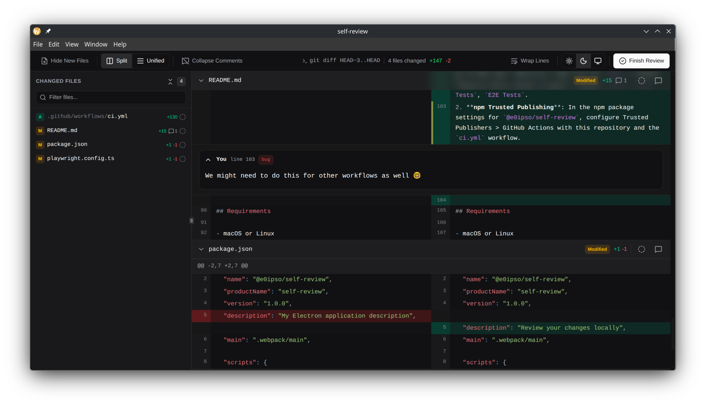

## Use Cases

### Reviewing AI Assistant Plans

Review **rendered markdown** plans from AI assistants and leave **inline feedback** on specific
sections. Feed the structured XML back to improve the plan.

<details>
<summary>Learn more</summary>

Plans generated by AI assistants are often long markdown documents. Reviewing them in the terminal
is difficult, by the time you reach the end, you've lost track of feedback you had at the beginning.
self-review solves this with two features: **rendered markdown view** for readability, and
**in-context comments** attached to specific paragraphs and sections.

Open the plan file in self-review, switch to the rendered view, and comment directly on the sections
that need changes. The XML output preserves the exact location of each comment, so the AI assistant
knows precisely what to fix.

```bash
# Review an AI-generated plan (as an untracked new file)
self-review
```

|                                                                    |                                                              |
| ------------------------------------------------------------------ | ------------------------------------------------------------ |
| 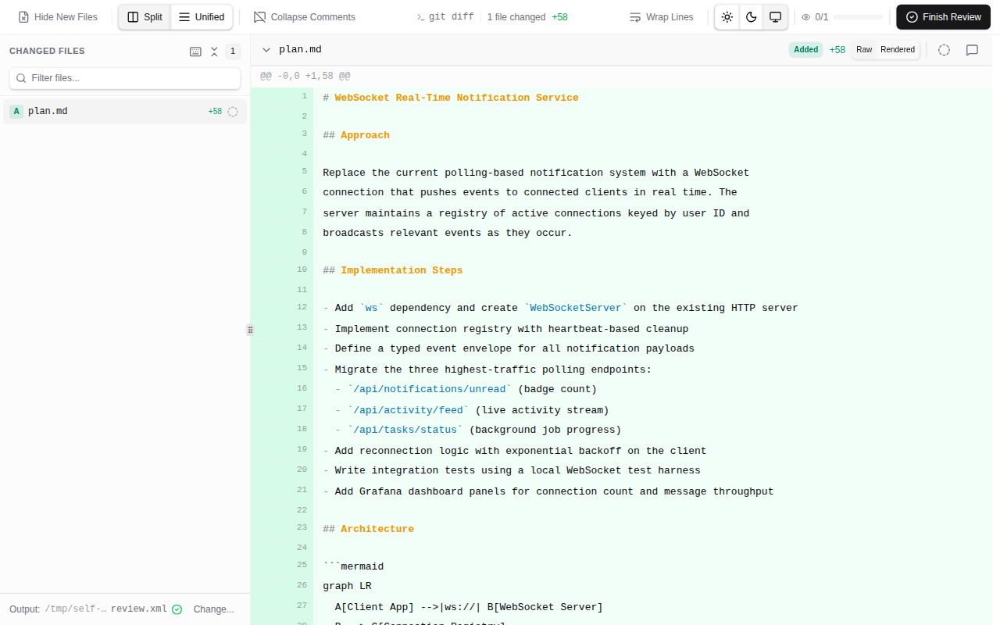              | 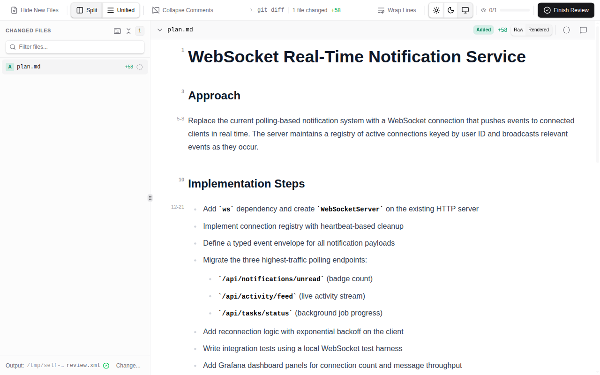 |
| Raw diff of the plan file                                          | Rendered markdown for easier reading                         |
| 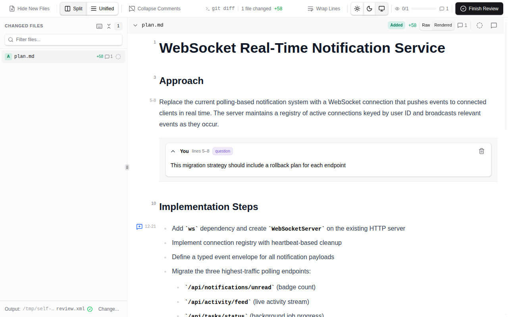 |                                                              |
| Comment attached to a specific section                             |                                                              |

</details>

### Reviewing AI-Generated Code

Review code diffs in a **GitHub-style split view** with **inline comments and suggestions**, all
without leaving your machine.

<details>
<summary>Learn more</summary>

After an AI assistant generates code changes, you need to review the diff before accepting it. You
could push to GitHub and use a pull request, but that has drawbacks:

- **Slower iteration**, push, wait for CI, pull down comments, address them, push again
- **Noisy git history**, "address review comments" commits clutter the remote
- **Privacy**, unfinished or experimental code is exposed to the remote server and your team
- **Wasted CI**, intermediate pushes burn CI minutes on code that isn't ready

With self-review, you review locally. The code that eventually leaves your machine is code you **own
intellectually**, you've read it, understood it, and refined it. Your team only sees the finished
result.

```bash
# Review staged changes
self-review --staged

# Review changes between branches
self-review main
```

|                                                         |                                                     |
| ------------------------------------------------------- | --------------------------------------------------- |
| 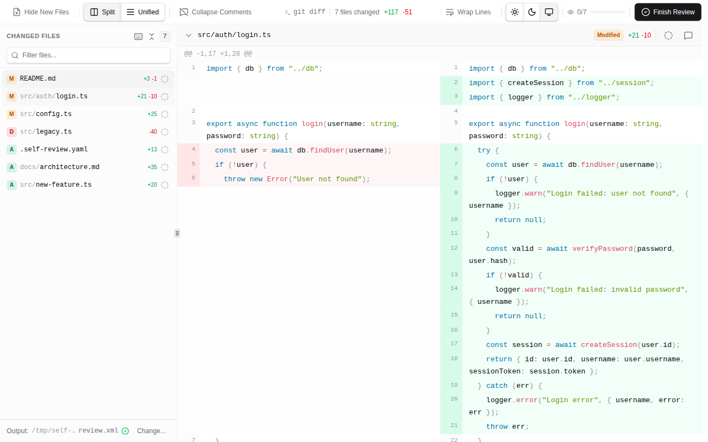 | 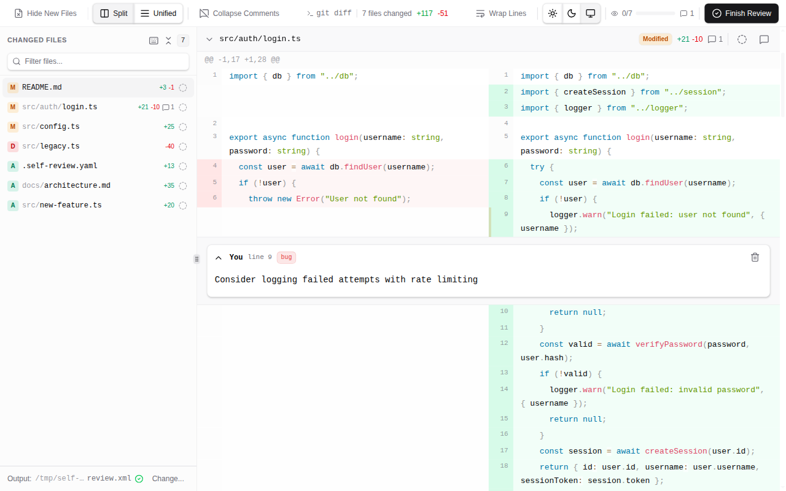 |
| Side-by-side diff view                                  | Inline comment on a specific line                   |
| 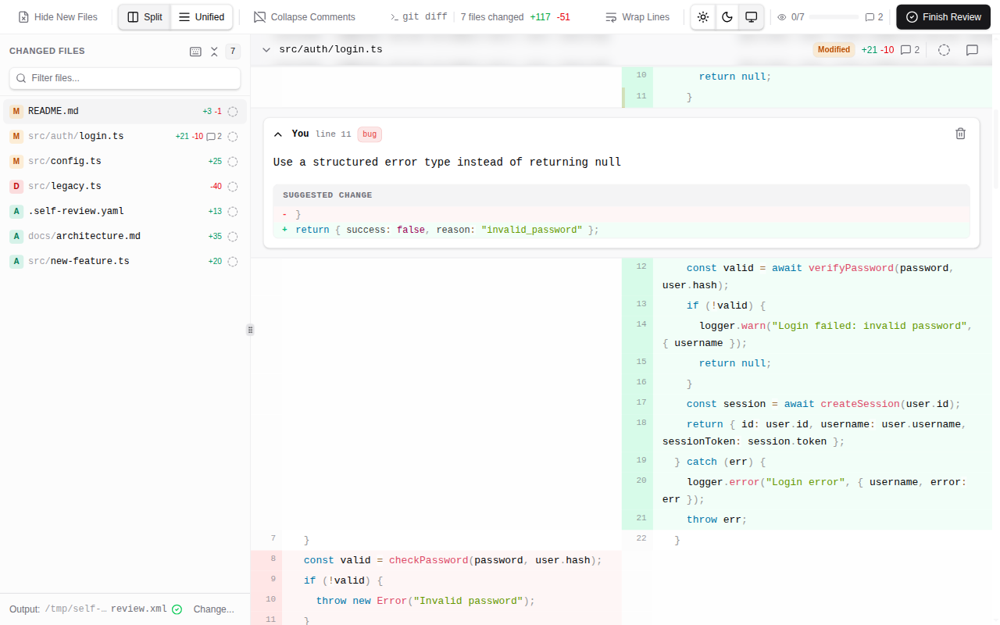 |                                                     |
| Suggestion with proposed replacement code               |                                                     |

</details>

### Codebase Exploration

Open any directory and **annotate the code** with categorized comments, questions, improvements,
documentation gaps, then feed the XML to an LLM to act on your notes.

<details>
<summary>Learn more</summary>

When onboarding to a new project, you need to understand the codebase before you can contribute.
self-review lets you open a directory, browse the files, and leave **categorized notes** as you go.
Tag comments as `question`, `improvement`, or `needs-docs` using **custom categories** defined in
`.self-review.yaml`.

Once you're done, the XML file contains all your annotations with file paths, line numbers, and
categories. You can feed this to an LLM and ask it to: create tickets for the improvements, generate
documentation for the gaps, or explain the parts you didn't understand. No need to awkwardly copy
file names, line numbers, and class names into a prompt.

```bash
# Review all changes in the working tree
self-review
```

|                                                           |                                                               |
| --------------------------------------------------------- | ------------------------------------------------------------- |
| 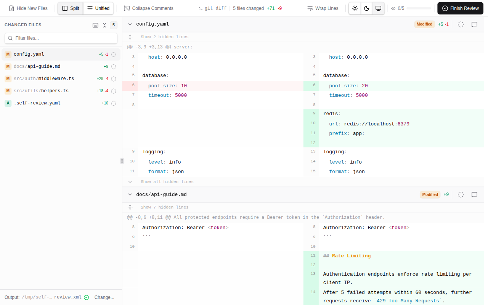 | 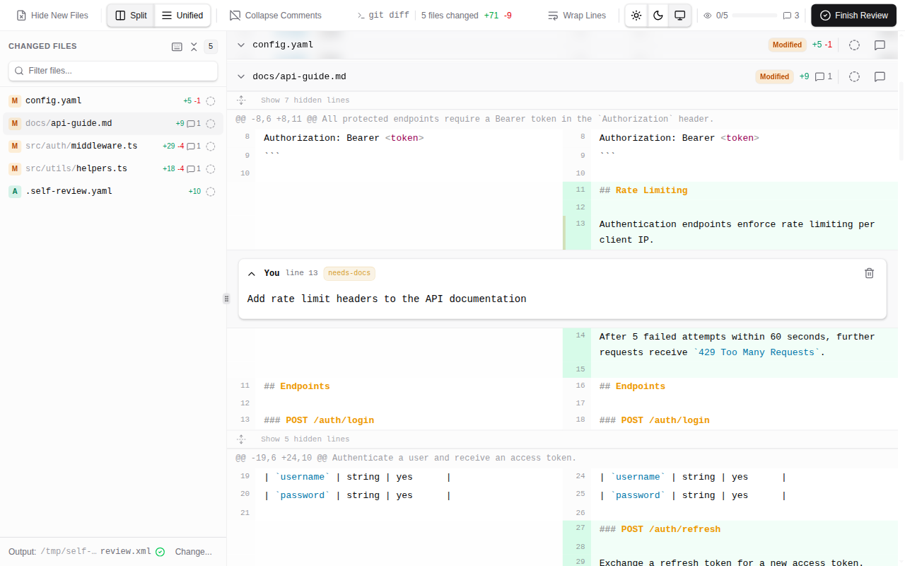 |
| File tree showing the directory structure                 | Comments tagged with different categories                     |
| 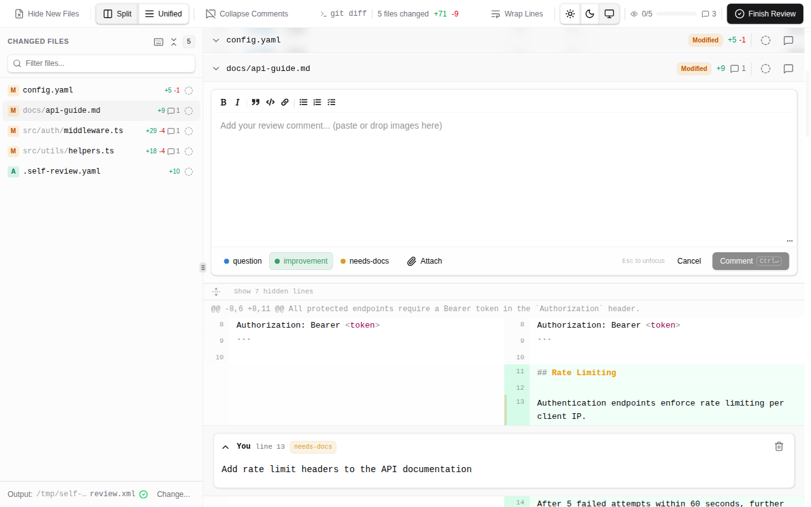 |                                                               |
| Custom category selector for organizing notes             |                                                               |

</details>

### AI-Assisted Review

Have an AI assistant **pre-generate a review**, then open it in self-review to **validate, edit, or
discard** each comment before feeding it back.

<details>
<summary>Learn more</summary>

Instead of starting your review from scratch, you can ask a second AI assistant to critique the
changes first. Using the `/self-review-critique` skill included in this repo, the assistant
generates an XML review file compatible with self-review. You then open self-review with
`--resume-from` to load those comments.

The critique run also produces a **walkthrough guide** sidecar (`review.guide.xml`) via the
`/self-review-guide` skill, which critique invokes as its first step (the guide skill also runs
standalone). When self-review finds the guide next to its output file, the file tree reorganizes
into named, ordered reading groups with rationales, each file gets a one-line description of its
role in the change, and an overview appears before the first file. A Guided/Flat toggle always
restores the plain alphabetical view, every file stays reachable, and a missing or invalid guide
simply falls back to the flat view.

From there, you **curate the review**: discard comments that are wrong, keep the ones that are
useful, and add your own feedback on top. The final XML contains exactly the comments you approved,
AI-suggested minus what you removed, plus what you added, ready to feed back to the coding
assistant.

```bash
# Generate an AI review, then validate it
/self-review-critique --staged
self-review --staged --resume-from review.xml
```

|                                                                 |                                                                         |
| --------------------------------------------------------------- | ----------------------------------------------------------------------- |
| 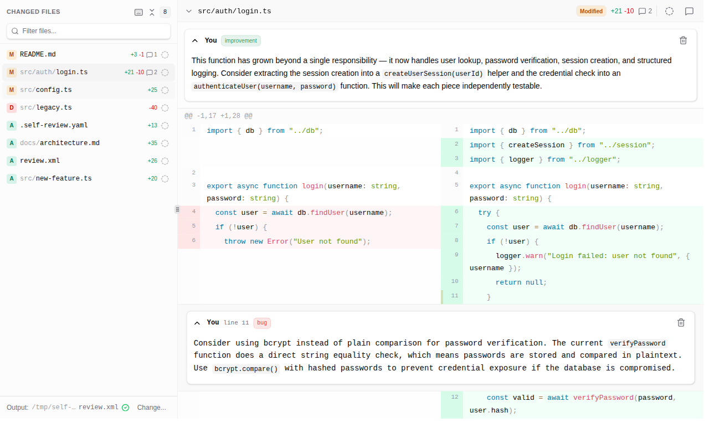 | 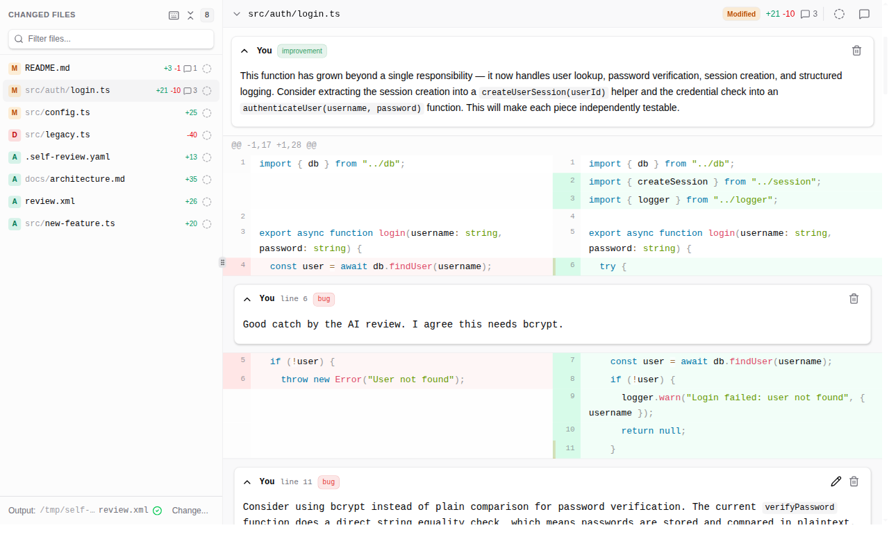 |
| AI-generated comments loaded from XML                           | Your own comments added alongside AI feedback                           |

</details>

## Installation

### macOS

Install with [Homebrew](https://brew.sh/):

```bash
brew install --cask e0ipso/self-review/self-review
```

To upgrade later:

```bash
brew upgrade --cask self-review
```

<details>
<summary>Advanced Installation Instructions</summary>

Prefer to install manually? Download the latest release from
[GitHub Releases](https://github.com/e0ipso/self-review/releases).

Download the `.zip` archive, extract it, and move the app to your Applications folder:

```bash
unzip Self.Review-darwin-*.zip -d /Applications
```

</details>

Because the app is not yet code-signed, macOS Gatekeeper will flag it as damaged. Remove the
quarantine attribute before opening:

```bash
xattr -cr /Applications/Self\ Review.app
```

To use the `self-review` command from the terminal, create a wrapper script:

```bash
sudo tee /usr/local/bin/self-review > /dev/null << 'SCRIPT'
#!/bin/bash
exec "/Applications/Self Review.app/Contents/MacOS/Self Review" "$@"
SCRIPT
sudo chmod +x /usr/local/bin/self-review
```

### Linux

Install with [Homebrew](https://brew.sh/):

```bash
brew install e0ipso/self-review/self-review
```

To upgrade later:

```bash
brew upgrade self-review
```

<details>
<summary>Advanced Installation Instructions</summary>

Prefer to install manually? Download the latest release from
[GitHub Releases](https://github.com/e0ipso/self-review/releases).

Linux release assets ship an x64 build of each package; an arm64 build joins them starting with the
first release cut from the new arm64 pipeline, so `aarch64` readers find no matching asset before
that. Run `uname -m` and take the asset that matches your architecture: `amd64` / `x86_64`, or
`arm64` once it is published.

**Debian/Ubuntu** — download the `.deb` package and install it:

```bash
# Replace X.Y.Z with the version you downloaded, and amd64 with arm64 on arm hardware
sudo dpkg -i self-review_X.Y.Z_amd64.deb
```

**Fedora/RHEL** — download the `.rpm` package and install it:

```bash
# Replace X.Y.Z with the version you downloaded, and x86_64 with arm64 on arm hardware
sudo rpm -i self-review-X.Y.Z-1.x86_64.rpm
```

The `self-review` command will be available system-wide.

</details>

## How it works

Instead of seeing your changes with `git diff <arguments>` execute `self-review <arguments>`. This
will open the app and will record all the feedback in an XML file (`review.xml` by default).

You can continue your saved review if you didn't finish it:

```bash
# Resume a previous review
self-review --staged --resume-from review.xml
```

Arguments that are not self-review's own go straight to `git diff`. `--resume-from <file>` also
takes the `--resume-from=<file>` form, a `--` ends self-review's own options (everything after it,
and the value of a git option such as `-S`, is passed to git as written), and options that change
what git prints (`--stat`, `--name-only`, `--word-diff`, ...) are refused with the flag named,
because the review needs a patch it can parse. Git output the app cannot show faithfully, such as a
merge-conflict section, is reported in the window instead of being left out of the review.

### Saving and quitting

**Finish Review** writes the review and exits. Closing the window, or choosing Quit from the menu
(Ctrl+Q / Cmd+Q), asks first: **Save & Quit**, **Discard** or **Cancel**. The app only exits after a
successful save or an explicit Discard. If the save fails, for example because the output path is a
directory, the disk is full or the file is not writable, the window stays open with all your
comments, a dialog says why, and any earlier `review.xml` is left exactly as it was. Fix the cause
or pick another path from the footer of the file tree and save again.

### Examples

```bash
# Review staged changes, produces ./review.xml by default
self-review --staged

# Review changes between branches
self-review main

# Review the last commit
self-review HEAD^

# Review the current changes
self-review

# Review a remote pull/merge request by URL
self-review https://github.com/owner/repo/pull/42
self-review https://gitlab.com/group/project/-/merge_requests/7
```

### Reviewing a remote PR/MR

Hand self-review a GitHub pull request or GitLab merge request URL (self-hosted GitLab works too —
the forge is detected from the URL shape) and review it in the same UI, existing discussion threads
included. The review is still written to a local `review.xml`; nothing is ever sent back to the
forge.

Under the hood the diff is materialized through local git: if you run the command from inside a
clone of that repository, self-review reuses it (it only fetches into refs of its own under
`refs/self-review/`, which it deletes when you close the app — your working tree and branches are
untouched, and several self-review sessions can share the clone); otherwise it creates a temporary
blobless clone under your system temp directory and removes it when you close the app. Each git
command is bounded (10 minutes), the desktop app gives the whole startup 45 seconds, a URL opened
from the welcome screen gets 10 minutes, and Ctrl+C on `fetch-comments` cancels the clone in
progress and removes it before exiting. Private repositories work through git's own credentials (SSH
keys or credential helpers — `gh auth setup-git` / `glab auth git-credential` wire your forge CLI
login into git). The `gh` / `glab` CLIs are only needed to sync the PR/MR discussion threads;
without them the review itself still works at full fidelity, just without the threads.

There is also a headless subcommand that fetches the discussion threads into a review file without
opening a window:

```bash
# Write the PR's discussion threads to ./review.xml (no window)
self-review fetch-comments https://github.com/owner/repo/pull/42

# Include threads GitLab marks resolved (default is unresolved only)
self-review fetch-comments https://gitlab.com/group/project/-/merge_requests/7 --all-threads
```

It needs no display. On Linux the command picks a headless graphics platform for itself, so it runs
over SSH, in CI and in a container with `$DISPLAY` unset and no `xvfb-run` wrapper.

### Serve mode

The same review UI also runs in your browser, through `self-review-serve`, for when opening an
Electron window is not an option: a remote box, a container, or a machine with no display.

```bash
npx @self-review/serve --staged
```

It takes the same git diff arguments as `self-review`, plus `-o`/`--output` for where to write the
review and `--resume-from` to carry a previous one in:

```bash
npx @self-review/serve                            # unstaged changes
npx @self-review/serve --staged
npx @self-review/serve main..feature-branch
npx @self-review/serve --resume-from review.xml   # continue a previous review
npx @self-review/serve -o my-review.xml --staged  # write somewhere other than ./review.xml
```

The URL goes to stderr when the process starts. Open it in a browser exactly as printed: the part
after `#` is this session's key, and the page does not work without it.

The output path is set once, at startup, by `--output`/`-o` or by `output-file` in
`.self-review.yaml`. No control in the browser changes it afterward. Finishing the review writes
that file and stops the process.

Closing the tab warns you first, once you have entered something. Comments live only in the page
until you finish, so closing without finishing loses them. The desktop application asks the same
question with more options, since it can offer to save on the way out and a browser cannot. Nothing
is auto-saved either way.

Walkthrough guides work as they do in the desktop application. A `review.guide.xml` sitting next to
your output path is picked up at startup and the file tree opens in guided mode.

The listener binds to `127.0.0.1`, will not answer a request that names anything but itself (so a
web page you happen to be visiting cannot reach it), and requires the session key on every API
request (so another account on the same host cannot either). The key is drawn fresh each start and
exists only in the printed URL's fragment: a reloaded or retyped address does not have it and gets a
page saying so, and a lost URL means starting the process again. Reaching it over an `ssh -L`
forward works as you would expect — open the printed URL against the forwarded port, fragment and
all. Anyone who can reach that forwarded port and has the URL has the access you do, so treat the
URL like a password.

See [`packages/serve/README.md`](packages/serve/README.md) for the package itself.

## Assistant Skill

self-review ships with an AI assistant skill that closes the feedback loop: it reads your review
XML, prioritizes the feedback, and executes the changes. It works with any assistant that supports
skill directories, such as **Claude Code**, **Codex**, **OpenCode**, and others.

The repo also ships two companion skills under `.agents/skills/`: `self-review-critique`
(pre-generates a review for you to curate) and `self-review-guide` (generates the walkthrough guide
sidecar that powers guided mode; critique runs it as its first step). Install them the same way as
`self-review-apply` below.

### Install

Copy the skill directory into your project:

```bash
# From the self-review repo (or download the folder from GitHub)
cp -r .agents/skills/self-review-apply /path/to/your/project/.agents/skills/
```

### Usage

After running self-review and producing a `review.xml`, invoke the skill in your assistant:

```
/self-review-apply review.xml
```

<details>
<summary>Details</summary>
Your project should end up with:

<code>
your-project/
└── .agents/
    └── skills/
        └── self-review-apply/
            ├── SKILL.md
            └── self-review-v3.xsd
</code>

The skill will:

1. Read the XSD schema to understand the review format
2. Parse your review XML
3. Categorize and prioritize comments, honouring `--min-severity` / `--min-confidence` floors when
   given
4. Output a task plan showing parallel and sequential work groups
5. Execute the changes, applying suggestions first, then addressing open-ended feedback

</details>

## Configuration

Customize **self-review** with YAML configuration files:

- **User config:** `~/.config/self-review/config.yaml`, personal preferences for all projects
- **Project config:** `.self-review.yaml`, per-project settings (committable)

Project config overrides user config, which overrides built-in defaults.

The two files are trusted differently, because a project file is committed by whoever owns the
repository while the user file is yours. An `output-file` from your user config is treated like a
path you typed and may point anywhere, such as a reviews directory outside the repository; an
`output-file` from a project config, or the default `./review.xml`, must stay inside the directory
you launched from and may not be a symlink, so a repository cannot redirect where the review is
saved. Likewise `default-diff-args` from a project config may not contain `--output`, `--ext-diff`
or `--textconv` (git options that write a file or run an external program); the app refuses to start
and names the option and the file. Your own arguments and user config are not restricted.

### Available options

- `theme`: light, dark, or system (default: system)
- `diff-view`: split or unified (default: split)
- `font-size`: font size in pixels for diff code (default: 14; the row height grows with it, and a
  value that is not a positive number falls back to the default)
- `output-file`: path for the review XML output (default: `./review.xml`)
- `guide-file`: path to the walkthrough guide sidecar (default: derived from `output-file` as
  `<output-basename>.guide.xml`, e.g. `review.guide.xml`)
- `ignore`: file patterns to exclude from diff (gitignore-compatible syntax; defaults cover common
  vendor/build dirs and lock files)
- `categories`: custom comment tags (see example above)
- `default-diff-args`: default arguments passed to `git diff`, split with shell quoting rules, so
  `-- "my file.txt"` stays a single argument
- `show-untracked`: show new files not yet added to git (default: true)
- `word-wrap`: wrap long lines in the diff viewer (default: true)
- `max-files`: maximum number of files before the large payload guard triggers (default: 500). Set
  to `0` to disable.
- `max-total-lines`: maximum total diff lines before the large payload guard triggers (default:
  100000). Set to `0` to disable.

When either threshold is exceeded, a confirmation dialog appears. Cancelling exits the app;
continuing enters large-payload mode with lazy content loading: every file starts collapsed, and a
file's hunks are fetched when you open it. A fetch that fails shows its error with a Retry button
and is not retried on its own.

<details>
<summary>Example: Custom comment categories</summary>

```yaml
# .self-review.yaml
categories:
  - name: bug
    description: 'Likely defect or incorrect behavior'
    color: '#e53e3e'
  - name: security
    description: 'Potential security vulnerability'
    color: '#d69e2e'
  - name: nit
    description: 'Minor style or formatting suggestion'
    color: '#718096'
  - name: question
    description: 'Clarification needed'
    color: '#3182ce'
```

</details>

See [docs/PRD.md](docs/PRD.md#7-configuration) for complete documentation.

## Design principles

- **CLI-first.** Launched from the terminal, writes review output to a file. Behaves like a Unix
  tool.
- **One-shot.** Open → review → close → done. No persistent state. Serve mode does run a listener,
  but only on loopback and only for the duration of one review: submitting writes the output file
  and stops the process, so the principle holds even there.
- **Local-only.** No network access, no accounts, no telemetry. Your code stays on your machine. The
  one opt-in exception: reviewing a remote PR/MR by URL fetches that repository through git and
  reads its discussion threads — and even then, nothing is ever sent to the forge.
- **AI-native output.** The XML format is designed to be parsed by LLMs, with an XSD schema they can
  reference for structure.
